# Data-Science-e-Saude
Extraido da plataforma da Alura, e otimizado por mim, enquanto uso para treinamento pessoal.

Modelos de extraçao de dados em fase de mudança de database.

<a href="https://colab.research.google.com/github/MuriloKrominski/data-science-e-saude/blob/master/Alura_Curso_Data_Science_e_Sau%CC%81de.ipynb" target="_parent"></a>

# Alura

Curso de introdução a data science na saúde extraido da plataforma da Alura, e otimizado por mim, enquanto uso para treinamento pessoal.


```python
import pandas as pd

confirmed = pd.read_csv("https://raw.githubusercontent.com/CSSEGISandData/COVID-19/master/csse_covid_19_data/csse_covid_19_time_series/time_series_covid19_deaths_global.csv")
confirmed.head()
```


<div>

<table border="1" class="dataframe">
  <thead>
    <tr style="text-align: right;">
      <th></th>
      <th>Province/State</th>
      <th>Country/Region</th>
      <th>Lat</th>
      <th>Long</th>
      <th>1/22/20</th>
      <th>1/23/20</th>
      <th>1/24/20</th>
      <th>1/25/20</th>
      <th>1/26/20</th>
      <th>1/27/20</th>
      <th>1/28/20</th>
      <th>1/29/20</th>
      <th>1/30/20</th>
      <th>1/31/20</th>
      <th>2/1/20</th>
      <th>2/2/20</th>
      <th>2/3/20</th>
      <th>2/4/20</th>
      <th>2/5/20</th>
      <th>2/6/20</th>
      <th>2/7/20</th>
      <th>2/8/20</th>
      <th>2/9/20</th>
      <th>2/10/20</th>
      <th>2/11/20</th>
      <th>2/12/20</th>
      <th>2/13/20</th>
      <th>2/14/20</th>
      <th>2/15/20</th>
      <th>2/16/20</th>
      <th>2/17/20</th>
      <th>2/18/20</th>
      <th>2/19/20</th>
      <th>2/20/20</th>
      <th>2/21/20</th>
      <th>2/22/20</th>
      <th>2/23/20</th>
      <th>2/24/20</th>
      <th>2/25/20</th>
      <th>2/26/20</th>
      <th>...</th>
      <th>8/25/20</th>
      <th>8/26/20</th>
      <th>8/27/20</th>
      <th>8/28/20</th>
      <th>8/29/20</th>
      <th>8/30/20</th>
      <th>8/31/20</th>
      <th>9/1/20</th>
      <th>9/2/20</th>
      <th>9/3/20</th>
      <th>9/4/20</th>
      <th>9/5/20</th>
      <th>9/6/20</th>
      <th>9/7/20</th>
      <th>9/8/20</th>
      <th>9/9/20</th>
      <th>9/10/20</th>
      <th>9/11/20</th>
      <th>9/12/20</th>
      <th>9/13/20</th>
      <th>9/14/20</th>
      <th>9/15/20</th>
      <th>9/16/20</th>
      <th>9/17/20</th>
      <th>9/18/20</th>
      <th>9/19/20</th>
      <th>9/20/20</th>
      <th>9/21/20</th>
      <th>9/22/20</th>
      <th>9/23/20</th>
      <th>9/24/20</th>
      <th>9/25/20</th>
      <th>9/26/20</th>
      <th>9/27/20</th>
      <th>9/28/20</th>
      <th>9/29/20</th>
      <th>9/30/20</th>
      <th>10/1/20</th>
      <th>10/2/20</th>
      <th>10/3/20</th>
    </tr>
  </thead>
  <tbody>
    <tr>
      <th>0</th>
      <td>NaN</td>
      <td>Afghanistan</td>
      <td>33.93911</td>
      <td>67.709953</td>
      <td>0</td>
      <td>0</td>
      <td>0</td>
      <td>0</td>
      <td>0</td>
      <td>0</td>
      <td>0</td>
      <td>0</td>
      <td>0</td>
      <td>0</td>
      <td>0</td>
      <td>0</td>
      <td>0</td>
      <td>0</td>
      <td>0</td>
      <td>0</td>
      <td>0</td>
      <td>0</td>
      <td>0</td>
      <td>0</td>
      <td>0</td>
      <td>0</td>
      <td>0</td>
      <td>0</td>
      <td>0</td>
      <td>0</td>
      <td>0</td>
      <td>0</td>
      <td>0</td>
      <td>0</td>
      <td>0</td>
      <td>0</td>
      <td>0</td>
      <td>0</td>
      <td>0</td>
      <td>0</td>
      <td>...</td>
      <td>1397</td>
      <td>1401</td>
      <td>1401</td>
      <td>1402</td>
      <td>1402</td>
      <td>1402</td>
      <td>1402</td>
      <td>1406</td>
      <td>1409</td>
      <td>1409</td>
      <td>1409</td>
      <td>1409</td>
      <td>1412</td>
      <td>1415</td>
      <td>1418</td>
      <td>1420</td>
      <td>1420</td>
      <td>1420</td>
      <td>1420</td>
      <td>1420</td>
      <td>1425</td>
      <td>1426</td>
      <td>1436</td>
      <td>1436</td>
      <td>1437</td>
      <td>1437</td>
      <td>1441</td>
      <td>1444</td>
      <td>1445</td>
      <td>1446</td>
      <td>1451</td>
      <td>1451</td>
      <td>1453</td>
      <td>1453</td>
      <td>1455</td>
      <td>1458</td>
      <td>1458</td>
      <td>1458</td>
      <td>1458</td>
      <td>1462</td>
    </tr>
    <tr>
      <th>1</th>
      <td>NaN</td>
      <td>Albania</td>
      <td>41.15330</td>
      <td>20.168300</td>
      <td>0</td>
      <td>0</td>
      <td>0</td>
      <td>0</td>
      <td>0</td>
      <td>0</td>
      <td>0</td>
      <td>0</td>
      <td>0</td>
      <td>0</td>
      <td>0</td>
      <td>0</td>
      <td>0</td>
      <td>0</td>
      <td>0</td>
      <td>0</td>
      <td>0</td>
      <td>0</td>
      <td>0</td>
      <td>0</td>
      <td>0</td>
      <td>0</td>
      <td>0</td>
      <td>0</td>
      <td>0</td>
      <td>0</td>
      <td>0</td>
      <td>0</td>
      <td>0</td>
      <td>0</td>
      <td>0</td>
      <td>0</td>
      <td>0</td>
      <td>0</td>
      <td>0</td>
      <td>0</td>
      <td>...</td>
      <td>259</td>
      <td>263</td>
      <td>266</td>
      <td>271</td>
      <td>275</td>
      <td>280</td>
      <td>284</td>
      <td>290</td>
      <td>296</td>
      <td>301</td>
      <td>306</td>
      <td>312</td>
      <td>316</td>
      <td>319</td>
      <td>321</td>
      <td>322</td>
      <td>324</td>
      <td>327</td>
      <td>330</td>
      <td>334</td>
      <td>338</td>
      <td>340</td>
      <td>343</td>
      <td>347</td>
      <td>353</td>
      <td>358</td>
      <td>362</td>
      <td>364</td>
      <td>367</td>
      <td>370</td>
      <td>370</td>
      <td>373</td>
      <td>375</td>
      <td>377</td>
      <td>380</td>
      <td>384</td>
      <td>387</td>
      <td>388</td>
      <td>389</td>
      <td>392</td>
    </tr>
    <tr>
      <th>2</th>
      <td>NaN</td>
      <td>Algeria</td>
      <td>28.03390</td>
      <td>1.659600</td>
      <td>0</td>
      <td>0</td>
      <td>0</td>
      <td>0</td>
      <td>0</td>
      <td>0</td>
      <td>0</td>
      <td>0</td>
      <td>0</td>
      <td>0</td>
      <td>0</td>
      <td>0</td>
      <td>0</td>
      <td>0</td>
      <td>0</td>
      <td>0</td>
      <td>0</td>
      <td>0</td>
      <td>0</td>
      <td>0</td>
      <td>0</td>
      <td>0</td>
      <td>0</td>
      <td>0</td>
      <td>0</td>
      <td>0</td>
      <td>0</td>
      <td>0</td>
      <td>0</td>
      <td>0</td>
      <td>0</td>
      <td>0</td>
      <td>0</td>
      <td>0</td>
      <td>0</td>
      <td>0</td>
      <td>...</td>
      <td>1456</td>
      <td>1465</td>
      <td>1475</td>
      <td>1483</td>
      <td>1491</td>
      <td>1501</td>
      <td>1510</td>
      <td>1518</td>
      <td>1523</td>
      <td>1529</td>
      <td>1539</td>
      <td>1549</td>
      <td>1556</td>
      <td>1562</td>
      <td>1571</td>
      <td>1581</td>
      <td>1591</td>
      <td>1599</td>
      <td>1605</td>
      <td>1612</td>
      <td>1620</td>
      <td>1632</td>
      <td>1645</td>
      <td>1654</td>
      <td>1659</td>
      <td>1665</td>
      <td>1672</td>
      <td>1679</td>
      <td>1689</td>
      <td>1698</td>
      <td>1703</td>
      <td>1707</td>
      <td>1711</td>
      <td>1714</td>
      <td>1719</td>
      <td>1726</td>
      <td>1736</td>
      <td>1741</td>
      <td>1749</td>
      <td>1756</td>
    </tr>
    <tr>
      <th>3</th>
      <td>NaN</td>
      <td>Andorra</td>
      <td>42.50630</td>
      <td>1.521800</td>
      <td>0</td>
      <td>0</td>
      <td>0</td>
      <td>0</td>
      <td>0</td>
      <td>0</td>
      <td>0</td>
      <td>0</td>
      <td>0</td>
      <td>0</td>
      <td>0</td>
      <td>0</td>
      <td>0</td>
      <td>0</td>
      <td>0</td>
      <td>0</td>
      <td>0</td>
      <td>0</td>
      <td>0</td>
      <td>0</td>
      <td>0</td>
      <td>0</td>
      <td>0</td>
      <td>0</td>
      <td>0</td>
      <td>0</td>
      <td>0</td>
      <td>0</td>
      <td>0</td>
      <td>0</td>
      <td>0</td>
      <td>0</td>
      <td>0</td>
      <td>0</td>
      <td>0</td>
      <td>0</td>
      <td>...</td>
      <td>53</td>
      <td>53</td>
      <td>53</td>
      <td>53</td>
      <td>53</td>
      <td>53</td>
      <td>53</td>
      <td>53</td>
      <td>53</td>
      <td>53</td>
      <td>53</td>
      <td>53</td>
      <td>53</td>
      <td>53</td>
      <td>53</td>
      <td>53</td>
      <td>53</td>
      <td>53</td>
      <td>53</td>
      <td>53</td>
      <td>53</td>
      <td>53</td>
      <td>53</td>
      <td>53</td>
      <td>53</td>
      <td>53</td>
      <td>53</td>
      <td>53</td>
      <td>53</td>
      <td>53</td>
      <td>53</td>
      <td>53</td>
      <td>53</td>
      <td>53</td>
      <td>53</td>
      <td>53</td>
      <td>53</td>
      <td>53</td>
      <td>53</td>
      <td>53</td>
    </tr>
    <tr>
      <th>4</th>
      <td>NaN</td>
      <td>Angola</td>
      <td>-11.20270</td>
      <td>17.873900</td>
      <td>0</td>
      <td>0</td>
      <td>0</td>
      <td>0</td>
      <td>0</td>
      <td>0</td>
      <td>0</td>
      <td>0</td>
      <td>0</td>
      <td>0</td>
      <td>0</td>
      <td>0</td>
      <td>0</td>
      <td>0</td>
      <td>0</td>
      <td>0</td>
      <td>0</td>
      <td>0</td>
      <td>0</td>
      <td>0</td>
      <td>0</td>
      <td>0</td>
      <td>0</td>
      <td>0</td>
      <td>0</td>
      <td>0</td>
      <td>0</td>
      <td>0</td>
      <td>0</td>
      <td>0</td>
      <td>0</td>
      <td>0</td>
      <td>0</td>
      <td>0</td>
      <td>0</td>
      <td>0</td>
      <td>...</td>
      <td>102</td>
      <td>103</td>
      <td>105</td>
      <td>106</td>
      <td>107</td>
      <td>107</td>
      <td>108</td>
      <td>109</td>
      <td>112</td>
      <td>113</td>
      <td>115</td>
      <td>117</td>
      <td>117</td>
      <td>120</td>
      <td>124</td>
      <td>126</td>
      <td>130</td>
      <td>131</td>
      <td>132</td>
      <td>134</td>
      <td>136</td>
      <td>139</td>
      <td>143</td>
      <td>144</td>
      <td>147</td>
      <td>147</td>
      <td>152</td>
      <td>154</td>
      <td>155</td>
      <td>159</td>
      <td>162</td>
      <td>167</td>
      <td>171</td>
      <td>174</td>
      <td>176</td>
      <td>179</td>
      <td>183</td>
      <td>185</td>
      <td>189</td>
      <td>193</td>
    </tr>
  </tbody>
</table>
<p>5 rows × 260 columns</p>
</div>


```python
confirmed.shape
```


    (266, 260)


```python
last_date = "3/2/20"

confirmed[last_date]
```


    0      0
    1      0
    2      0
    3      0
    4      0
          ..
    261    0
    262    0
    263    0
    264    0
    265    0
    Name: 3/2/20, Length: 266, dtype: int64


```python
confirmed["Country/Region"]
```


    0             Afghanistan
    1                 Albania
    2                 Algeria
    3                 Andorra
    4                  Angola
                  ...        
    261    West Bank and Gaza
    262        Western Sahara
    263                 Yemen
    264                Zambia
    265              Zimbabwe
    Name: Country/Region, Length: 266, dtype: object


```python
confirmed["Country/Region"].unique()
```


    array(['Afghanistan', 'Albania', 'Algeria', 'Andorra', 'Angola',
           'Antigua and Barbuda', 'Argentina', 'Armenia', 'Australia',
           'Austria', 'Azerbaijan', 'Bahamas', 'Bahrain', 'Bangladesh',
           'Barbados', 'Belarus', 'Belgium', 'Belize', 'Benin', 'Bhutan',
           'Bolivia', 'Bosnia and Herzegovina', 'Botswana', 'Brazil',
           'Brunei', 'Bulgaria', 'Burkina Faso', 'Burma', 'Burundi',
           'Cabo Verde', 'Cambodia', 'Cameroon', 'Canada',
           'Central African Republic', 'Chad', 'Chile', 'China', 'Colombia',
           'Comoros', 'Congo (Brazzaville)', 'Congo (Kinshasa)', 'Costa Rica',
           "Cote d'Ivoire", 'Croatia', 'Cuba', 'Cyprus', 'Czechia', 'Denmark',
           'Diamond Princess', 'Djibouti', 'Dominica', 'Dominican Republic',
           'Ecuador', 'Egypt', 'El Salvador', 'Equatorial Guinea', 'Eritrea',
           'Estonia', 'Eswatini', 'Ethiopia', 'Fiji', 'Finland', 'France',
           'Gabon', 'Gambia', 'Georgia', 'Germany', 'Ghana', 'Greece',
           'Grenada', 'Guatemala', 'Guinea', 'Guinea-Bissau', 'Guyana',
           'Haiti', 'Holy See', 'Honduras', 'Hungary', 'Iceland', 'India',
           'Indonesia', 'Iran', 'Iraq', 'Ireland', 'Israel', 'Italy',
           'Jamaica', 'Japan', 'Jordan', 'Kazakhstan', 'Kenya',
           'Korea, South', 'Kosovo', 'Kuwait', 'Kyrgyzstan', 'Laos', 'Latvia',
           'Lebanon', 'Lesotho', 'Liberia', 'Libya', 'Liechtenstein',
           'Lithuania', 'Luxembourg', 'MS Zaandam', 'Madagascar', 'Malawi',
           'Malaysia', 'Maldives', 'Mali', 'Malta', 'Mauritania', 'Mauritius',
           'Mexico', 'Moldova', 'Monaco', 'Mongolia', 'Montenegro', 'Morocco',
           'Mozambique', 'Namibia', 'Nepal', 'Netherlands', 'New Zealand',
           'Nicaragua', 'Niger', 'Nigeria', 'North Macedonia', 'Norway',
           'Oman', 'Pakistan', 'Panama', 'Papua New Guinea', 'Paraguay',
           'Peru', 'Philippines', 'Poland', 'Portugal', 'Qatar', 'Romania',
           'Russia', 'Rwanda', 'Saint Kitts and Nevis', 'Saint Lucia',
           'Saint Vincent and the Grenadines', 'San Marino',
           'Sao Tome and Principe', 'Saudi Arabia', 'Senegal', 'Serbia',
           'Seychelles', 'Sierra Leone', 'Singapore', 'Slovakia', 'Slovenia',
           'Somalia', 'South Africa', 'South Sudan', 'Spain', 'Sri Lanka',
           'Sudan', 'Suriname', 'Sweden', 'Switzerland', 'Syria', 'Taiwan*',
           'Tajikistan', 'Tanzania', 'Thailand', 'Timor-Leste', 'Togo',
           'Trinidad and Tobago', 'Tunisia', 'Turkey', 'US', 'Uganda',
           'Ukraine', 'United Arab Emirates', 'United Kingdom', 'Uruguay',
           'Uzbekistan', 'Venezuela', 'Vietnam', 'West Bank and Gaza',
           'Western Sahara', 'Yemen', 'Zambia', 'Zimbabwe'], dtype=object)


```python
confirmed["Province/State"].unique()
```


    array([nan, 'Australian Capital Territory', 'New South Wales',
           'Northern Territory', 'Queensland', 'South Australia', 'Tasmania',
           'Victoria', 'Western Australia', 'Alberta', 'British Columbia',
           'Diamond Princess', 'Grand Princess', 'Manitoba', 'New Brunswick',
           'Newfoundland and Labrador', 'Northwest Territories',
           'Nova Scotia', 'Ontario', 'Prince Edward Island', 'Quebec',
           'Saskatchewan', 'Yukon', 'Anhui', 'Beijing', 'Chongqing', 'Fujian',
           'Gansu', 'Guangdong', 'Guangxi', 'Guizhou', 'Hainan', 'Hebei',
           'Heilongjiang', 'Henan', 'Hong Kong', 'Hubei', 'Hunan',
           'Inner Mongolia', 'Jiangsu', 'Jiangxi', 'Jilin', 'Liaoning',
           'Macau', 'Ningxia', 'Qinghai', 'Shaanxi', 'Shandong', 'Shanghai',
           'Shanxi', 'Sichuan', 'Tianjin', 'Tibet', 'Xinjiang', 'Yunnan',
           'Zhejiang', 'Faroe Islands', 'Greenland', 'French Guiana',
           'French Polynesia', 'Guadeloupe', 'Martinique', 'Mayotte',
           'New Caledonia', 'Reunion', 'Saint Barthelemy',
           'Saint Pierre and Miquelon', 'St Martin', 'Aruba',
           'Bonaire, Sint Eustatius and Saba', 'Curacao', 'Sint Maarten',
           'Anguilla', 'Bermuda', 'British Virgin Islands', 'Cayman Islands',
           'Channel Islands', 'Falkland Islands (Malvinas)', 'Gibraltar',
           'Isle of Man', 'Montserrat', 'Turks and Caicos Islands'],
          dtype=object)


```python
confirmed.sample(20)
```


<div>

<table border="1" class="dataframe">
  <thead>
    <tr style="text-align: right;">
      <th></th>
      <th>Province/State</th>
      <th>Country/Region</th>
      <th>Lat</th>
      <th>Long</th>
      <th>1/22/20</th>
      <th>1/23/20</th>
      <th>1/24/20</th>
      <th>1/25/20</th>
      <th>1/26/20</th>
      <th>1/27/20</th>
      <th>1/28/20</th>
      <th>1/29/20</th>
      <th>1/30/20</th>
      <th>1/31/20</th>
      <th>2/1/20</th>
      <th>2/2/20</th>
      <th>2/3/20</th>
      <th>2/4/20</th>
      <th>2/5/20</th>
      <th>2/6/20</th>
      <th>2/7/20</th>
      <th>2/8/20</th>
      <th>2/9/20</th>
      <th>2/10/20</th>
      <th>2/11/20</th>
      <th>2/12/20</th>
      <th>2/13/20</th>
      <th>2/14/20</th>
      <th>2/15/20</th>
      <th>2/16/20</th>
      <th>2/17/20</th>
      <th>2/18/20</th>
      <th>2/19/20</th>
      <th>2/20/20</th>
      <th>2/21/20</th>
      <th>2/22/20</th>
      <th>2/23/20</th>
      <th>2/24/20</th>
      <th>2/25/20</th>
      <th>2/26/20</th>
      <th>...</th>
      <th>8/25/20</th>
      <th>8/26/20</th>
      <th>8/27/20</th>
      <th>8/28/20</th>
      <th>8/29/20</th>
      <th>8/30/20</th>
      <th>8/31/20</th>
      <th>9/1/20</th>
      <th>9/2/20</th>
      <th>9/3/20</th>
      <th>9/4/20</th>
      <th>9/5/20</th>
      <th>9/6/20</th>
      <th>9/7/20</th>
      <th>9/8/20</th>
      <th>9/9/20</th>
      <th>9/10/20</th>
      <th>9/11/20</th>
      <th>9/12/20</th>
      <th>9/13/20</th>
      <th>9/14/20</th>
      <th>9/15/20</th>
      <th>9/16/20</th>
      <th>9/17/20</th>
      <th>9/18/20</th>
      <th>9/19/20</th>
      <th>9/20/20</th>
      <th>9/21/20</th>
      <th>9/22/20</th>
      <th>9/23/20</th>
      <th>9/24/20</th>
      <th>9/25/20</th>
      <th>9/26/20</th>
      <th>9/27/20</th>
      <th>9/28/20</th>
      <th>9/29/20</th>
      <th>9/30/20</th>
      <th>10/1/20</th>
      <th>10/2/20</th>
      <th>10/3/20</th>
    </tr>
  </thead>
  <tbody>
    <tr>
      <th>81</th>
      <td>Shanghai</td>
      <td>China</td>
      <td>31.202000</td>
      <td>121.449100</td>
      <td>0</td>
      <td>0</td>
      <td>0</td>
      <td>0</td>
      <td>1</td>
      <td>1</td>
      <td>1</td>
      <td>1</td>
      <td>1</td>
      <td>1</td>
      <td>1</td>
      <td>1</td>
      <td>1</td>
      <td>1</td>
      <td>1</td>
      <td>1</td>
      <td>1</td>
      <td>1</td>
      <td>1</td>
      <td>1</td>
      <td>1</td>
      <td>1</td>
      <td>1</td>
      <td>1</td>
      <td>1</td>
      <td>1</td>
      <td>1</td>
      <td>1</td>
      <td>2</td>
      <td>2</td>
      <td>2</td>
      <td>3</td>
      <td>3</td>
      <td>3</td>
      <td>3</td>
      <td>3</td>
      <td>...</td>
      <td>7</td>
      <td>7</td>
      <td>7</td>
      <td>7</td>
      <td>7</td>
      <td>7</td>
      <td>7</td>
      <td>7</td>
      <td>7</td>
      <td>7</td>
      <td>7</td>
      <td>7</td>
      <td>7</td>
      <td>7</td>
      <td>7</td>
      <td>7</td>
      <td>7</td>
      <td>7</td>
      <td>7</td>
      <td>7</td>
      <td>7</td>
      <td>7</td>
      <td>7</td>
      <td>7</td>
      <td>7</td>
      <td>7</td>
      <td>7</td>
      <td>7</td>
      <td>7</td>
      <td>7</td>
      <td>7</td>
      <td>7</td>
      <td>7</td>
      <td>7</td>
      <td>7</td>
      <td>7</td>
      <td>7</td>
      <td>7</td>
      <td>7</td>
      <td>7</td>
    </tr>
    <tr>
      <th>205</th>
      <td>NaN</td>
      <td>Portugal</td>
      <td>39.399900</td>
      <td>-8.224500</td>
      <td>0</td>
      <td>0</td>
      <td>0</td>
      <td>0</td>
      <td>0</td>
      <td>0</td>
      <td>0</td>
      <td>0</td>
      <td>0</td>
      <td>0</td>
      <td>0</td>
      <td>0</td>
      <td>0</td>
      <td>0</td>
      <td>0</td>
      <td>0</td>
      <td>0</td>
      <td>0</td>
      <td>0</td>
      <td>0</td>
      <td>0</td>
      <td>0</td>
      <td>0</td>
      <td>0</td>
      <td>0</td>
      <td>0</td>
      <td>0</td>
      <td>0</td>
      <td>0</td>
      <td>0</td>
      <td>0</td>
      <td>0</td>
      <td>0</td>
      <td>0</td>
      <td>0</td>
      <td>0</td>
      <td>...</td>
      <td>1805</td>
      <td>1807</td>
      <td>1809</td>
      <td>1815</td>
      <td>1818</td>
      <td>1819</td>
      <td>1822</td>
      <td>1824</td>
      <td>1827</td>
      <td>1829</td>
      <td>1833</td>
      <td>1838</td>
      <td>1840</td>
      <td>1843</td>
      <td>1846</td>
      <td>1849</td>
      <td>1852</td>
      <td>1855</td>
      <td>1860</td>
      <td>1867</td>
      <td>1871</td>
      <td>1875</td>
      <td>1878</td>
      <td>1888</td>
      <td>1894</td>
      <td>1899</td>
      <td>1912</td>
      <td>1920</td>
      <td>1925</td>
      <td>1928</td>
      <td>1931</td>
      <td>1936</td>
      <td>1944</td>
      <td>1953</td>
      <td>1957</td>
      <td>1963</td>
      <td>1971</td>
      <td>1977</td>
      <td>1983</td>
      <td>1995</td>
    </tr>
    <tr>
      <th>252</th>
      <td>Gibraltar</td>
      <td>United Kingdom</td>
      <td>36.140800</td>
      <td>-5.353600</td>
      <td>0</td>
      <td>0</td>
      <td>0</td>
      <td>0</td>
      <td>0</td>
      <td>0</td>
      <td>0</td>
      <td>0</td>
      <td>0</td>
      <td>0</td>
      <td>0</td>
      <td>0</td>
      <td>0</td>
      <td>0</td>
      <td>0</td>
      <td>0</td>
      <td>0</td>
      <td>0</td>
      <td>0</td>
      <td>0</td>
      <td>0</td>
      <td>0</td>
      <td>0</td>
      <td>0</td>
      <td>0</td>
      <td>0</td>
      <td>0</td>
      <td>0</td>
      <td>0</td>
      <td>0</td>
      <td>0</td>
      <td>0</td>
      <td>0</td>
      <td>0</td>
      <td>0</td>
      <td>0</td>
      <td>...</td>
      <td>0</td>
      <td>0</td>
      <td>0</td>
      <td>0</td>
      <td>0</td>
      <td>0</td>
      <td>0</td>
      <td>0</td>
      <td>0</td>
      <td>0</td>
      <td>0</td>
      <td>0</td>
      <td>0</td>
      <td>0</td>
      <td>0</td>
      <td>0</td>
      <td>0</td>
      <td>0</td>
      <td>0</td>
      <td>0</td>
      <td>0</td>
      <td>0</td>
      <td>0</td>
      <td>0</td>
      <td>0</td>
      <td>0</td>
      <td>0</td>
      <td>0</td>
      <td>0</td>
      <td>0</td>
      <td>0</td>
      <td>0</td>
      <td>0</td>
      <td>0</td>
      <td>0</td>
      <td>0</td>
      <td>0</td>
      <td>0</td>
      <td>0</td>
      <td>0</td>
    </tr>
    <tr>
      <th>230</th>
      <td>NaN</td>
      <td>Sweden</td>
      <td>60.128161</td>
      <td>18.643501</td>
      <td>0</td>
      <td>0</td>
      <td>0</td>
      <td>0</td>
      <td>0</td>
      <td>0</td>
      <td>0</td>
      <td>0</td>
      <td>0</td>
      <td>0</td>
      <td>0</td>
      <td>0</td>
      <td>0</td>
      <td>0</td>
      <td>0</td>
      <td>0</td>
      <td>0</td>
      <td>0</td>
      <td>0</td>
      <td>0</td>
      <td>0</td>
      <td>0</td>
      <td>0</td>
      <td>0</td>
      <td>0</td>
      <td>0</td>
      <td>0</td>
      <td>0</td>
      <td>0</td>
      <td>0</td>
      <td>0</td>
      <td>0</td>
      <td>0</td>
      <td>0</td>
      <td>0</td>
      <td>0</td>
      <td>...</td>
      <td>5816</td>
      <td>5816</td>
      <td>5820</td>
      <td>5821</td>
      <td>5821</td>
      <td>5821</td>
      <td>5808</td>
      <td>5813</td>
      <td>5820</td>
      <td>5832</td>
      <td>5835</td>
      <td>5835</td>
      <td>5835</td>
      <td>5837</td>
      <td>5838</td>
      <td>5842</td>
      <td>5843</td>
      <td>5846</td>
      <td>5846</td>
      <td>5846</td>
      <td>5846</td>
      <td>5851</td>
      <td>5860</td>
      <td>5864</td>
      <td>5865</td>
      <td>5865</td>
      <td>5865</td>
      <td>5865</td>
      <td>5870</td>
      <td>5876</td>
      <td>5878</td>
      <td>5880</td>
      <td>5880</td>
      <td>5880</td>
      <td>5880</td>
      <td>5890</td>
      <td>5893</td>
      <td>5893</td>
      <td>5895</td>
      <td>5895</td>
    </tr>
    <tr>
      <th>199</th>
      <td>NaN</td>
      <td>Panama</td>
      <td>8.538000</td>
      <td>-80.782100</td>
      <td>0</td>
      <td>0</td>
      <td>0</td>
      <td>0</td>
      <td>0</td>
      <td>0</td>
      <td>0</td>
      <td>0</td>
      <td>0</td>
      <td>0</td>
      <td>0</td>
      <td>0</td>
      <td>0</td>
      <td>0</td>
      <td>0</td>
      <td>0</td>
      <td>0</td>
      <td>0</td>
      <td>0</td>
      <td>0</td>
      <td>0</td>
      <td>0</td>
      <td>0</td>
      <td>0</td>
      <td>0</td>
      <td>0</td>
      <td>0</td>
      <td>0</td>
      <td>0</td>
      <td>0</td>
      <td>0</td>
      <td>0</td>
      <td>0</td>
      <td>0</td>
      <td>0</td>
      <td>0</td>
      <td>...</td>
      <td>1919</td>
      <td>1932</td>
      <td>1948</td>
      <td>1966</td>
      <td>1983</td>
      <td>1995</td>
      <td>2002</td>
      <td>2018</td>
      <td>2030</td>
      <td>2046</td>
      <td>2063</td>
      <td>2075</td>
      <td>2086</td>
      <td>2099</td>
      <td>2107</td>
      <td>2116</td>
      <td>2127</td>
      <td>2140</td>
      <td>2155</td>
      <td>2166</td>
      <td>2173</td>
      <td>2187</td>
      <td>2198</td>
      <td>2213</td>
      <td>2229</td>
      <td>2247</td>
      <td>2257</td>
      <td>2272</td>
      <td>2285</td>
      <td>2291</td>
      <td>2297</td>
      <td>2311</td>
      <td>2323</td>
      <td>2340</td>
      <td>2348</td>
      <td>2364</td>
      <td>2372</td>
      <td>2387</td>
      <td>2406</td>
      <td>2414</td>
    </tr>
    <tr>
      <th>265</th>
      <td>NaN</td>
      <td>Zimbabwe</td>
      <td>-19.015438</td>
      <td>29.154857</td>
      <td>0</td>
      <td>0</td>
      <td>0</td>
      <td>0</td>
      <td>0</td>
      <td>0</td>
      <td>0</td>
      <td>0</td>
      <td>0</td>
      <td>0</td>
      <td>0</td>
      <td>0</td>
      <td>0</td>
      <td>0</td>
      <td>0</td>
      <td>0</td>
      <td>0</td>
      <td>0</td>
      <td>0</td>
      <td>0</td>
      <td>0</td>
      <td>0</td>
      <td>0</td>
      <td>0</td>
      <td>0</td>
      <td>0</td>
      <td>0</td>
      <td>0</td>
      <td>0</td>
      <td>0</td>
      <td>0</td>
      <td>0</td>
      <td>0</td>
      <td>0</td>
      <td>0</td>
      <td>0</td>
      <td>...</td>
      <td>166</td>
      <td>179</td>
      <td>189</td>
      <td>195</td>
      <td>196</td>
      <td>196</td>
      <td>202</td>
      <td>203</td>
      <td>206</td>
      <td>206</td>
      <td>206</td>
      <td>206</td>
      <td>206</td>
      <td>210</td>
      <td>218</td>
      <td>222</td>
      <td>222</td>
      <td>224</td>
      <td>224</td>
      <td>224</td>
      <td>224</td>
      <td>224</td>
      <td>224</td>
      <td>224</td>
      <td>224</td>
      <td>225</td>
      <td>225</td>
      <td>225</td>
      <td>226</td>
      <td>227</td>
      <td>227</td>
      <td>227</td>
      <td>227</td>
      <td>227</td>
      <td>228</td>
      <td>228</td>
      <td>228</td>
      <td>228</td>
      <td>228</td>
      <td>228</td>
    </tr>
    <tr>
      <th>145</th>
      <td>NaN</td>
      <td>Iran</td>
      <td>32.427908</td>
      <td>53.688046</td>
      <td>0</td>
      <td>0</td>
      <td>0</td>
      <td>0</td>
      <td>0</td>
      <td>0</td>
      <td>0</td>
      <td>0</td>
      <td>0</td>
      <td>0</td>
      <td>0</td>
      <td>0</td>
      <td>0</td>
      <td>0</td>
      <td>0</td>
      <td>0</td>
      <td>0</td>
      <td>0</td>
      <td>0</td>
      <td>0</td>
      <td>0</td>
      <td>0</td>
      <td>0</td>
      <td>0</td>
      <td>0</td>
      <td>0</td>
      <td>0</td>
      <td>0</td>
      <td>2</td>
      <td>2</td>
      <td>4</td>
      <td>5</td>
      <td>8</td>
      <td>12</td>
      <td>16</td>
      <td>19</td>
      <td>...</td>
      <td>20901</td>
      <td>21020</td>
      <td>21137</td>
      <td>21249</td>
      <td>21359</td>
      <td>21462</td>
      <td>21571</td>
      <td>21672</td>
      <td>21797</td>
      <td>21926</td>
      <td>22044</td>
      <td>22154</td>
      <td>22293</td>
      <td>22410</td>
      <td>22542</td>
      <td>22669</td>
      <td>22798</td>
      <td>22913</td>
      <td>23029</td>
      <td>23157</td>
      <td>23313</td>
      <td>23453</td>
      <td>23632</td>
      <td>23808</td>
      <td>23952</td>
      <td>24118</td>
      <td>24301</td>
      <td>24478</td>
      <td>24656</td>
      <td>24840</td>
      <td>25015</td>
      <td>25222</td>
      <td>25394</td>
      <td>25589</td>
      <td>25779</td>
      <td>25986</td>
      <td>26169</td>
      <td>26380</td>
      <td>26567</td>
      <td>26746</td>
    </tr>
    <tr>
      <th>143</th>
      <td>NaN</td>
      <td>India</td>
      <td>20.593684</td>
      <td>78.962880</td>
      <td>0</td>
      <td>0</td>
      <td>0</td>
      <td>0</td>
      <td>0</td>
      <td>0</td>
      <td>0</td>
      <td>0</td>
      <td>0</td>
      <td>0</td>
      <td>0</td>
      <td>0</td>
      <td>0</td>
      <td>0</td>
      <td>0</td>
      <td>0</td>
      <td>0</td>
      <td>0</td>
      <td>0</td>
      <td>0</td>
      <td>0</td>
      <td>0</td>
      <td>0</td>
      <td>0</td>
      <td>0</td>
      <td>0</td>
      <td>0</td>
      <td>0</td>
      <td>0</td>
      <td>0</td>
      <td>0</td>
      <td>0</td>
      <td>0</td>
      <td>0</td>
      <td>0</td>
      <td>0</td>
      <td>...</td>
      <td>59357</td>
      <td>60472</td>
      <td>61529</td>
      <td>62550</td>
      <td>63498</td>
      <td>64469</td>
      <td>65288</td>
      <td>66333</td>
      <td>67376</td>
      <td>68472</td>
      <td>69561</td>
      <td>70626</td>
      <td>71642</td>
      <td>72775</td>
      <td>73890</td>
      <td>75062</td>
      <td>76271</td>
      <td>77472</td>
      <td>78586</td>
      <td>79722</td>
      <td>80776</td>
      <td>82066</td>
      <td>83198</td>
      <td>84372</td>
      <td>85619</td>
      <td>86752</td>
      <td>87882</td>
      <td>88935</td>
      <td>90020</td>
      <td>91149</td>
      <td>92290</td>
      <td>93379</td>
      <td>94503</td>
      <td>95542</td>
      <td>96318</td>
      <td>97497</td>
      <td>98678</td>
      <td>99773</td>
      <td>100842</td>
      <td>101782</td>
    </tr>
    <tr>
      <th>134</th>
      <td>NaN</td>
      <td>Guatemala</td>
      <td>15.783500</td>
      <td>-90.230800</td>
      <td>0</td>
      <td>0</td>
      <td>0</td>
      <td>0</td>
      <td>0</td>
      <td>0</td>
      <td>0</td>
      <td>0</td>
      <td>0</td>
      <td>0</td>
      <td>0</td>
      <td>0</td>
      <td>0</td>
      <td>0</td>
      <td>0</td>
      <td>0</td>
      <td>0</td>
      <td>0</td>
      <td>0</td>
      <td>0</td>
      <td>0</td>
      <td>0</td>
      <td>0</td>
      <td>0</td>
      <td>0</td>
      <td>0</td>
      <td>0</td>
      <td>0</td>
      <td>0</td>
      <td>0</td>
      <td>0</td>
      <td>0</td>
      <td>0</td>
      <td>0</td>
      <td>0</td>
      <td>0</td>
      <td>...</td>
      <td>2630</td>
      <td>2662</td>
      <td>2685</td>
      <td>2709</td>
      <td>2728</td>
      <td>2740</td>
      <td>2760</td>
      <td>2778</td>
      <td>2790</td>
      <td>2804</td>
      <td>2825</td>
      <td>2845</td>
      <td>2852</td>
      <td>2862</td>
      <td>2890</td>
      <td>2897</td>
      <td>2918</td>
      <td>2929</td>
      <td>2949</td>
      <td>2957</td>
      <td>2972</td>
      <td>2984</td>
      <td>3009</td>
      <td>3036</td>
      <td>3076</td>
      <td>3105</td>
      <td>3119</td>
      <td>3124</td>
      <td>3137</td>
      <td>3154</td>
      <td>3170</td>
      <td>3186</td>
      <td>3213</td>
      <td>3229</td>
      <td>3234</td>
      <td>3238</td>
      <td>3246</td>
      <td>3261</td>
      <td>3267</td>
      <td>3285</td>
    </tr>
    <tr>
      <th>142</th>
      <td>NaN</td>
      <td>Iceland</td>
      <td>64.963100</td>
      <td>-19.020800</td>
      <td>0</td>
      <td>0</td>
      <td>0</td>
      <td>0</td>
      <td>0</td>
      <td>0</td>
      <td>0</td>
      <td>0</td>
      <td>0</td>
      <td>0</td>
      <td>0</td>
      <td>0</td>
      <td>0</td>
      <td>0</td>
      <td>0</td>
      <td>0</td>
      <td>0</td>
      <td>0</td>
      <td>0</td>
      <td>0</td>
      <td>0</td>
      <td>0</td>
      <td>0</td>
      <td>0</td>
      <td>0</td>
      <td>0</td>
      <td>0</td>
      <td>0</td>
      <td>0</td>
      <td>0</td>
      <td>0</td>
      <td>0</td>
      <td>0</td>
      <td>0</td>
      <td>0</td>
      <td>0</td>
      <td>...</td>
      <td>10</td>
      <td>10</td>
      <td>10</td>
      <td>10</td>
      <td>10</td>
      <td>10</td>
      <td>10</td>
      <td>10</td>
      <td>10</td>
      <td>10</td>
      <td>10</td>
      <td>10</td>
      <td>10</td>
      <td>10</td>
      <td>10</td>
      <td>10</td>
      <td>10</td>
      <td>10</td>
      <td>10</td>
      <td>10</td>
      <td>10</td>
      <td>10</td>
      <td>10</td>
      <td>10</td>
      <td>10</td>
      <td>10</td>
      <td>10</td>
      <td>10</td>
      <td>10</td>
      <td>10</td>
      <td>10</td>
      <td>10</td>
      <td>10</td>
      <td>10</td>
      <td>10</td>
      <td>10</td>
      <td>10</td>
      <td>10</td>
      <td>10</td>
      <td>10</td>
    </tr>
    <tr>
      <th>155</th>
      <td>NaN</td>
      <td>Korea, South</td>
      <td>35.907757</td>
      <td>127.766922</td>
      <td>0</td>
      <td>0</td>
      <td>0</td>
      <td>0</td>
      <td>0</td>
      <td>0</td>
      <td>0</td>
      <td>0</td>
      <td>0</td>
      <td>0</td>
      <td>0</td>
      <td>0</td>
      <td>0</td>
      <td>0</td>
      <td>0</td>
      <td>0</td>
      <td>0</td>
      <td>0</td>
      <td>0</td>
      <td>0</td>
      <td>0</td>
      <td>0</td>
      <td>0</td>
      <td>0</td>
      <td>0</td>
      <td>0</td>
      <td>0</td>
      <td>0</td>
      <td>0</td>
      <td>1</td>
      <td>2</td>
      <td>2</td>
      <td>6</td>
      <td>8</td>
      <td>10</td>
      <td>12</td>
      <td>...</td>
      <td>312</td>
      <td>313</td>
      <td>316</td>
      <td>321</td>
      <td>323</td>
      <td>324</td>
      <td>324</td>
      <td>326</td>
      <td>329</td>
      <td>331</td>
      <td>333</td>
      <td>334</td>
      <td>336</td>
      <td>341</td>
      <td>344</td>
      <td>346</td>
      <td>350</td>
      <td>355</td>
      <td>358</td>
      <td>363</td>
      <td>367</td>
      <td>367</td>
      <td>372</td>
      <td>377</td>
      <td>378</td>
      <td>383</td>
      <td>385</td>
      <td>388</td>
      <td>388</td>
      <td>393</td>
      <td>395</td>
      <td>399</td>
      <td>401</td>
      <td>406</td>
      <td>407</td>
      <td>413</td>
      <td>415</td>
      <td>416</td>
      <td>420</td>
      <td>421</td>
    </tr>
    <tr>
      <th>131</th>
      <td>NaN</td>
      <td>Ghana</td>
      <td>7.946500</td>
      <td>-1.023200</td>
      <td>0</td>
      <td>0</td>
      <td>0</td>
      <td>0</td>
      <td>0</td>
      <td>0</td>
      <td>0</td>
      <td>0</td>
      <td>0</td>
      <td>0</td>
      <td>0</td>
      <td>0</td>
      <td>0</td>
      <td>0</td>
      <td>0</td>
      <td>0</td>
      <td>0</td>
      <td>0</td>
      <td>0</td>
      <td>0</td>
      <td>0</td>
      <td>0</td>
      <td>0</td>
      <td>0</td>
      <td>0</td>
      <td>0</td>
      <td>0</td>
      <td>0</td>
      <td>0</td>
      <td>0</td>
      <td>0</td>
      <td>0</td>
      <td>0</td>
      <td>0</td>
      <td>0</td>
      <td>0</td>
      <td>...</td>
      <td>270</td>
      <td>270</td>
      <td>270</td>
      <td>270</td>
      <td>270</td>
      <td>276</td>
      <td>276</td>
      <td>276</td>
      <td>276</td>
      <td>280</td>
      <td>283</td>
      <td>283</td>
      <td>283</td>
      <td>283</td>
      <td>283</td>
      <td>283</td>
      <td>283</td>
      <td>285</td>
      <td>286</td>
      <td>286</td>
      <td>294</td>
      <td>294</td>
      <td>294</td>
      <td>294</td>
      <td>295</td>
      <td>297</td>
      <td>297</td>
      <td>297</td>
      <td>297</td>
      <td>299</td>
      <td>299</td>
      <td>299</td>
      <td>299</td>
      <td>299</td>
      <td>299</td>
      <td>301</td>
      <td>301</td>
      <td>301</td>
      <td>301</td>
      <td>303</td>
    </tr>
    <tr>
      <th>112</th>
      <td>NaN</td>
      <td>Eswatini</td>
      <td>-26.522500</td>
      <td>31.465900</td>
      <td>0</td>
      <td>0</td>
      <td>0</td>
      <td>0</td>
      <td>0</td>
      <td>0</td>
      <td>0</td>
      <td>0</td>
      <td>0</td>
      <td>0</td>
      <td>0</td>
      <td>0</td>
      <td>0</td>
      <td>0</td>
      <td>0</td>
      <td>0</td>
      <td>0</td>
      <td>0</td>
      <td>0</td>
      <td>0</td>
      <td>0</td>
      <td>0</td>
      <td>0</td>
      <td>0</td>
      <td>0</td>
      <td>0</td>
      <td>0</td>
      <td>0</td>
      <td>0</td>
      <td>0</td>
      <td>0</td>
      <td>0</td>
      <td>0</td>
      <td>0</td>
      <td>0</td>
      <td>0</td>
      <td>...</td>
      <td>86</td>
      <td>88</td>
      <td>89</td>
      <td>91</td>
      <td>91</td>
      <td>91</td>
      <td>91</td>
      <td>94</td>
      <td>94</td>
      <td>94</td>
      <td>94</td>
      <td>94</td>
      <td>94</td>
      <td>94</td>
      <td>96</td>
      <td>97</td>
      <td>98</td>
      <td>98</td>
      <td>98</td>
      <td>98</td>
      <td>101</td>
      <td>101</td>
      <td>101</td>
      <td>103</td>
      <td>103</td>
      <td>104</td>
      <td>104</td>
      <td>104</td>
      <td>106</td>
      <td>108</td>
      <td>108</td>
      <td>108</td>
      <td>108</td>
      <td>108</td>
      <td>108</td>
      <td>108</td>
      <td>109</td>
      <td>111</td>
      <td>111</td>
      <td>111</td>
    </tr>
    <tr>
      <th>172</th>
      <td>NaN</td>
      <td>Maldives</td>
      <td>3.202800</td>
      <td>73.220700</td>
      <td>0</td>
      <td>0</td>
      <td>0</td>
      <td>0</td>
      <td>0</td>
      <td>0</td>
      <td>0</td>
      <td>0</td>
      <td>0</td>
      <td>0</td>
      <td>0</td>
      <td>0</td>
      <td>0</td>
      <td>0</td>
      <td>0</td>
      <td>0</td>
      <td>0</td>
      <td>0</td>
      <td>0</td>
      <td>0</td>
      <td>0</td>
      <td>0</td>
      <td>0</td>
      <td>0</td>
      <td>0</td>
      <td>0</td>
      <td>0</td>
      <td>0</td>
      <td>0</td>
      <td>0</td>
      <td>0</td>
      <td>0</td>
      <td>0</td>
      <td>0</td>
      <td>0</td>
      <td>0</td>
      <td>...</td>
      <td>28</td>
      <td>28</td>
      <td>28</td>
      <td>28</td>
      <td>28</td>
      <td>28</td>
      <td>28</td>
      <td>29</td>
      <td>29</td>
      <td>29</td>
      <td>29</td>
      <td>29</td>
      <td>29</td>
      <td>29</td>
      <td>29</td>
      <td>31</td>
      <td>31</td>
      <td>31</td>
      <td>31</td>
      <td>32</td>
      <td>33</td>
      <td>33</td>
      <td>33</td>
      <td>33</td>
      <td>33</td>
      <td>33</td>
      <td>33</td>
      <td>34</td>
      <td>34</td>
      <td>34</td>
      <td>34</td>
      <td>34</td>
      <td>34</td>
      <td>34</td>
      <td>34</td>
      <td>34</td>
      <td>34</td>
      <td>34</td>
      <td>34</td>
      <td>34</td>
    </tr>
    <tr>
      <th>260</th>
      <td>NaN</td>
      <td>Vietnam</td>
      <td>14.058324</td>
      <td>108.277199</td>
      <td>0</td>
      <td>0</td>
      <td>0</td>
      <td>0</td>
      <td>0</td>
      <td>0</td>
      <td>0</td>
      <td>0</td>
      <td>0</td>
      <td>0</td>
      <td>0</td>
      <td>0</td>
      <td>0</td>
      <td>0</td>
      <td>0</td>
      <td>0</td>
      <td>0</td>
      <td>0</td>
      <td>0</td>
      <td>0</td>
      <td>0</td>
      <td>0</td>
      <td>0</td>
      <td>0</td>
      <td>0</td>
      <td>0</td>
      <td>0</td>
      <td>0</td>
      <td>0</td>
      <td>0</td>
      <td>0</td>
      <td>0</td>
      <td>0</td>
      <td>0</td>
      <td>0</td>
      <td>0</td>
      <td>...</td>
      <td>27</td>
      <td>30</td>
      <td>30</td>
      <td>30</td>
      <td>32</td>
      <td>32</td>
      <td>34</td>
      <td>34</td>
      <td>34</td>
      <td>35</td>
      <td>35</td>
      <td>35</td>
      <td>35</td>
      <td>35</td>
      <td>35</td>
      <td>35</td>
      <td>35</td>
      <td>35</td>
      <td>35</td>
      <td>35</td>
      <td>35</td>
      <td>35</td>
      <td>35</td>
      <td>35</td>
      <td>35</td>
      <td>35</td>
      <td>35</td>
      <td>35</td>
      <td>35</td>
      <td>35</td>
      <td>35</td>
      <td>35</td>
      <td>35</td>
      <td>35</td>
      <td>35</td>
      <td>35</td>
      <td>35</td>
      <td>35</td>
      <td>35</td>
      <td>35</td>
    </tr>
    <tr>
      <th>173</th>
      <td>NaN</td>
      <td>Mali</td>
      <td>17.570692</td>
      <td>-3.996166</td>
      <td>0</td>
      <td>0</td>
      <td>0</td>
      <td>0</td>
      <td>0</td>
      <td>0</td>
      <td>0</td>
      <td>0</td>
      <td>0</td>
      <td>0</td>
      <td>0</td>
      <td>0</td>
      <td>0</td>
      <td>0</td>
      <td>0</td>
      <td>0</td>
      <td>0</td>
      <td>0</td>
      <td>0</td>
      <td>0</td>
      <td>0</td>
      <td>0</td>
      <td>0</td>
      <td>0</td>
      <td>0</td>
      <td>0</td>
      <td>0</td>
      <td>0</td>
      <td>0</td>
      <td>0</td>
      <td>0</td>
      <td>0</td>
      <td>0</td>
      <td>0</td>
      <td>0</td>
      <td>0</td>
      <td>...</td>
      <td>125</td>
      <td>126</td>
      <td>126</td>
      <td>126</td>
      <td>126</td>
      <td>126</td>
      <td>126</td>
      <td>126</td>
      <td>126</td>
      <td>126</td>
      <td>126</td>
      <td>126</td>
      <td>127</td>
      <td>127</td>
      <td>127</td>
      <td>128</td>
      <td>128</td>
      <td>128</td>
      <td>128</td>
      <td>128</td>
      <td>128</td>
      <td>128</td>
      <td>128</td>
      <td>128</td>
      <td>128</td>
      <td>128</td>
      <td>128</td>
      <td>128</td>
      <td>129</td>
      <td>130</td>
      <td>130</td>
      <td>130</td>
      <td>130</td>
      <td>130</td>
      <td>130</td>
      <td>131</td>
      <td>131</td>
      <td>131</td>
      <td>131</td>
      <td>131</td>
    </tr>
    <tr>
      <th>77</th>
      <td>Ningxia</td>
      <td>China</td>
      <td>37.269200</td>
      <td>106.165500</td>
      <td>0</td>
      <td>0</td>
      <td>0</td>
      <td>0</td>
      <td>0</td>
      <td>0</td>
      <td>0</td>
      <td>0</td>
      <td>0</td>
      <td>0</td>
      <td>0</td>
      <td>0</td>
      <td>0</td>
      <td>0</td>
      <td>0</td>
      <td>0</td>
      <td>0</td>
      <td>0</td>
      <td>0</td>
      <td>0</td>
      <td>0</td>
      <td>0</td>
      <td>0</td>
      <td>0</td>
      <td>0</td>
      <td>0</td>
      <td>0</td>
      <td>0</td>
      <td>0</td>
      <td>0</td>
      <td>0</td>
      <td>0</td>
      <td>0</td>
      <td>0</td>
      <td>0</td>
      <td>0</td>
      <td>...</td>
      <td>0</td>
      <td>0</td>
      <td>0</td>
      <td>0</td>
      <td>0</td>
      <td>0</td>
      <td>0</td>
      <td>0</td>
      <td>0</td>
      <td>0</td>
      <td>0</td>
      <td>0</td>
      <td>0</td>
      <td>0</td>
      <td>0</td>
      <td>0</td>
      <td>0</td>
      <td>0</td>
      <td>0</td>
      <td>0</td>
      <td>0</td>
      <td>0</td>
      <td>0</td>
      <td>0</td>
      <td>0</td>
      <td>0</td>
      <td>0</td>
      <td>0</td>
      <td>0</td>
      <td>0</td>
      <td>0</td>
      <td>0</td>
      <td>0</td>
      <td>0</td>
      <td>0</td>
      <td>0</td>
      <td>0</td>
      <td>0</td>
      <td>0</td>
      <td>0</td>
    </tr>
    <tr>
      <th>213</th>
      <td>NaN</td>
      <td>San Marino</td>
      <td>43.942400</td>
      <td>12.457800</td>
      <td>0</td>
      <td>0</td>
      <td>0</td>
      <td>0</td>
      <td>0</td>
      <td>0</td>
      <td>0</td>
      <td>0</td>
      <td>0</td>
      <td>0</td>
      <td>0</td>
      <td>0</td>
      <td>0</td>
      <td>0</td>
      <td>0</td>
      <td>0</td>
      <td>0</td>
      <td>0</td>
      <td>0</td>
      <td>0</td>
      <td>0</td>
      <td>0</td>
      <td>0</td>
      <td>0</td>
      <td>0</td>
      <td>0</td>
      <td>0</td>
      <td>0</td>
      <td>0</td>
      <td>0</td>
      <td>0</td>
      <td>0</td>
      <td>0</td>
      <td>0</td>
      <td>0</td>
      <td>0</td>
      <td>...</td>
      <td>42</td>
      <td>42</td>
      <td>42</td>
      <td>42</td>
      <td>42</td>
      <td>42</td>
      <td>42</td>
      <td>42</td>
      <td>42</td>
      <td>42</td>
      <td>42</td>
      <td>42</td>
      <td>42</td>
      <td>42</td>
      <td>42</td>
      <td>42</td>
      <td>42</td>
      <td>42</td>
      <td>42</td>
      <td>42</td>
      <td>42</td>
      <td>42</td>
      <td>42</td>
      <td>42</td>
      <td>42</td>
      <td>42</td>
      <td>42</td>
      <td>42</td>
      <td>42</td>
      <td>42</td>
      <td>42</td>
      <td>42</td>
      <td>42</td>
      <td>42</td>
      <td>42</td>
      <td>42</td>
      <td>42</td>
      <td>42</td>
      <td>42</td>
      <td>42</td>
    </tr>
    <tr>
      <th>174</th>
      <td>NaN</td>
      <td>Malta</td>
      <td>35.937500</td>
      <td>14.375400</td>
      <td>0</td>
      <td>0</td>
      <td>0</td>
      <td>0</td>
      <td>0</td>
      <td>0</td>
      <td>0</td>
      <td>0</td>
      <td>0</td>
      <td>0</td>
      <td>0</td>
      <td>0</td>
      <td>0</td>
      <td>0</td>
      <td>0</td>
      <td>0</td>
      <td>0</td>
      <td>0</td>
      <td>0</td>
      <td>0</td>
      <td>0</td>
      <td>0</td>
      <td>0</td>
      <td>0</td>
      <td>0</td>
      <td>0</td>
      <td>0</td>
      <td>0</td>
      <td>0</td>
      <td>0</td>
      <td>0</td>
      <td>0</td>
      <td>0</td>
      <td>0</td>
      <td>0</td>
      <td>0</td>
      <td>...</td>
      <td>10</td>
      <td>10</td>
      <td>10</td>
      <td>10</td>
      <td>10</td>
      <td>12</td>
      <td>12</td>
      <td>12</td>
      <td>13</td>
      <td>13</td>
      <td>13</td>
      <td>14</td>
      <td>14</td>
      <td>14</td>
      <td>14</td>
      <td>14</td>
      <td>14</td>
      <td>15</td>
      <td>15</td>
      <td>15</td>
      <td>16</td>
      <td>16</td>
      <td>16</td>
      <td>16</td>
      <td>17</td>
      <td>19</td>
      <td>20</td>
      <td>23</td>
      <td>23</td>
      <td>25</td>
      <td>27</td>
      <td>29</td>
      <td>31</td>
      <td>31</td>
      <td>32</td>
      <td>34</td>
      <td>35</td>
      <td>35</td>
      <td>37</td>
      <td>38</td>
    </tr>
    <tr>
      <th>150</th>
      <td>NaN</td>
      <td>Jamaica</td>
      <td>18.109600</td>
      <td>-77.297500</td>
      <td>0</td>
      <td>0</td>
      <td>0</td>
      <td>0</td>
      <td>0</td>
      <td>0</td>
      <td>0</td>
      <td>0</td>
      <td>0</td>
      <td>0</td>
      <td>0</td>
      <td>0</td>
      <td>0</td>
      <td>0</td>
      <td>0</td>
      <td>0</td>
      <td>0</td>
      <td>0</td>
      <td>0</td>
      <td>0</td>
      <td>0</td>
      <td>0</td>
      <td>0</td>
      <td>0</td>
      <td>0</td>
      <td>0</td>
      <td>0</td>
      <td>0</td>
      <td>0</td>
      <td>0</td>
      <td>0</td>
      <td>0</td>
      <td>0</td>
      <td>0</td>
      <td>0</td>
      <td>0</td>
      <td>...</td>
      <td>19</td>
      <td>19</td>
      <td>19</td>
      <td>19</td>
      <td>20</td>
      <td>21</td>
      <td>21</td>
      <td>21</td>
      <td>24</td>
      <td>29</td>
      <td>30</td>
      <td>32</td>
      <td>33</td>
      <td>34</td>
      <td>36</td>
      <td>38</td>
      <td>40</td>
      <td>40</td>
      <td>40</td>
      <td>42</td>
      <td>44</td>
      <td>46</td>
      <td>46</td>
      <td>51</td>
      <td>55</td>
      <td>60</td>
      <td>67</td>
      <td>70</td>
      <td>75</td>
      <td>76</td>
      <td>77</td>
      <td>80</td>
      <td>88</td>
      <td>89</td>
      <td>93</td>
      <td>101</td>
      <td>107</td>
      <td>111</td>
      <td>116</td>
      <td>119</td>
    </tr>
  </tbody>
</table>
<p>20 rows × 260 columns</p>
</div>


```python
confirmed.iloc[1]
```


    Province/State        NaN
    Country/Region    Albania
    Lat               41.1533
    Long              20.1683
    1/22/20                 0
                       ...   
    9/29/20               384
    9/30/20               387
    10/1/20               388
    10/2/20               389
    10/3/20               392
    Name: 1, Length: 260, dtype: object


```python
confirmed.set_index("Province/State").loc["Anhui"]
```


    Country/Region      China
    Lat               31.8257
    Long              117.226
    1/22/20                 0
    1/23/20                 0
                       ...   
    9/29/20                 6
    9/30/20                 6
    10/1/20                 6
    10/2/20                 6
    10/3/20                 6
    Name: Anhui, Length: 259, dtype: object


```python
confirmed.set_index("Province/State").iloc[1]
```


    Country/Region    Albania
    Lat               41.1533
    Long              20.1683
    1/22/20                 0
    1/23/20                 0
                       ...   
    9/29/20               384
    9/30/20               387
    10/1/20               388
    10/2/20               389
    10/3/20               392
    Name: nan, Length: 259, dtype: object


```python
# valor falso pois o erro é muito grande
# não vou considerar essa analise pois tem muito campo vazio (muita disparidade no padrão)

confirmed["Country/Region"].value_counts()

```


    China               33
    Canada              14
    France              11
    United Kingdom      11
    Australia            8
                        ..
    Thailand             1
    Diamond Princess     1
    Ukraine              1
    Maldives             1
    Belarus              1
    Name: Country/Region, Length: 188, dtype: int64


```python
confirmed_by_country = confirmed.groupby("Country/Region").sum()
confirmed_by_country.head()
```


<div>

<table border="1" class="dataframe">
  <thead>
    <tr style="text-align: right;">
      <th></th>
      <th>Lat</th>
      <th>Long</th>
      <th>1/22/20</th>
      <th>1/23/20</th>
      <th>1/24/20</th>
      <th>1/25/20</th>
      <th>1/26/20</th>
      <th>1/27/20</th>
      <th>1/28/20</th>
      <th>1/29/20</th>
      <th>1/30/20</th>
      <th>1/31/20</th>
      <th>2/1/20</th>
      <th>2/2/20</th>
      <th>2/3/20</th>
      <th>2/4/20</th>
      <th>2/5/20</th>
      <th>2/6/20</th>
      <th>2/7/20</th>
      <th>2/8/20</th>
      <th>2/9/20</th>
      <th>2/10/20</th>
      <th>2/11/20</th>
      <th>2/12/20</th>
      <th>2/13/20</th>
      <th>2/14/20</th>
      <th>2/15/20</th>
      <th>2/16/20</th>
      <th>2/17/20</th>
      <th>2/18/20</th>
      <th>2/19/20</th>
      <th>2/20/20</th>
      <th>2/21/20</th>
      <th>2/22/20</th>
      <th>2/23/20</th>
      <th>2/24/20</th>
      <th>2/25/20</th>
      <th>2/26/20</th>
      <th>2/27/20</th>
      <th>2/28/20</th>
      <th>...</th>
      <th>8/25/20</th>
      <th>8/26/20</th>
      <th>8/27/20</th>
      <th>8/28/20</th>
      <th>8/29/20</th>
      <th>8/30/20</th>
      <th>8/31/20</th>
      <th>9/1/20</th>
      <th>9/2/20</th>
      <th>9/3/20</th>
      <th>9/4/20</th>
      <th>9/5/20</th>
      <th>9/6/20</th>
      <th>9/7/20</th>
      <th>9/8/20</th>
      <th>9/9/20</th>
      <th>9/10/20</th>
      <th>9/11/20</th>
      <th>9/12/20</th>
      <th>9/13/20</th>
      <th>9/14/20</th>
      <th>9/15/20</th>
      <th>9/16/20</th>
      <th>9/17/20</th>
      <th>9/18/20</th>
      <th>9/19/20</th>
      <th>9/20/20</th>
      <th>9/21/20</th>
      <th>9/22/20</th>
      <th>9/23/20</th>
      <th>9/24/20</th>
      <th>9/25/20</th>
      <th>9/26/20</th>
      <th>9/27/20</th>
      <th>9/28/20</th>
      <th>9/29/20</th>
      <th>9/30/20</th>
      <th>10/1/20</th>
      <th>10/2/20</th>
      <th>10/3/20</th>
    </tr>
    <tr>
      <th>Country/Region</th>
      <th></th>
      <th></th>
      <th></th>
      <th></th>
      <th></th>
      <th></th>
      <th></th>
      <th></th>
      <th></th>
      <th></th>
      <th></th>
      <th></th>
      <th></th>
      <th></th>
      <th></th>
      <th></th>
      <th></th>
      <th></th>
      <th></th>
      <th></th>
      <th></th>
      <th></th>
      <th></th>
      <th></th>
      <th></th>
      <th></th>
      <th></th>
      <th></th>
      <th></th>
      <th></th>
      <th></th>
      <th></th>
      <th></th>
      <th></th>
      <th></th>
      <th></th>
      <th></th>
      <th></th>
      <th></th>
      <th></th>
      <th></th>
      <th></th>
      <th></th>
      <th></th>
      <th></th>
      <th></th>
      <th></th>
      <th></th>
      <th></th>
      <th></th>
      <th></th>
      <th></th>
      <th></th>
      <th></th>
      <th></th>
      <th></th>
      <th></th>
      <th></th>
      <th></th>
      <th></th>
      <th></th>
      <th></th>
      <th></th>
      <th></th>
      <th></th>
      <th></th>
      <th></th>
      <th></th>
      <th></th>
      <th></th>
      <th></th>
      <th></th>
      <th></th>
      <th></th>
      <th></th>
      <th></th>
      <th></th>
      <th></th>
      <th></th>
      <th></th>
      <th></th>
    </tr>
  </thead>
  <tbody>
    <tr>
      <th>Afghanistan</th>
      <td>33.93911</td>
      <td>67.709953</td>
      <td>0</td>
      <td>0</td>
      <td>0</td>
      <td>0</td>
      <td>0</td>
      <td>0</td>
      <td>0</td>
      <td>0</td>
      <td>0</td>
      <td>0</td>
      <td>0</td>
      <td>0</td>
      <td>0</td>
      <td>0</td>
      <td>0</td>
      <td>0</td>
      <td>0</td>
      <td>0</td>
      <td>0</td>
      <td>0</td>
      <td>0</td>
      <td>0</td>
      <td>0</td>
      <td>0</td>
      <td>0</td>
      <td>0</td>
      <td>0</td>
      <td>0</td>
      <td>0</td>
      <td>0</td>
      <td>0</td>
      <td>0</td>
      <td>0</td>
      <td>0</td>
      <td>0</td>
      <td>0</td>
      <td>0</td>
      <td>0</td>
      <td>...</td>
      <td>1397</td>
      <td>1401</td>
      <td>1401</td>
      <td>1402</td>
      <td>1402</td>
      <td>1402</td>
      <td>1402</td>
      <td>1406</td>
      <td>1409</td>
      <td>1409</td>
      <td>1409</td>
      <td>1409</td>
      <td>1412</td>
      <td>1415</td>
      <td>1418</td>
      <td>1420</td>
      <td>1420</td>
      <td>1420</td>
      <td>1420</td>
      <td>1420</td>
      <td>1425</td>
      <td>1426</td>
      <td>1436</td>
      <td>1436</td>
      <td>1437</td>
      <td>1437</td>
      <td>1441</td>
      <td>1444</td>
      <td>1445</td>
      <td>1446</td>
      <td>1451</td>
      <td>1451</td>
      <td>1453</td>
      <td>1453</td>
      <td>1455</td>
      <td>1458</td>
      <td>1458</td>
      <td>1458</td>
      <td>1458</td>
      <td>1462</td>
    </tr>
    <tr>
      <th>Albania</th>
      <td>41.15330</td>
      <td>20.168300</td>
      <td>0</td>
      <td>0</td>
      <td>0</td>
      <td>0</td>
      <td>0</td>
      <td>0</td>
      <td>0</td>
      <td>0</td>
      <td>0</td>
      <td>0</td>
      <td>0</td>
      <td>0</td>
      <td>0</td>
      <td>0</td>
      <td>0</td>
      <td>0</td>
      <td>0</td>
      <td>0</td>
      <td>0</td>
      <td>0</td>
      <td>0</td>
      <td>0</td>
      <td>0</td>
      <td>0</td>
      <td>0</td>
      <td>0</td>
      <td>0</td>
      <td>0</td>
      <td>0</td>
      <td>0</td>
      <td>0</td>
      <td>0</td>
      <td>0</td>
      <td>0</td>
      <td>0</td>
      <td>0</td>
      <td>0</td>
      <td>0</td>
      <td>...</td>
      <td>259</td>
      <td>263</td>
      <td>266</td>
      <td>271</td>
      <td>275</td>
      <td>280</td>
      <td>284</td>
      <td>290</td>
      <td>296</td>
      <td>301</td>
      <td>306</td>
      <td>312</td>
      <td>316</td>
      <td>319</td>
      <td>321</td>
      <td>322</td>
      <td>324</td>
      <td>327</td>
      <td>330</td>
      <td>334</td>
      <td>338</td>
      <td>340</td>
      <td>343</td>
      <td>347</td>
      <td>353</td>
      <td>358</td>
      <td>362</td>
      <td>364</td>
      <td>367</td>
      <td>370</td>
      <td>370</td>
      <td>373</td>
      <td>375</td>
      <td>377</td>
      <td>380</td>
      <td>384</td>
      <td>387</td>
      <td>388</td>
      <td>389</td>
      <td>392</td>
    </tr>
    <tr>
      <th>Algeria</th>
      <td>28.03390</td>
      <td>1.659600</td>
      <td>0</td>
      <td>0</td>
      <td>0</td>
      <td>0</td>
      <td>0</td>
      <td>0</td>
      <td>0</td>
      <td>0</td>
      <td>0</td>
      <td>0</td>
      <td>0</td>
      <td>0</td>
      <td>0</td>
      <td>0</td>
      <td>0</td>
      <td>0</td>
      <td>0</td>
      <td>0</td>
      <td>0</td>
      <td>0</td>
      <td>0</td>
      <td>0</td>
      <td>0</td>
      <td>0</td>
      <td>0</td>
      <td>0</td>
      <td>0</td>
      <td>0</td>
      <td>0</td>
      <td>0</td>
      <td>0</td>
      <td>0</td>
      <td>0</td>
      <td>0</td>
      <td>0</td>
      <td>0</td>
      <td>0</td>
      <td>0</td>
      <td>...</td>
      <td>1456</td>
      <td>1465</td>
      <td>1475</td>
      <td>1483</td>
      <td>1491</td>
      <td>1501</td>
      <td>1510</td>
      <td>1518</td>
      <td>1523</td>
      <td>1529</td>
      <td>1539</td>
      <td>1549</td>
      <td>1556</td>
      <td>1562</td>
      <td>1571</td>
      <td>1581</td>
      <td>1591</td>
      <td>1599</td>
      <td>1605</td>
      <td>1612</td>
      <td>1620</td>
      <td>1632</td>
      <td>1645</td>
      <td>1654</td>
      <td>1659</td>
      <td>1665</td>
      <td>1672</td>
      <td>1679</td>
      <td>1689</td>
      <td>1698</td>
      <td>1703</td>
      <td>1707</td>
      <td>1711</td>
      <td>1714</td>
      <td>1719</td>
      <td>1726</td>
      <td>1736</td>
      <td>1741</td>
      <td>1749</td>
      <td>1756</td>
    </tr>
    <tr>
      <th>Andorra</th>
      <td>42.50630</td>
      <td>1.521800</td>
      <td>0</td>
      <td>0</td>
      <td>0</td>
      <td>0</td>
      <td>0</td>
      <td>0</td>
      <td>0</td>
      <td>0</td>
      <td>0</td>
      <td>0</td>
      <td>0</td>
      <td>0</td>
      <td>0</td>
      <td>0</td>
      <td>0</td>
      <td>0</td>
      <td>0</td>
      <td>0</td>
      <td>0</td>
      <td>0</td>
      <td>0</td>
      <td>0</td>
      <td>0</td>
      <td>0</td>
      <td>0</td>
      <td>0</td>
      <td>0</td>
      <td>0</td>
      <td>0</td>
      <td>0</td>
      <td>0</td>
      <td>0</td>
      <td>0</td>
      <td>0</td>
      <td>0</td>
      <td>0</td>
      <td>0</td>
      <td>0</td>
      <td>...</td>
      <td>53</td>
      <td>53</td>
      <td>53</td>
      <td>53</td>
      <td>53</td>
      <td>53</td>
      <td>53</td>
      <td>53</td>
      <td>53</td>
      <td>53</td>
      <td>53</td>
      <td>53</td>
      <td>53</td>
      <td>53</td>
      <td>53</td>
      <td>53</td>
      <td>53</td>
      <td>53</td>
      <td>53</td>
      <td>53</td>
      <td>53</td>
      <td>53</td>
      <td>53</td>
      <td>53</td>
      <td>53</td>
      <td>53</td>
      <td>53</td>
      <td>53</td>
      <td>53</td>
      <td>53</td>
      <td>53</td>
      <td>53</td>
      <td>53</td>
      <td>53</td>
      <td>53</td>
      <td>53</td>
      <td>53</td>
      <td>53</td>
      <td>53</td>
      <td>53</td>
    </tr>
    <tr>
      <th>Angola</th>
      <td>-11.20270</td>
      <td>17.873900</td>
      <td>0</td>
      <td>0</td>
      <td>0</td>
      <td>0</td>
      <td>0</td>
      <td>0</td>
      <td>0</td>
      <td>0</td>
      <td>0</td>
      <td>0</td>
      <td>0</td>
      <td>0</td>
      <td>0</td>
      <td>0</td>
      <td>0</td>
      <td>0</td>
      <td>0</td>
      <td>0</td>
      <td>0</td>
      <td>0</td>
      <td>0</td>
      <td>0</td>
      <td>0</td>
      <td>0</td>
      <td>0</td>
      <td>0</td>
      <td>0</td>
      <td>0</td>
      <td>0</td>
      <td>0</td>
      <td>0</td>
      <td>0</td>
      <td>0</td>
      <td>0</td>
      <td>0</td>
      <td>0</td>
      <td>0</td>
      <td>0</td>
      <td>...</td>
      <td>102</td>
      <td>103</td>
      <td>105</td>
      <td>106</td>
      <td>107</td>
      <td>107</td>
      <td>108</td>
      <td>109</td>
      <td>112</td>
      <td>113</td>
      <td>115</td>
      <td>117</td>
      <td>117</td>
      <td>120</td>
      <td>124</td>
      <td>126</td>
      <td>130</td>
      <td>131</td>
      <td>132</td>
      <td>134</td>
      <td>136</td>
      <td>139</td>
      <td>143</td>
      <td>144</td>
      <td>147</td>
      <td>147</td>
      <td>152</td>
      <td>154</td>
      <td>155</td>
      <td>159</td>
      <td>162</td>
      <td>167</td>
      <td>171</td>
      <td>174</td>
      <td>176</td>
      <td>179</td>
      <td>183</td>
      <td>185</td>
      <td>189</td>
      <td>193</td>
    </tr>
  </tbody>
</table>
<p>5 rows × 258 columns</p>
</div>


```python
confirmed_by_country.sample(10)
```


<div>

<table border="1" class="dataframe">
  <thead>
    <tr style="text-align: right;">
      <th></th>
      <th>Lat</th>
      <th>Long</th>
      <th>1/22/20</th>
      <th>1/23/20</th>
      <th>1/24/20</th>
      <th>1/25/20</th>
      <th>1/26/20</th>
      <th>1/27/20</th>
      <th>1/28/20</th>
      <th>1/29/20</th>
      <th>1/30/20</th>
      <th>1/31/20</th>
      <th>2/1/20</th>
      <th>2/2/20</th>
      <th>2/3/20</th>
      <th>2/4/20</th>
      <th>2/5/20</th>
      <th>2/6/20</th>
      <th>2/7/20</th>
      <th>2/8/20</th>
      <th>2/9/20</th>
      <th>2/10/20</th>
      <th>2/11/20</th>
      <th>2/12/20</th>
      <th>2/13/20</th>
      <th>2/14/20</th>
      <th>2/15/20</th>
      <th>2/16/20</th>
      <th>2/17/20</th>
      <th>2/18/20</th>
      <th>2/19/20</th>
      <th>2/20/20</th>
      <th>2/21/20</th>
      <th>2/22/20</th>
      <th>2/23/20</th>
      <th>2/24/20</th>
      <th>2/25/20</th>
      <th>2/26/20</th>
      <th>2/27/20</th>
      <th>2/28/20</th>
      <th>...</th>
      <th>8/25/20</th>
      <th>8/26/20</th>
      <th>8/27/20</th>
      <th>8/28/20</th>
      <th>8/29/20</th>
      <th>8/30/20</th>
      <th>8/31/20</th>
      <th>9/1/20</th>
      <th>9/2/20</th>
      <th>9/3/20</th>
      <th>9/4/20</th>
      <th>9/5/20</th>
      <th>9/6/20</th>
      <th>9/7/20</th>
      <th>9/8/20</th>
      <th>9/9/20</th>
      <th>9/10/20</th>
      <th>9/11/20</th>
      <th>9/12/20</th>
      <th>9/13/20</th>
      <th>9/14/20</th>
      <th>9/15/20</th>
      <th>9/16/20</th>
      <th>9/17/20</th>
      <th>9/18/20</th>
      <th>9/19/20</th>
      <th>9/20/20</th>
      <th>9/21/20</th>
      <th>9/22/20</th>
      <th>9/23/20</th>
      <th>9/24/20</th>
      <th>9/25/20</th>
      <th>9/26/20</th>
      <th>9/27/20</th>
      <th>9/28/20</th>
      <th>9/29/20</th>
      <th>9/30/20</th>
      <th>10/1/20</th>
      <th>10/2/20</th>
      <th>10/3/20</th>
    </tr>
    <tr>
      <th>Country/Region</th>
      <th></th>
      <th></th>
      <th></th>
      <th></th>
      <th></th>
      <th></th>
      <th></th>
      <th></th>
      <th></th>
      <th></th>
      <th></th>
      <th></th>
      <th></th>
      <th></th>
      <th></th>
      <th></th>
      <th></th>
      <th></th>
      <th></th>
      <th></th>
      <th></th>
      <th></th>
      <th></th>
      <th></th>
      <th></th>
      <th></th>
      <th></th>
      <th></th>
      <th></th>
      <th></th>
      <th></th>
      <th></th>
      <th></th>
      <th></th>
      <th></th>
      <th></th>
      <th></th>
      <th></th>
      <th></th>
      <th></th>
      <th></th>
      <th></th>
      <th></th>
      <th></th>
      <th></th>
      <th></th>
      <th></th>
      <th></th>
      <th></th>
      <th></th>
      <th></th>
      <th></th>
      <th></th>
      <th></th>
      <th></th>
      <th></th>
      <th></th>
      <th></th>
      <th></th>
      <th></th>
      <th></th>
      <th></th>
      <th></th>
      <th></th>
      <th></th>
      <th></th>
      <th></th>
      <th></th>
      <th></th>
      <th></th>
      <th></th>
      <th></th>
      <th></th>
      <th></th>
      <th></th>
      <th></th>
      <th></th>
      <th></th>
      <th></th>
      <th></th>
      <th></th>
    </tr>
  </thead>
  <tbody>
    <tr>
      <th>Seychelles</th>
      <td>-4.679600</td>
      <td>55.492000</td>
      <td>0</td>
      <td>0</td>
      <td>0</td>
      <td>0</td>
      <td>0</td>
      <td>0</td>
      <td>0</td>
      <td>0</td>
      <td>0</td>
      <td>0</td>
      <td>0</td>
      <td>0</td>
      <td>0</td>
      <td>0</td>
      <td>0</td>
      <td>0</td>
      <td>0</td>
      <td>0</td>
      <td>0</td>
      <td>0</td>
      <td>0</td>
      <td>0</td>
      <td>0</td>
      <td>0</td>
      <td>0</td>
      <td>0</td>
      <td>0</td>
      <td>0</td>
      <td>0</td>
      <td>0</td>
      <td>0</td>
      <td>0</td>
      <td>0</td>
      <td>0</td>
      <td>0</td>
      <td>0</td>
      <td>0</td>
      <td>0</td>
      <td>...</td>
      <td>0</td>
      <td>0</td>
      <td>0</td>
      <td>0</td>
      <td>0</td>
      <td>0</td>
      <td>0</td>
      <td>0</td>
      <td>0</td>
      <td>0</td>
      <td>0</td>
      <td>0</td>
      <td>0</td>
      <td>0</td>
      <td>0</td>
      <td>0</td>
      <td>0</td>
      <td>0</td>
      <td>0</td>
      <td>0</td>
      <td>0</td>
      <td>0</td>
      <td>0</td>
      <td>0</td>
      <td>0</td>
      <td>0</td>
      <td>0</td>
      <td>0</td>
      <td>0</td>
      <td>0</td>
      <td>0</td>
      <td>0</td>
      <td>0</td>
      <td>0</td>
      <td>0</td>
      <td>0</td>
      <td>0</td>
      <td>0</td>
      <td>0</td>
      <td>0</td>
    </tr>
    <tr>
      <th>Italy</th>
      <td>41.871940</td>
      <td>12.567380</td>
      <td>0</td>
      <td>0</td>
      <td>0</td>
      <td>0</td>
      <td>0</td>
      <td>0</td>
      <td>0</td>
      <td>0</td>
      <td>0</td>
      <td>0</td>
      <td>0</td>
      <td>0</td>
      <td>0</td>
      <td>0</td>
      <td>0</td>
      <td>0</td>
      <td>0</td>
      <td>0</td>
      <td>0</td>
      <td>0</td>
      <td>0</td>
      <td>0</td>
      <td>0</td>
      <td>0</td>
      <td>0</td>
      <td>0</td>
      <td>0</td>
      <td>0</td>
      <td>0</td>
      <td>0</td>
      <td>1</td>
      <td>2</td>
      <td>3</td>
      <td>7</td>
      <td>10</td>
      <td>12</td>
      <td>17</td>
      <td>21</td>
      <td>...</td>
      <td>35445</td>
      <td>35458</td>
      <td>35463</td>
      <td>35472</td>
      <td>35473</td>
      <td>35477</td>
      <td>35483</td>
      <td>35491</td>
      <td>35497</td>
      <td>35507</td>
      <td>35518</td>
      <td>35534</td>
      <td>35541</td>
      <td>35553</td>
      <td>35563</td>
      <td>35577</td>
      <td>35587</td>
      <td>35597</td>
      <td>35603</td>
      <td>35610</td>
      <td>35624</td>
      <td>35633</td>
      <td>35645</td>
      <td>35658</td>
      <td>35668</td>
      <td>35692</td>
      <td>35707</td>
      <td>35724</td>
      <td>35738</td>
      <td>35758</td>
      <td>35781</td>
      <td>35801</td>
      <td>35818</td>
      <td>35835</td>
      <td>35851</td>
      <td>35875</td>
      <td>35894</td>
      <td>35918</td>
      <td>35941</td>
      <td>35968</td>
    </tr>
    <tr>
      <th>Brunei</th>
      <td>4.535300</td>
      <td>114.727700</td>
      <td>0</td>
      <td>0</td>
      <td>0</td>
      <td>0</td>
      <td>0</td>
      <td>0</td>
      <td>0</td>
      <td>0</td>
      <td>0</td>
      <td>0</td>
      <td>0</td>
      <td>0</td>
      <td>0</td>
      <td>0</td>
      <td>0</td>
      <td>0</td>
      <td>0</td>
      <td>0</td>
      <td>0</td>
      <td>0</td>
      <td>0</td>
      <td>0</td>
      <td>0</td>
      <td>0</td>
      <td>0</td>
      <td>0</td>
      <td>0</td>
      <td>0</td>
      <td>0</td>
      <td>0</td>
      <td>0</td>
      <td>0</td>
      <td>0</td>
      <td>0</td>
      <td>0</td>
      <td>0</td>
      <td>0</td>
      <td>0</td>
      <td>...</td>
      <td>3</td>
      <td>3</td>
      <td>3</td>
      <td>3</td>
      <td>3</td>
      <td>3</td>
      <td>3</td>
      <td>3</td>
      <td>3</td>
      <td>3</td>
      <td>3</td>
      <td>3</td>
      <td>3</td>
      <td>3</td>
      <td>3</td>
      <td>3</td>
      <td>3</td>
      <td>3</td>
      <td>3</td>
      <td>3</td>
      <td>3</td>
      <td>3</td>
      <td>3</td>
      <td>3</td>
      <td>3</td>
      <td>3</td>
      <td>3</td>
      <td>3</td>
      <td>3</td>
      <td>3</td>
      <td>3</td>
      <td>3</td>
      <td>3</td>
      <td>3</td>
      <td>3</td>
      <td>3</td>
      <td>3</td>
      <td>3</td>
      <td>3</td>
      <td>3</td>
    </tr>
    <tr>
      <th>Dominica</th>
      <td>15.415000</td>
      <td>-61.371000</td>
      <td>0</td>
      <td>0</td>
      <td>0</td>
      <td>0</td>
      <td>0</td>
      <td>0</td>
      <td>0</td>
      <td>0</td>
      <td>0</td>
      <td>0</td>
      <td>0</td>
      <td>0</td>
      <td>0</td>
      <td>0</td>
      <td>0</td>
      <td>0</td>
      <td>0</td>
      <td>0</td>
      <td>0</td>
      <td>0</td>
      <td>0</td>
      <td>0</td>
      <td>0</td>
      <td>0</td>
      <td>0</td>
      <td>0</td>
      <td>0</td>
      <td>0</td>
      <td>0</td>
      <td>0</td>
      <td>0</td>
      <td>0</td>
      <td>0</td>
      <td>0</td>
      <td>0</td>
      <td>0</td>
      <td>0</td>
      <td>0</td>
      <td>...</td>
      <td>0</td>
      <td>0</td>
      <td>0</td>
      <td>0</td>
      <td>0</td>
      <td>0</td>
      <td>0</td>
      <td>0</td>
      <td>0</td>
      <td>0</td>
      <td>0</td>
      <td>0</td>
      <td>0</td>
      <td>0</td>
      <td>0</td>
      <td>0</td>
      <td>0</td>
      <td>0</td>
      <td>0</td>
      <td>0</td>
      <td>0</td>
      <td>0</td>
      <td>0</td>
      <td>0</td>
      <td>0</td>
      <td>0</td>
      <td>0</td>
      <td>0</td>
      <td>0</td>
      <td>0</td>
      <td>0</td>
      <td>0</td>
      <td>0</td>
      <td>0</td>
      <td>0</td>
      <td>0</td>
      <td>0</td>
      <td>0</td>
      <td>0</td>
      <td>0</td>
    </tr>
    <tr>
      <th>Oman</th>
      <td>21.512583</td>
      <td>55.923255</td>
      <td>0</td>
      <td>0</td>
      <td>0</td>
      <td>0</td>
      <td>0</td>
      <td>0</td>
      <td>0</td>
      <td>0</td>
      <td>0</td>
      <td>0</td>
      <td>0</td>
      <td>0</td>
      <td>0</td>
      <td>0</td>
      <td>0</td>
      <td>0</td>
      <td>0</td>
      <td>0</td>
      <td>0</td>
      <td>0</td>
      <td>0</td>
      <td>0</td>
      <td>0</td>
      <td>0</td>
      <td>0</td>
      <td>0</td>
      <td>0</td>
      <td>0</td>
      <td>0</td>
      <td>0</td>
      <td>0</td>
      <td>0</td>
      <td>0</td>
      <td>0</td>
      <td>0</td>
      <td>0</td>
      <td>0</td>
      <td>0</td>
      <td>...</td>
      <td>642</td>
      <td>646</td>
      <td>650</td>
      <td>650</td>
      <td>650</td>
      <td>677</td>
      <td>685</td>
      <td>689</td>
      <td>689</td>
      <td>705</td>
      <td>705</td>
      <td>705</td>
      <td>728</td>
      <td>734</td>
      <td>742</td>
      <td>751</td>
      <td>762</td>
      <td>762</td>
      <td>762</td>
      <td>780</td>
      <td>790</td>
      <td>797</td>
      <td>805</td>
      <td>818</td>
      <td>818</td>
      <td>818</td>
      <td>846</td>
      <td>853</td>
      <td>865</td>
      <td>875</td>
      <td>885</td>
      <td>885</td>
      <td>885</td>
      <td>909</td>
      <td>924</td>
      <td>935</td>
      <td>935</td>
      <td>935</td>
      <td>935</td>
      <td>935</td>
    </tr>
    <tr>
      <th>Indonesia</th>
      <td>-0.789300</td>
      <td>113.921300</td>
      <td>0</td>
      <td>0</td>
      <td>0</td>
      <td>0</td>
      <td>0</td>
      <td>0</td>
      <td>0</td>
      <td>0</td>
      <td>0</td>
      <td>0</td>
      <td>0</td>
      <td>0</td>
      <td>0</td>
      <td>0</td>
      <td>0</td>
      <td>0</td>
      <td>0</td>
      <td>0</td>
      <td>0</td>
      <td>0</td>
      <td>0</td>
      <td>0</td>
      <td>0</td>
      <td>0</td>
      <td>0</td>
      <td>0</td>
      <td>0</td>
      <td>0</td>
      <td>0</td>
      <td>0</td>
      <td>0</td>
      <td>0</td>
      <td>0</td>
      <td>0</td>
      <td>0</td>
      <td>0</td>
      <td>0</td>
      <td>0</td>
      <td>...</td>
      <td>6858</td>
      <td>6944</td>
      <td>7064</td>
      <td>7169</td>
      <td>7261</td>
      <td>7343</td>
      <td>7417</td>
      <td>7505</td>
      <td>7616</td>
      <td>7750</td>
      <td>7832</td>
      <td>7940</td>
      <td>8025</td>
      <td>8130</td>
      <td>8230</td>
      <td>8336</td>
      <td>8456</td>
      <td>8544</td>
      <td>8650</td>
      <td>8723</td>
      <td>8841</td>
      <td>8965</td>
      <td>9100</td>
      <td>9222</td>
      <td>9336</td>
      <td>9448</td>
      <td>9553</td>
      <td>9677</td>
      <td>9837</td>
      <td>9977</td>
      <td>10105</td>
      <td>10218</td>
      <td>10308</td>
      <td>10386</td>
      <td>10473</td>
      <td>10601</td>
      <td>10740</td>
      <td>10856</td>
      <td>10972</td>
      <td>11055</td>
    </tr>
    <tr>
      <th>Peru</th>
      <td>-9.190000</td>
      <td>-75.015200</td>
      <td>0</td>
      <td>0</td>
      <td>0</td>
      <td>0</td>
      <td>0</td>
      <td>0</td>
      <td>0</td>
      <td>0</td>
      <td>0</td>
      <td>0</td>
      <td>0</td>
      <td>0</td>
      <td>0</td>
      <td>0</td>
      <td>0</td>
      <td>0</td>
      <td>0</td>
      <td>0</td>
      <td>0</td>
      <td>0</td>
      <td>0</td>
      <td>0</td>
      <td>0</td>
      <td>0</td>
      <td>0</td>
      <td>0</td>
      <td>0</td>
      <td>0</td>
      <td>0</td>
      <td>0</td>
      <td>0</td>
      <td>0</td>
      <td>0</td>
      <td>0</td>
      <td>0</td>
      <td>0</td>
      <td>0</td>
      <td>0</td>
      <td>...</td>
      <td>27813</td>
      <td>28001</td>
      <td>28124</td>
      <td>28277</td>
      <td>28471</td>
      <td>28607</td>
      <td>28788</td>
      <td>28944</td>
      <td>29068</td>
      <td>29068</td>
      <td>29405</td>
      <td>29554</td>
      <td>29687</td>
      <td>29838</td>
      <td>29976</td>
      <td>30123</td>
      <td>30236</td>
      <td>30344</td>
      <td>30470</td>
      <td>30526</td>
      <td>30710</td>
      <td>30812</td>
      <td>30927</td>
      <td>31051</td>
      <td>31146</td>
      <td>31283</td>
      <td>31369</td>
      <td>31369</td>
      <td>31369</td>
      <td>31568</td>
      <td>31870</td>
      <td>32037</td>
      <td>32037</td>
      <td>32142</td>
      <td>32262</td>
      <td>32324</td>
      <td>32396</td>
      <td>32463</td>
      <td>32535</td>
      <td>32609</td>
    </tr>
    <tr>
      <th>Jordan</th>
      <td>31.240000</td>
      <td>36.510000</td>
      <td>0</td>
      <td>0</td>
      <td>0</td>
      <td>0</td>
      <td>0</td>
      <td>0</td>
      <td>0</td>
      <td>0</td>
      <td>0</td>
      <td>0</td>
      <td>0</td>
      <td>0</td>
      <td>0</td>
      <td>0</td>
      <td>0</td>
      <td>0</td>
      <td>0</td>
      <td>0</td>
      <td>0</td>
      <td>0</td>
      <td>0</td>
      <td>0</td>
      <td>0</td>
      <td>0</td>
      <td>0</td>
      <td>0</td>
      <td>0</td>
      <td>0</td>
      <td>0</td>
      <td>0</td>
      <td>0</td>
      <td>0</td>
      <td>0</td>
      <td>0</td>
      <td>0</td>
      <td>0</td>
      <td>0</td>
      <td>0</td>
      <td>...</td>
      <td>14</td>
      <td>15</td>
      <td>15</td>
      <td>15</td>
      <td>15</td>
      <td>15</td>
      <td>15</td>
      <td>15</td>
      <td>15</td>
      <td>15</td>
      <td>16</td>
      <td>16</td>
      <td>16</td>
      <td>17</td>
      <td>19</td>
      <td>19</td>
      <td>20</td>
      <td>21</td>
      <td>22</td>
      <td>24</td>
      <td>26</td>
      <td>26</td>
      <td>26</td>
      <td>26</td>
      <td>29</td>
      <td>30</td>
      <td>30</td>
      <td>32</td>
      <td>33</td>
      <td>35</td>
      <td>36</td>
      <td>39</td>
      <td>43</td>
      <td>45</td>
      <td>51</td>
      <td>57</td>
      <td>61</td>
      <td>69</td>
      <td>79</td>
      <td>88</td>
    </tr>
    <tr>
      <th>Taiwan*</th>
      <td>23.700000</td>
      <td>121.000000</td>
      <td>0</td>
      <td>0</td>
      <td>0</td>
      <td>0</td>
      <td>0</td>
      <td>0</td>
      <td>0</td>
      <td>0</td>
      <td>0</td>
      <td>0</td>
      <td>0</td>
      <td>0</td>
      <td>0</td>
      <td>0</td>
      <td>0</td>
      <td>0</td>
      <td>0</td>
      <td>0</td>
      <td>0</td>
      <td>0</td>
      <td>0</td>
      <td>0</td>
      <td>0</td>
      <td>0</td>
      <td>0</td>
      <td>1</td>
      <td>1</td>
      <td>1</td>
      <td>1</td>
      <td>1</td>
      <td>1</td>
      <td>1</td>
      <td>1</td>
      <td>1</td>
      <td>1</td>
      <td>1</td>
      <td>1</td>
      <td>1</td>
      <td>...</td>
      <td>7</td>
      <td>7</td>
      <td>7</td>
      <td>7</td>
      <td>7</td>
      <td>7</td>
      <td>7</td>
      <td>7</td>
      <td>7</td>
      <td>7</td>
      <td>7</td>
      <td>7</td>
      <td>7</td>
      <td>7</td>
      <td>7</td>
      <td>7</td>
      <td>7</td>
      <td>7</td>
      <td>7</td>
      <td>7</td>
      <td>7</td>
      <td>7</td>
      <td>7</td>
      <td>7</td>
      <td>7</td>
      <td>7</td>
      <td>7</td>
      <td>7</td>
      <td>7</td>
      <td>7</td>
      <td>7</td>
      <td>7</td>
      <td>7</td>
      <td>7</td>
      <td>7</td>
      <td>7</td>
      <td>7</td>
      <td>7</td>
      <td>7</td>
      <td>7</td>
    </tr>
    <tr>
      <th>North Macedonia</th>
      <td>41.608600</td>
      <td>21.745300</td>
      <td>0</td>
      <td>0</td>
      <td>0</td>
      <td>0</td>
      <td>0</td>
      <td>0</td>
      <td>0</td>
      <td>0</td>
      <td>0</td>
      <td>0</td>
      <td>0</td>
      <td>0</td>
      <td>0</td>
      <td>0</td>
      <td>0</td>
      <td>0</td>
      <td>0</td>
      <td>0</td>
      <td>0</td>
      <td>0</td>
      <td>0</td>
      <td>0</td>
      <td>0</td>
      <td>0</td>
      <td>0</td>
      <td>0</td>
      <td>0</td>
      <td>0</td>
      <td>0</td>
      <td>0</td>
      <td>0</td>
      <td>0</td>
      <td>0</td>
      <td>0</td>
      <td>0</td>
      <td>0</td>
      <td>0</td>
      <td>0</td>
      <td>...</td>
      <td>573</td>
      <td>578</td>
      <td>585</td>
      <td>590</td>
      <td>596</td>
      <td>600</td>
      <td>603</td>
      <td>604</td>
      <td>606</td>
      <td>606</td>
      <td>609</td>
      <td>614</td>
      <td>617</td>
      <td>623</td>
      <td>631</td>
      <td>634</td>
      <td>637</td>
      <td>642</td>
      <td>646</td>
      <td>648</td>
      <td>652</td>
      <td>661</td>
      <td>668</td>
      <td>675</td>
      <td>683</td>
      <td>689</td>
      <td>693</td>
      <td>700</td>
      <td>705</td>
      <td>710</td>
      <td>712</td>
      <td>721</td>
      <td>722</td>
      <td>725</td>
      <td>729</td>
      <td>737</td>
      <td>739</td>
      <td>743</td>
      <td>749</td>
      <td>753</td>
    </tr>
  </tbody>
</table>
<p>10 rows × 258 columns</p>
</div>


```python
confirmed_by_country.loc["China"][2:]
```


    1/22/20      17.0
    1/23/20      18.0
    1/24/20      26.0
    1/25/20      42.0
    1/26/20      56.0
                ...  
    9/29/20    4739.0
    9/30/20    4739.0
    10/1/20    4739.0
    10/2/20    4739.0
    10/3/20    4739.0
    Name: China, Length: 256, dtype: float64


```python
import matplotlib.pyplot as plt

# grafico extremamente apertado
# estamos sendo longe do adequado ao passar uma mensagem errada

plt.figure(figsize=(2,5))
confirmed_by_country.loc["China"][2:].plot()
plt.title("Casos confirmados em 'China'")
plt.show()
```


    

    


Nos últimos 20 dias desses dados, DOBROU os casos confirmados


```python
# por isso em data visualization é FUNDAMENTAL
# estarmos atentos aos DOIS EIXOS
# esse aqui esta tentando comparar o crescimento do momento inicial ao momento atual

plt.figure(figsize=(10,5))
confirmed_by_country.loc["China"][2:].plot()
plt.title("Casos confirmados em 'China'")
plt.show()
```


    
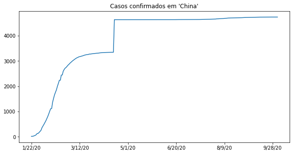
    


```python
# exemplo ruim de manusear o eixo y
# aqui a mensagem ficou novamente diferente

# esse aqui esta tentando comparar o momento inicial com 1.386bi (populacao da xchina em 2017)
# aqui a mensagem eh novamente completamente diferente
# e pode ser uma mensagem ruim, ate mesmo errada. poderai ser uma doenca grave
# mas ao usarmos o eixo y com a populacao geral, fingimos que ela nao eh grave
# sendo que na realidade ESSE grafico nao POSSUI INFORMACAO NENHUMA sobre a gravidade
# da doenca

# pq? so tem caso confirmado. nao fala letalidade? nao fala incidencia?
# quais sao as provincias infectadas? sao de toda a china? e estou comparando com a
# populacao de toda a china. errado.

plt.figure(figsize=(10,5))
confirmed_by_country.loc["China"][2:].plot()
plt.title("Gráfico errado. Passa uma mensagem errada, com comparações injustas.")
plt.ylim(0, 1386000000)
plt.show()
```


    
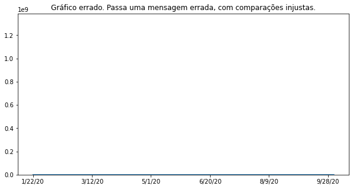
    


```python
plt.figure(figsize=(10,5))
plt.title("Casos novos em 'China'")
new_cases_mainland_china = confirmed_by_country.loc["China"][2:].diff().dropna()
new_cases_mainland_china.plot()
```


    <matplotlib.axes._subplots.AxesSubplot at 0x7fdb0c3d5710>


    
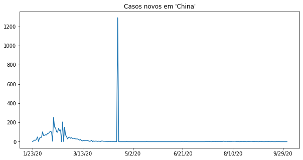
    


```python
# não faz sentido um gráfico cujo eixo X são categorias não ordenadas com um gráfico delinha
# dá pra ver no gráfico que... não dá para entendê-lo.... por isso vamos tentar em breve
# melhorá-lo

plt.figure(figsize=(10,5))

confirmed_by_country[last_date].plot()
plt.title("Confirmados por país")
```


    Text(0.5, 1.0, 'Confirmados por país')


    
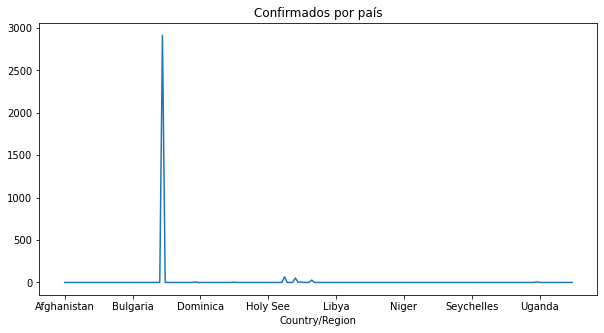
    


```python
plt.figure(figsize=(10,5))

# 99.99% das vezes não devemos usar grafico de pizza e torta
# "se o nome do gráfico tem comida no meio, não use" (boa pratica)

# 1. muitas categorias inviavel
# 2. poucas categorias, a comparacao eh de area!!!


# ah, mas cai no 0.01% que eh pra usar torta/pizza
# não, não caiu. pense novamente. se acredita que sim. pense novamente
# se acrdita que sim, assuma os riscos

confirmed_by_country[last_date].plot(kind='pie')
plt.title("Confirmados por país")
plt.show()
```


    
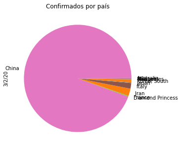
    


```python
# melhorando, mas ainda não ideal

plt.figure(figsize=(10,5))

confirmed_by_country[last_date].plot(kind='bar')
plt.title("Confirmados por país")
plt.show()
```


    
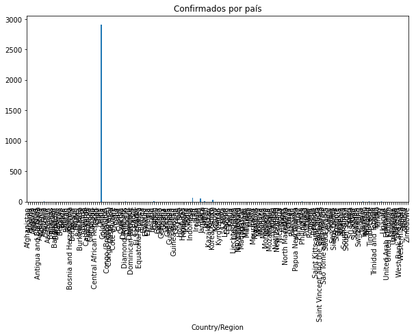
    


```python
# melhor, mas ainda não ideal

plt.figure(figsize=(10,5))

confirmed_by_country[last_date].sort_values(ascending=False).plot(kind='bar')
plt.title("Confirmados por país")
plt.show()
```


    
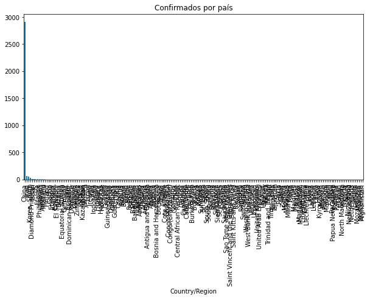
    


```python
# opa... chegamos em algo que já ficou útil para destacar o epicentro

plt.figure(figsize=(10,5))

confirmed_by_country[last_date].sort_values(ascending=False)[:10].plot(kind='bar')
plt.title("Confirmados por país")
plt.show()
```


    

    


```python
# aqui já vira uma comparação entre os países fora do epicentro

plt.figure(figsize=(10,5))

confirmed_by_country[last_date].sort_values(ascending=False)[1:10].plot(kind='bar')
plt.title("Confirmados por país (amostra de 10 países)")
plt.show()

# Lembrando que existe um vicio aqui pois paises que não testaram individuos
# podem sim ter casos ocorrendo mas não confirmados ainda.
```


    
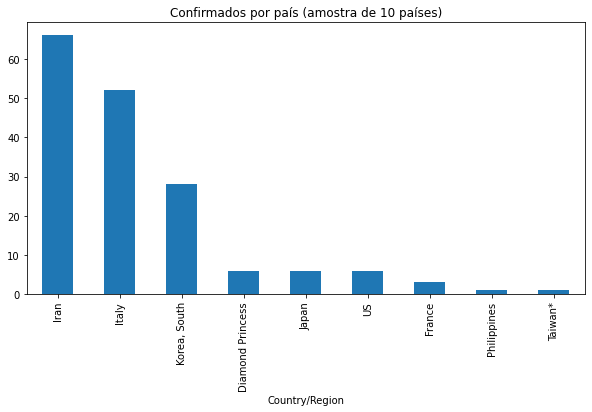
    


```python
deaths = pd.read_csv("https://raw.githubusercontent.com/CSSEGISandData/COVID-19/master/csse_covid_19_data/csse_covid_19_time_series/time_series_covid19_deaths_global.csv")
recovered = pd.read_csv("https://raw.githubusercontent.com/CSSEGISandData/COVID-19/master/csse_covid_19_data/csse_covid_19_time_series/time_series_covid19_recovered_global.csv")

display(deaths.head())
display(recovered.head())
```


<div>

<table border="1" class="dataframe">
  <thead>
    <tr style="text-align: right;">
      <th></th>
      <th>Province/State</th>
      <th>Country/Region</th>
      <th>Lat</th>
      <th>Long</th>
      <th>1/22/20</th>
      <th>1/23/20</th>
      <th>1/24/20</th>
      <th>1/25/20</th>
      <th>1/26/20</th>
      <th>1/27/20</th>
      <th>1/28/20</th>
      <th>1/29/20</th>
      <th>1/30/20</th>
      <th>1/31/20</th>
      <th>2/1/20</th>
      <th>2/2/20</th>
      <th>2/3/20</th>
      <th>2/4/20</th>
      <th>2/5/20</th>
      <th>2/6/20</th>
      <th>2/7/20</th>
      <th>2/8/20</th>
      <th>2/9/20</th>
      <th>2/10/20</th>
      <th>2/11/20</th>
      <th>2/12/20</th>
      <th>2/13/20</th>
      <th>2/14/20</th>
      <th>2/15/20</th>
      <th>2/16/20</th>
      <th>2/17/20</th>
      <th>2/18/20</th>
      <th>2/19/20</th>
      <th>2/20/20</th>
      <th>2/21/20</th>
      <th>2/22/20</th>
      <th>2/23/20</th>
      <th>2/24/20</th>
      <th>2/25/20</th>
      <th>2/26/20</th>
      <th>...</th>
      <th>8/25/20</th>
      <th>8/26/20</th>
      <th>8/27/20</th>
      <th>8/28/20</th>
      <th>8/29/20</th>
      <th>8/30/20</th>
      <th>8/31/20</th>
      <th>9/1/20</th>
      <th>9/2/20</th>
      <th>9/3/20</th>
      <th>9/4/20</th>
      <th>9/5/20</th>
      <th>9/6/20</th>
      <th>9/7/20</th>
      <th>9/8/20</th>
      <th>9/9/20</th>
      <th>9/10/20</th>
      <th>9/11/20</th>
      <th>9/12/20</th>
      <th>9/13/20</th>
      <th>9/14/20</th>
      <th>9/15/20</th>
      <th>9/16/20</th>
      <th>9/17/20</th>
      <th>9/18/20</th>
      <th>9/19/20</th>
      <th>9/20/20</th>
      <th>9/21/20</th>
      <th>9/22/20</th>
      <th>9/23/20</th>
      <th>9/24/20</th>
      <th>9/25/20</th>
      <th>9/26/20</th>
      <th>9/27/20</th>
      <th>9/28/20</th>
      <th>9/29/20</th>
      <th>9/30/20</th>
      <th>10/1/20</th>
      <th>10/2/20</th>
      <th>10/3/20</th>
    </tr>
  </thead>
  <tbody>
    <tr>
      <th>0</th>
      <td>NaN</td>
      <td>Afghanistan</td>
      <td>33.93911</td>
      <td>67.709953</td>
      <td>0</td>
      <td>0</td>
      <td>0</td>
      <td>0</td>
      <td>0</td>
      <td>0</td>
      <td>0</td>
      <td>0</td>
      <td>0</td>
      <td>0</td>
      <td>0</td>
      <td>0</td>
      <td>0</td>
      <td>0</td>
      <td>0</td>
      <td>0</td>
      <td>0</td>
      <td>0</td>
      <td>0</td>
      <td>0</td>
      <td>0</td>
      <td>0</td>
      <td>0</td>
      <td>0</td>
      <td>0</td>
      <td>0</td>
      <td>0</td>
      <td>0</td>
      <td>0</td>
      <td>0</td>
      <td>0</td>
      <td>0</td>
      <td>0</td>
      <td>0</td>
      <td>0</td>
      <td>0</td>
      <td>...</td>
      <td>1397</td>
      <td>1401</td>
      <td>1401</td>
      <td>1402</td>
      <td>1402</td>
      <td>1402</td>
      <td>1402</td>
      <td>1406</td>
      <td>1409</td>
      <td>1409</td>
      <td>1409</td>
      <td>1409</td>
      <td>1412</td>
      <td>1415</td>
      <td>1418</td>
      <td>1420</td>
      <td>1420</td>
      <td>1420</td>
      <td>1420</td>
      <td>1420</td>
      <td>1425</td>
      <td>1426</td>
      <td>1436</td>
      <td>1436</td>
      <td>1437</td>
      <td>1437</td>
      <td>1441</td>
      <td>1444</td>
      <td>1445</td>
      <td>1446</td>
      <td>1451</td>
      <td>1451</td>
      <td>1453</td>
      <td>1453</td>
      <td>1455</td>
      <td>1458</td>
      <td>1458</td>
      <td>1458</td>
      <td>1458</td>
      <td>1462</td>
    </tr>
    <tr>
      <th>1</th>
      <td>NaN</td>
      <td>Albania</td>
      <td>41.15330</td>
      <td>20.168300</td>
      <td>0</td>
      <td>0</td>
      <td>0</td>
      <td>0</td>
      <td>0</td>
      <td>0</td>
      <td>0</td>
      <td>0</td>
      <td>0</td>
      <td>0</td>
      <td>0</td>
      <td>0</td>
      <td>0</td>
      <td>0</td>
      <td>0</td>
      <td>0</td>
      <td>0</td>
      <td>0</td>
      <td>0</td>
      <td>0</td>
      <td>0</td>
      <td>0</td>
      <td>0</td>
      <td>0</td>
      <td>0</td>
      <td>0</td>
      <td>0</td>
      <td>0</td>
      <td>0</td>
      <td>0</td>
      <td>0</td>
      <td>0</td>
      <td>0</td>
      <td>0</td>
      <td>0</td>
      <td>0</td>
      <td>...</td>
      <td>259</td>
      <td>263</td>
      <td>266</td>
      <td>271</td>
      <td>275</td>
      <td>280</td>
      <td>284</td>
      <td>290</td>
      <td>296</td>
      <td>301</td>
      <td>306</td>
      <td>312</td>
      <td>316</td>
      <td>319</td>
      <td>321</td>
      <td>322</td>
      <td>324</td>
      <td>327</td>
      <td>330</td>
      <td>334</td>
      <td>338</td>
      <td>340</td>
      <td>343</td>
      <td>347</td>
      <td>353</td>
      <td>358</td>
      <td>362</td>
      <td>364</td>
      <td>367</td>
      <td>370</td>
      <td>370</td>
      <td>373</td>
      <td>375</td>
      <td>377</td>
      <td>380</td>
      <td>384</td>
      <td>387</td>
      <td>388</td>
      <td>389</td>
      <td>392</td>
    </tr>
    <tr>
      <th>2</th>
      <td>NaN</td>
      <td>Algeria</td>
      <td>28.03390</td>
      <td>1.659600</td>
      <td>0</td>
      <td>0</td>
      <td>0</td>
      <td>0</td>
      <td>0</td>
      <td>0</td>
      <td>0</td>
      <td>0</td>
      <td>0</td>
      <td>0</td>
      <td>0</td>
      <td>0</td>
      <td>0</td>
      <td>0</td>
      <td>0</td>
      <td>0</td>
      <td>0</td>
      <td>0</td>
      <td>0</td>
      <td>0</td>
      <td>0</td>
      <td>0</td>
      <td>0</td>
      <td>0</td>
      <td>0</td>
      <td>0</td>
      <td>0</td>
      <td>0</td>
      <td>0</td>
      <td>0</td>
      <td>0</td>
      <td>0</td>
      <td>0</td>
      <td>0</td>
      <td>0</td>
      <td>0</td>
      <td>...</td>
      <td>1456</td>
      <td>1465</td>
      <td>1475</td>
      <td>1483</td>
      <td>1491</td>
      <td>1501</td>
      <td>1510</td>
      <td>1518</td>
      <td>1523</td>
      <td>1529</td>
      <td>1539</td>
      <td>1549</td>
      <td>1556</td>
      <td>1562</td>
      <td>1571</td>
      <td>1581</td>
      <td>1591</td>
      <td>1599</td>
      <td>1605</td>
      <td>1612</td>
      <td>1620</td>
      <td>1632</td>
      <td>1645</td>
      <td>1654</td>
      <td>1659</td>
      <td>1665</td>
      <td>1672</td>
      <td>1679</td>
      <td>1689</td>
      <td>1698</td>
      <td>1703</td>
      <td>1707</td>
      <td>1711</td>
      <td>1714</td>
      <td>1719</td>
      <td>1726</td>
      <td>1736</td>
      <td>1741</td>
      <td>1749</td>
      <td>1756</td>
    </tr>
    <tr>
      <th>3</th>
      <td>NaN</td>
      <td>Andorra</td>
      <td>42.50630</td>
      <td>1.521800</td>
      <td>0</td>
      <td>0</td>
      <td>0</td>
      <td>0</td>
      <td>0</td>
      <td>0</td>
      <td>0</td>
      <td>0</td>
      <td>0</td>
      <td>0</td>
      <td>0</td>
      <td>0</td>
      <td>0</td>
      <td>0</td>
      <td>0</td>
      <td>0</td>
      <td>0</td>
      <td>0</td>
      <td>0</td>
      <td>0</td>
      <td>0</td>
      <td>0</td>
      <td>0</td>
      <td>0</td>
      <td>0</td>
      <td>0</td>
      <td>0</td>
      <td>0</td>
      <td>0</td>
      <td>0</td>
      <td>0</td>
      <td>0</td>
      <td>0</td>
      <td>0</td>
      <td>0</td>
      <td>0</td>
      <td>...</td>
      <td>53</td>
      <td>53</td>
      <td>53</td>
      <td>53</td>
      <td>53</td>
      <td>53</td>
      <td>53</td>
      <td>53</td>
      <td>53</td>
      <td>53</td>
      <td>53</td>
      <td>53</td>
      <td>53</td>
      <td>53</td>
      <td>53</td>
      <td>53</td>
      <td>53</td>
      <td>53</td>
      <td>53</td>
      <td>53</td>
      <td>53</td>
      <td>53</td>
      <td>53</td>
      <td>53</td>
      <td>53</td>
      <td>53</td>
      <td>53</td>
      <td>53</td>
      <td>53</td>
      <td>53</td>
      <td>53</td>
      <td>53</td>
      <td>53</td>
      <td>53</td>
      <td>53</td>
      <td>53</td>
      <td>53</td>
      <td>53</td>
      <td>53</td>
      <td>53</td>
    </tr>
    <tr>
      <th>4</th>
      <td>NaN</td>
      <td>Angola</td>
      <td>-11.20270</td>
      <td>17.873900</td>
      <td>0</td>
      <td>0</td>
      <td>0</td>
      <td>0</td>
      <td>0</td>
      <td>0</td>
      <td>0</td>
      <td>0</td>
      <td>0</td>
      <td>0</td>
      <td>0</td>
      <td>0</td>
      <td>0</td>
      <td>0</td>
      <td>0</td>
      <td>0</td>
      <td>0</td>
      <td>0</td>
      <td>0</td>
      <td>0</td>
      <td>0</td>
      <td>0</td>
      <td>0</td>
      <td>0</td>
      <td>0</td>
      <td>0</td>
      <td>0</td>
      <td>0</td>
      <td>0</td>
      <td>0</td>
      <td>0</td>
      <td>0</td>
      <td>0</td>
      <td>0</td>
      <td>0</td>
      <td>0</td>
      <td>...</td>
      <td>102</td>
      <td>103</td>
      <td>105</td>
      <td>106</td>
      <td>107</td>
      <td>107</td>
      <td>108</td>
      <td>109</td>
      <td>112</td>
      <td>113</td>
      <td>115</td>
      <td>117</td>
      <td>117</td>
      <td>120</td>
      <td>124</td>
      <td>126</td>
      <td>130</td>
      <td>131</td>
      <td>132</td>
      <td>134</td>
      <td>136</td>
      <td>139</td>
      <td>143</td>
      <td>144</td>
      <td>147</td>
      <td>147</td>
      <td>152</td>
      <td>154</td>
      <td>155</td>
      <td>159</td>
      <td>162</td>
      <td>167</td>
      <td>171</td>
      <td>174</td>
      <td>176</td>
      <td>179</td>
      <td>183</td>
      <td>185</td>
      <td>189</td>
      <td>193</td>
    </tr>
  </tbody>
</table>
<p>5 rows × 260 columns</p>
</div>


<div>

<table border="1" class="dataframe">
  <thead>
    <tr style="text-align: right;">
      <th></th>
      <th>Province/State</th>
      <th>Country/Region</th>
      <th>Lat</th>
      <th>Long</th>
      <th>1/22/20</th>
      <th>1/23/20</th>
      <th>1/24/20</th>
      <th>1/25/20</th>
      <th>1/26/20</th>
      <th>1/27/20</th>
      <th>1/28/20</th>
      <th>1/29/20</th>
      <th>1/30/20</th>
      <th>1/31/20</th>
      <th>2/1/20</th>
      <th>2/2/20</th>
      <th>2/3/20</th>
      <th>2/4/20</th>
      <th>2/5/20</th>
      <th>2/6/20</th>
      <th>2/7/20</th>
      <th>2/8/20</th>
      <th>2/9/20</th>
      <th>2/10/20</th>
      <th>2/11/20</th>
      <th>2/12/20</th>
      <th>2/13/20</th>
      <th>2/14/20</th>
      <th>2/15/20</th>
      <th>2/16/20</th>
      <th>2/17/20</th>
      <th>2/18/20</th>
      <th>2/19/20</th>
      <th>2/20/20</th>
      <th>2/21/20</th>
      <th>2/22/20</th>
      <th>2/23/20</th>
      <th>2/24/20</th>
      <th>2/25/20</th>
      <th>2/26/20</th>
      <th>...</th>
      <th>8/25/20</th>
      <th>8/26/20</th>
      <th>8/27/20</th>
      <th>8/28/20</th>
      <th>8/29/20</th>
      <th>8/30/20</th>
      <th>8/31/20</th>
      <th>9/1/20</th>
      <th>9/2/20</th>
      <th>9/3/20</th>
      <th>9/4/20</th>
      <th>9/5/20</th>
      <th>9/6/20</th>
      <th>9/7/20</th>
      <th>9/8/20</th>
      <th>9/9/20</th>
      <th>9/10/20</th>
      <th>9/11/20</th>
      <th>9/12/20</th>
      <th>9/13/20</th>
      <th>9/14/20</th>
      <th>9/15/20</th>
      <th>9/16/20</th>
      <th>9/17/20</th>
      <th>9/18/20</th>
      <th>9/19/20</th>
      <th>9/20/20</th>
      <th>9/21/20</th>
      <th>9/22/20</th>
      <th>9/23/20</th>
      <th>9/24/20</th>
      <th>9/25/20</th>
      <th>9/26/20</th>
      <th>9/27/20</th>
      <th>9/28/20</th>
      <th>9/29/20</th>
      <th>9/30/20</th>
      <th>10/1/20</th>
      <th>10/2/20</th>
      <th>10/3/20</th>
    </tr>
  </thead>
  <tbody>
    <tr>
      <th>0</th>
      <td>NaN</td>
      <td>Afghanistan</td>
      <td>33.93911</td>
      <td>67.709953</td>
      <td>0</td>
      <td>0</td>
      <td>0</td>
      <td>0</td>
      <td>0</td>
      <td>0</td>
      <td>0</td>
      <td>0</td>
      <td>0</td>
      <td>0</td>
      <td>0</td>
      <td>0</td>
      <td>0</td>
      <td>0</td>
      <td>0</td>
      <td>0</td>
      <td>0</td>
      <td>0</td>
      <td>0</td>
      <td>0</td>
      <td>0</td>
      <td>0</td>
      <td>0</td>
      <td>0</td>
      <td>0</td>
      <td>0</td>
      <td>0</td>
      <td>0</td>
      <td>0</td>
      <td>0</td>
      <td>0</td>
      <td>0</td>
      <td>0</td>
      <td>0</td>
      <td>0</td>
      <td>0</td>
      <td>...</td>
      <td>28440</td>
      <td>29042</td>
      <td>29046</td>
      <td>29059</td>
      <td>29063</td>
      <td>29089</td>
      <td>29089</td>
      <td>29231</td>
      <td>29315</td>
      <td>29390</td>
      <td>29713</td>
      <td>30082</td>
      <td>30537</td>
      <td>30557</td>
      <td>30715</td>
      <td>31048</td>
      <td>31129</td>
      <td>31154</td>
      <td>31234</td>
      <td>31638</td>
      <td>32073</td>
      <td>32098</td>
      <td>32503</td>
      <td>32505</td>
      <td>32576</td>
      <td>32576</td>
      <td>32576</td>
      <td>32576</td>
      <td>32576</td>
      <td>32610</td>
      <td>32619</td>
      <td>32619</td>
      <td>32635</td>
      <td>32642</td>
      <td>32642</td>
      <td>32746</td>
      <td>32789</td>
      <td>32842</td>
      <td>32842</td>
      <td>32842</td>
    </tr>
    <tr>
      <th>1</th>
      <td>NaN</td>
      <td>Albania</td>
      <td>41.15330</td>
      <td>20.168300</td>
      <td>0</td>
      <td>0</td>
      <td>0</td>
      <td>0</td>
      <td>0</td>
      <td>0</td>
      <td>0</td>
      <td>0</td>
      <td>0</td>
      <td>0</td>
      <td>0</td>
      <td>0</td>
      <td>0</td>
      <td>0</td>
      <td>0</td>
      <td>0</td>
      <td>0</td>
      <td>0</td>
      <td>0</td>
      <td>0</td>
      <td>0</td>
      <td>0</td>
      <td>0</td>
      <td>0</td>
      <td>0</td>
      <td>0</td>
      <td>0</td>
      <td>0</td>
      <td>0</td>
      <td>0</td>
      <td>0</td>
      <td>0</td>
      <td>0</td>
      <td>0</td>
      <td>0</td>
      <td>0</td>
      <td>...</td>
      <td>4530</td>
      <td>4633</td>
      <td>4791</td>
      <td>4923</td>
      <td>5020</td>
      <td>5139</td>
      <td>5214</td>
      <td>5441</td>
      <td>5582</td>
      <td>5732</td>
      <td>5882</td>
      <td>5976</td>
      <td>6106</td>
      <td>6186</td>
      <td>6239</td>
      <td>6284</td>
      <td>6346</td>
      <td>6443</td>
      <td>6494</td>
      <td>6569</td>
      <td>6615</td>
      <td>6668</td>
      <td>6733</td>
      <td>6788</td>
      <td>6831</td>
      <td>6888</td>
      <td>6940</td>
      <td>6995</td>
      <td>7042</td>
      <td>7139</td>
      <td>7239</td>
      <td>7309</td>
      <td>7397</td>
      <td>7397</td>
      <td>7629</td>
      <td>7732</td>
      <td>7847</td>
      <td>8077</td>
      <td>8342</td>
      <td>8536</td>
    </tr>
    <tr>
      <th>2</th>
      <td>NaN</td>
      <td>Algeria</td>
      <td>28.03390</td>
      <td>1.659600</td>
      <td>0</td>
      <td>0</td>
      <td>0</td>
      <td>0</td>
      <td>0</td>
      <td>0</td>
      <td>0</td>
      <td>0</td>
      <td>0</td>
      <td>0</td>
      <td>0</td>
      <td>0</td>
      <td>0</td>
      <td>0</td>
      <td>0</td>
      <td>0</td>
      <td>0</td>
      <td>0</td>
      <td>0</td>
      <td>0</td>
      <td>0</td>
      <td>0</td>
      <td>0</td>
      <td>0</td>
      <td>0</td>
      <td>0</td>
      <td>0</td>
      <td>0</td>
      <td>0</td>
      <td>0</td>
      <td>0</td>
      <td>0</td>
      <td>0</td>
      <td>0</td>
      <td>0</td>
      <td>0</td>
      <td>...</td>
      <td>29587</td>
      <td>29886</td>
      <td>30157</td>
      <td>30436</td>
      <td>30717</td>
      <td>30978</td>
      <td>31244</td>
      <td>31493</td>
      <td>31746</td>
      <td>32006</td>
      <td>32259</td>
      <td>32481</td>
      <td>32745</td>
      <td>32985</td>
      <td>33183</td>
      <td>33379</td>
      <td>33562</td>
      <td>33723</td>
      <td>33875</td>
      <td>34037</td>
      <td>34204</td>
      <td>34385</td>
      <td>34517</td>
      <td>34675</td>
      <td>34818</td>
      <td>34923</td>
      <td>35047</td>
      <td>35180</td>
      <td>35307</td>
      <td>35428</td>
      <td>35544</td>
      <td>35654</td>
      <td>35756</td>
      <td>35860</td>
      <td>35962</td>
      <td>36063</td>
      <td>36174</td>
      <td>36282</td>
      <td>36385</td>
      <td>36482</td>
    </tr>
    <tr>
      <th>3</th>
      <td>NaN</td>
      <td>Andorra</td>
      <td>42.50630</td>
      <td>1.521800</td>
      <td>0</td>
      <td>0</td>
      <td>0</td>
      <td>0</td>
      <td>0</td>
      <td>0</td>
      <td>0</td>
      <td>0</td>
      <td>0</td>
      <td>0</td>
      <td>0</td>
      <td>0</td>
      <td>0</td>
      <td>0</td>
      <td>0</td>
      <td>0</td>
      <td>0</td>
      <td>0</td>
      <td>0</td>
      <td>0</td>
      <td>0</td>
      <td>0</td>
      <td>0</td>
      <td>0</td>
      <td>0</td>
      <td>0</td>
      <td>0</td>
      <td>0</td>
      <td>0</td>
      <td>0</td>
      <td>0</td>
      <td>0</td>
      <td>0</td>
      <td>0</td>
      <td>0</td>
      <td>0</td>
      <td>...</td>
      <td>877</td>
      <td>893</td>
      <td>893</td>
      <td>902</td>
      <td>902</td>
      <td>902</td>
      <td>908</td>
      <td>908</td>
      <td>909</td>
      <td>909</td>
      <td>928</td>
      <td>928</td>
      <td>928</td>
      <td>934</td>
      <td>934</td>
      <td>938</td>
      <td>938</td>
      <td>943</td>
      <td>943</td>
      <td>943</td>
      <td>945</td>
      <td>945</td>
      <td>1054</td>
      <td>1054</td>
      <td>1164</td>
      <td>1164</td>
      <td>1164</td>
      <td>1199</td>
      <td>1199</td>
      <td>1203</td>
      <td>1203</td>
      <td>1263</td>
      <td>1263</td>
      <td>1263</td>
      <td>1265</td>
      <td>1265</td>
      <td>1432</td>
      <td>1432</td>
      <td>1540</td>
      <td>1540</td>
    </tr>
    <tr>
      <th>4</th>
      <td>NaN</td>
      <td>Angola</td>
      <td>-11.20270</td>
      <td>17.873900</td>
      <td>0</td>
      <td>0</td>
      <td>0</td>
      <td>0</td>
      <td>0</td>
      <td>0</td>
      <td>0</td>
      <td>0</td>
      <td>0</td>
      <td>0</td>
      <td>0</td>
      <td>0</td>
      <td>0</td>
      <td>0</td>
      <td>0</td>
      <td>0</td>
      <td>0</td>
      <td>0</td>
      <td>0</td>
      <td>0</td>
      <td>0</td>
      <td>0</td>
      <td>0</td>
      <td>0</td>
      <td>0</td>
      <td>0</td>
      <td>0</td>
      <td>0</td>
      <td>0</td>
      <td>0</td>
      <td>0</td>
      <td>0</td>
      <td>0</td>
      <td>0</td>
      <td>0</td>
      <td>0</td>
      <td>...</td>
      <td>977</td>
      <td>977</td>
      <td>1335</td>
      <td>1028</td>
      <td>1041</td>
      <td>1063</td>
      <td>1071</td>
      <td>1084</td>
      <td>1115</td>
      <td>1144</td>
      <td>1167</td>
      <td>1192</td>
      <td>1198</td>
      <td>1215</td>
      <td>1215</td>
      <td>1245</td>
      <td>1277</td>
      <td>1288</td>
      <td>1289</td>
      <td>1301</td>
      <td>1324</td>
      <td>1332</td>
      <td>1401</td>
      <td>1405</td>
      <td>1443</td>
      <td>1445</td>
      <td>1445</td>
      <td>1449</td>
      <td>1462</td>
      <td>1473</td>
      <td>1503</td>
      <td>1554</td>
      <td>1639</td>
      <td>1707</td>
      <td>1813</td>
      <td>1833</td>
      <td>1941</td>
      <td>2082</td>
      <td>2215</td>
      <td>2436</td>
    </tr>
  </tbody>
</table>
<p>5 rows × 260 columns</p>
</div>


```python
def latest_by_country(data):
  return data.groupby("Country/Region").sum().iloc[:,-1]

display(latest_by_country(confirmed).head())
display(latest_by_country(deaths).head())
display(latest_by_country(recovered).head())
```


    Country/Region
    Afghanistan    1462
    Albania         392
    Algeria        1756
    Andorra          53
    Angola          193
    Name: 10/3/20, dtype: int64


    Country/Region
    Afghanistan    1462
    Albania         392
    Algeria        1756
    Andorra          53
    Angola          193
    Name: 10/3/20, dtype: int64


    Country/Region
    Afghanistan    32842
    Albania         8536
    Algeria        36482
    Andorra         1540
    Angola          2436
    Name: 10/3/20, dtype: int64


```python
informations = [latest_by_country(confirmed), latest_by_country(deaths), latest_by_country(recovered)]
combined = pd.concat(informations, axis=1)
combined.columns = ["confirmed", "deaths", "recovered"]
combined.head()
```


<div>

<table border="1" class="dataframe">
  <thead>
    <tr style="text-align: right;">
      <th></th>
      <th>confirmed</th>
      <th>deaths</th>
      <th>recovered</th>
    </tr>
    <tr>
      <th>Country/Region</th>
      <th></th>
      <th></th>
      <th></th>
    </tr>
  </thead>
  <tbody>
    <tr>
      <th>Afghanistan</th>
      <td>1462</td>
      <td>1462</td>
      <td>32842</td>
    </tr>
    <tr>
      <th>Albania</th>
      <td>392</td>
      <td>392</td>
      <td>8536</td>
    </tr>
    <tr>
      <th>Algeria</th>
      <td>1756</td>
      <td>1756</td>
      <td>36482</td>
    </tr>
    <tr>
      <th>Andorra</th>
      <td>53</td>
      <td>53</td>
      <td>1540</td>
    </tr>
    <tr>
      <th>Angola</th>
      <td>193</td>
      <td>193</td>
      <td>2436</td>
    </tr>
  </tbody>
</table>
</div>


```python
# taxa de letalidade é expressa em %
# o número de casos letais dentro dos casos que foram letais e não letais

# imagina que existe uma doença que em janeiro de 2020 afetou 100 pessoas
# 5 pessoas morreram (por exemplo). letalidade foi de 5%.
# não digo que ela É de 5% para sempre pq a doença continuou existindo

# conclusão é MUITO dificil de falar de letalidade tentando ser preciso
# durante uma epidemia

# no começo é comum que somente casos graves sejam reportados
```


```python
sum_up = combined.sum()
letality_rate_1 = sum_up["deaths"] / sum_up["confirmed"]
letality_rate_2 = sum_up["deaths"] / (sum_up["deaths"] + sum_up["recovered"])
print(letality_rate_1 * 100)
print(letality_rate_2 * 100)
```

    100.0
    4.080347995241541
    


```python
def latest_by_country_at(data, date):
  return data.groupby("Country/Region").sum()[date]


informations = [latest_by_country_at(confirmed, '2/20/20'), latest_by_country_at(deaths, '2/20/20'), latest_by_country_at(recovered, '2/20/20')]
combined_2_20_20 = pd.concat(informations, axis=1)
combined_2_20_20.columns = ["confirmed", "deaths", "recovered"]

sum_up = combined_2_20_20.loc["China"]
letality_rate_1 = sum_up["deaths"] / sum_up["confirmed"]
letality_rate_2 = sum_up["deaths"] / (sum_up["deaths"] + sum_up["recovered"])
print(letality_rate_1 * 100)
print(letality_rate_2 * 100)
```

    100.0
    11.050760418724076
    


```python
display(sum_up)
```


    confirmed     2238
    deaths        2238
    recovered    18014
    Name: China, dtype: int64


```python
informations = [latest_by_country_at(confirmed, '2/8/20'), latest_by_country_at(deaths, '2/20/20'), latest_by_country_at(recovered, '2/20/20')]
combined_12 = pd.concat(informations, axis=1)
combined_12.columns = ["confirmed", "deaths", "recovered"]

sum_up = combined_12.loc["China"]
letality_rate_3 = sum_up["deaths"] / sum_up["confirmed"]
print(letality_rate_3 * 100)
display(sum_up)
```

    278.0124223602484
    


    confirmed      805
    deaths        2238
    recovered    18014
    Name: China, dtype: int64


```python
letality_rate_1 = combined["deaths"] / combined["confirmed"] * 100
letality_rate_2 = combined["deaths"] / (combined["recovered"] + combined["deaths"]) * 100
combined["letality_rate_1"] = letality_rate_1
combined["letality_rate_2"] = letality_rate_2
combined.head()
```


<div>

<table border="1" class="dataframe">
  <thead>
    <tr style="text-align: right;">
      <th></th>
      <th>confirmed</th>
      <th>deaths</th>
      <th>recovered</th>
      <th>letality_rate_1</th>
      <th>letality_rate_2</th>
    </tr>
    <tr>
      <th>Country/Region</th>
      <th></th>
      <th></th>
      <th></th>
      <th></th>
      <th></th>
    </tr>
  </thead>
  <tbody>
    <tr>
      <th>Afghanistan</th>
      <td>1462</td>
      <td>1462</td>
      <td>32842</td>
      <td>100.0</td>
      <td>4.261894</td>
    </tr>
    <tr>
      <th>Albania</th>
      <td>392</td>
      <td>392</td>
      <td>8536</td>
      <td>100.0</td>
      <td>4.390681</td>
    </tr>
    <tr>
      <th>Algeria</th>
      <td>1756</td>
      <td>1756</td>
      <td>36482</td>
      <td>100.0</td>
      <td>4.592290</td>
    </tr>
    <tr>
      <th>Andorra</th>
      <td>53</td>
      <td>53</td>
      <td>1540</td>
      <td>100.0</td>
      <td>3.327056</td>
    </tr>
    <tr>
      <th>Angola</th>
      <td>193</td>
      <td>193</td>
      <td>2436</td>
      <td>100.0</td>
      <td>7.341194</td>
    </tr>
  </tbody>
</table>
</div>


```python
combined.sort_values("letality_rate_1", ascending=False).head(10)
```


<div>

<table border="1" class="dataframe">
  <thead>
    <tr style="text-align: right;">
      <th></th>
      <th>confirmed</th>
      <th>deaths</th>
      <th>recovered</th>
      <th>letality_rate_1</th>
      <th>letality_rate_2</th>
    </tr>
    <tr>
      <th>Country/Region</th>
      <th></th>
      <th></th>
      <th></th>
      <th></th>
      <th></th>
    </tr>
  </thead>
  <tbody>
    <tr>
      <th>Afghanistan</th>
      <td>1462</td>
      <td>1462</td>
      <td>32842</td>
      <td>100.0</td>
      <td>4.261894</td>
    </tr>
    <tr>
      <th>Norway</th>
      <td>275</td>
      <td>275</td>
      <td>11190</td>
      <td>100.0</td>
      <td>2.398604</td>
    </tr>
    <tr>
      <th>Namibia</th>
      <td>123</td>
      <td>123</td>
      <td>9419</td>
      <td>100.0</td>
      <td>1.289038</td>
    </tr>
    <tr>
      <th>Nepal</th>
      <td>528</td>
      <td>528</td>
      <td>62740</td>
      <td>100.0</td>
      <td>0.834545</td>
    </tr>
    <tr>
      <th>Netherlands</th>
      <td>6503</td>
      <td>6503</td>
      <td>4305</td>
      <td>100.0</td>
      <td>60.168394</td>
    </tr>
    <tr>
      <th>New Zealand</th>
      <td>25</td>
      <td>25</td>
      <td>1788</td>
      <td>100.0</td>
      <td>1.378930</td>
    </tr>
    <tr>
      <th>Nicaragua</th>
      <td>151</td>
      <td>151</td>
      <td>2913</td>
      <td>100.0</td>
      <td>4.928198</td>
    </tr>
    <tr>
      <th>Niger</th>
      <td>69</td>
      <td>69</td>
      <td>1115</td>
      <td>100.0</td>
      <td>5.827703</td>
    </tr>
    <tr>
      <th>Nigeria</th>
      <td>1113</td>
      <td>1113</td>
      <td>50718</td>
      <td>100.0</td>
      <td>2.147364</td>
    </tr>
    <tr>
      <th>North Macedonia</th>
      <td>753</td>
      <td>753</td>
      <td>15264</td>
      <td>100.0</td>
      <td>4.701255</td>
    </tr>
  </tbody>
</table>
</div>


```python
# visualização horrenda

combined[["confirmed", "letality_rate_1"]].plot()
```


    <matplotlib.axes._subplots.AxesSubplot at 0x7fdb0c3f2d30>


    
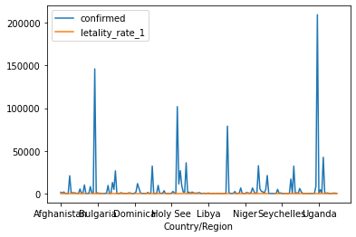
    


```python
# combined[["confirmed", "letality_rate_1"]].plot(kind='scatter')
```


```python
import seaborn as sns

sns.scatterplot(data = combined, x="confirmed", y="letality_rate_1")
```


    <matplotlib.axes._subplots.AxesSubplot at 0x7fdb0ad85cf8>


    

    


```python
sns.scatterplot(data = combined.query("confirmed > 40 and confirmed < 50000"), x="confirmed", y="letality_rate_1")

```


    <matplotlib.axes._subplots.AxesSubplot at 0x7fdaffa41198>


    
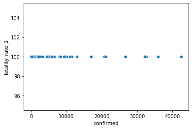
    


```python
sns.scatterplot(data = combined.query("confirmed > 40"), x="confirmed", y="letality_rate_1")
```


    <matplotlib.axes._subplots.AxesSubplot at 0x7fdaff9aee80>


    
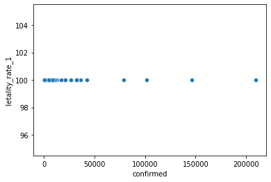
    


```python
sns.scatterplot(data = combined.query("recovered > 40"), x="confirmed", y="letality_rate_2")
```


    <matplotlib.axes._subplots.AxesSubplot at 0x7fdaff980240>


    
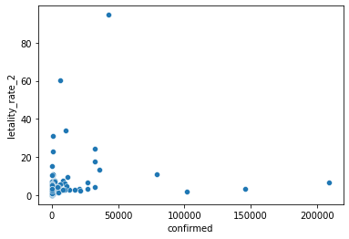
    


```python
sns.distplot(combined.query("confirmed > 40")["letality_rate_1"], kde=False)
```

    /usr/local/lib/python3.6/dist-packages/seaborn/distributions.py:2551: FutureWarning: `distplot` is a deprecated function and will be removed in a future version. Please adapt your code to use either `displot` (a figure-level function with similar flexibility) or `histplot` (an axes-level function for histograms).
      warnings.warn(msg, FutureWarning)
    


    <matplotlib.axes._subplots.AxesSubplot at 0x7fdaffa219e8>


    
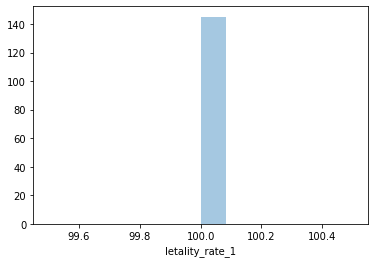
    


```python
# grafico nao faz sentido pois so tem 3 pontos ainda

sns.distplot(combined.query("recovered > 40")["letality_rate_2"], kde=False)
```

    /usr/local/lib/python3.6/dist-packages/seaborn/distributions.py:2551: FutureWarning: `distplot` is a deprecated function and will be removed in a future version. Please adapt your code to use either `displot` (a figure-level function with similar flexibility) or `histplot` (an axes-level function for histograms).
      warnings.warn(msg, FutureWarning)
    


    <matplotlib.axes._subplots.AxesSubplot at 0x7fdaff8b4da0>


    
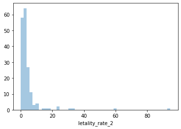
    


```python
combined.sort_values("letality_rate_1", ascending=False).query("confirmed > 40").head(10)
```


<div>

<table border="1" class="dataframe">
  <thead>
    <tr style="text-align: right;">
      <th></th>
      <th>confirmed</th>
      <th>deaths</th>
      <th>recovered</th>
      <th>letality_rate_1</th>
      <th>letality_rate_2</th>
    </tr>
    <tr>
      <th>Country/Region</th>
      <th></th>
      <th></th>
      <th></th>
      <th></th>
      <th></th>
    </tr>
  </thead>
  <tbody>
    <tr>
      <th>Afghanistan</th>
      <td>1462</td>
      <td>1462</td>
      <td>32842</td>
      <td>100.0</td>
      <td>4.261894</td>
    </tr>
    <tr>
      <th>Norway</th>
      <td>275</td>
      <td>275</td>
      <td>11190</td>
      <td>100.0</td>
      <td>2.398604</td>
    </tr>
    <tr>
      <th>Namibia</th>
      <td>123</td>
      <td>123</td>
      <td>9419</td>
      <td>100.0</td>
      <td>1.289038</td>
    </tr>
    <tr>
      <th>Nepal</th>
      <td>528</td>
      <td>528</td>
      <td>62740</td>
      <td>100.0</td>
      <td>0.834545</td>
    </tr>
    <tr>
      <th>Netherlands</th>
      <td>6503</td>
      <td>6503</td>
      <td>4305</td>
      <td>100.0</td>
      <td>60.168394</td>
    </tr>
    <tr>
      <th>Nicaragua</th>
      <td>151</td>
      <td>151</td>
      <td>2913</td>
      <td>100.0</td>
      <td>4.928198</td>
    </tr>
    <tr>
      <th>Niger</th>
      <td>69</td>
      <td>69</td>
      <td>1115</td>
      <td>100.0</td>
      <td>5.827703</td>
    </tr>
    <tr>
      <th>Nigeria</th>
      <td>1113</td>
      <td>1113</td>
      <td>50718</td>
      <td>100.0</td>
      <td>2.147364</td>
    </tr>
    <tr>
      <th>North Macedonia</th>
      <td>753</td>
      <td>753</td>
      <td>15264</td>
      <td>100.0</td>
      <td>4.701255</td>
    </tr>
    <tr>
      <th>Oman</th>
      <td>935</td>
      <td>935</td>
      <td>88528</td>
      <td>100.0</td>
      <td>1.045125</td>
    </tr>
  </tbody>
</table>
</div>


```python
combined.sort_values("letality_rate_2", ascending=False).query("recovered > 40").head(10)
```


<div>

<table border="1" class="dataframe">
  <thead>
    <tr style="text-align: right;">
      <th></th>
      <th>confirmed</th>
      <th>deaths</th>
      <th>recovered</th>
      <th>letality_rate_1</th>
      <th>letality_rate_2</th>
    </tr>
    <tr>
      <th>Country/Region</th>
      <th></th>
      <th></th>
      <th></th>
      <th></th>
      <th></th>
    </tr>
  </thead>
  <tbody>
    <tr>
      <th>United Kingdom</th>
      <td>42407</td>
      <td>42407</td>
      <td>2396</td>
      <td>100.0</td>
      <td>94.652144</td>
    </tr>
    <tr>
      <th>Netherlands</th>
      <td>6503</td>
      <td>6503</td>
      <td>4305</td>
      <td>100.0</td>
      <td>60.168394</td>
    </tr>
    <tr>
      <th>Belgium</th>
      <td>10044</td>
      <td>10044</td>
      <td>19645</td>
      <td>100.0</td>
      <td>33.830712</td>
    </tr>
    <tr>
      <th>Yemen</th>
      <td>589</td>
      <td>589</td>
      <td>1320</td>
      <td>100.0</td>
      <td>30.853850</td>
    </tr>
    <tr>
      <th>France</th>
      <td>32171</td>
      <td>32171</td>
      <td>100281</td>
      <td>100.0</td>
      <td>24.288799</td>
    </tr>
    <tr>
      <th>Greece</th>
      <td>405</td>
      <td>405</td>
      <td>1347</td>
      <td>100.0</td>
      <td>23.116438</td>
    </tr>
    <tr>
      <th>Spain</th>
      <td>32086</td>
      <td>32086</td>
      <td>150376</td>
      <td>100.0</td>
      <td>17.585031</td>
    </tr>
    <tr>
      <th>Syria</th>
      <td>204</td>
      <td>204</td>
      <td>1143</td>
      <td>100.0</td>
      <td>15.144766</td>
    </tr>
    <tr>
      <th>Italy</th>
      <td>35968</td>
      <td>35968</td>
      <td>231217</td>
      <td>100.0</td>
      <td>13.461834</td>
    </tr>
    <tr>
      <th>Mexico</th>
      <td>78880</td>
      <td>78880</td>
      <td>637993</td>
      <td>100.0</td>
      <td>11.003344</td>
    </tr>
  </tbody>
</table>
</div>


# Segunda parte


```python
confirmed.set_index("Country/Region").loc["China"].sum().tail()
```


    9/29/20    4739
    9/30/20    4739
    10/1/20    4739
    10/2/20    4739
    10/3/20    4739
    dtype: object


```python
is_mainland = confirmed["Country/Region"] == "Mainland China"
is_mainland.head()
```


    0    False
    1    False
    2    False
    3    False
    4    False
    Name: Country/Region, dtype: bool


```python
confirmed["is_mainland_china"] = is_mainland
display(confirmed.head())
display(confirmed.tail())
```


<div>

<table border="1" class="dataframe">
  <thead>
    <tr style="text-align: right;">
      <th></th>
      <th>Province/State</th>
      <th>Country/Region</th>
      <th>Lat</th>
      <th>Long</th>
      <th>1/22/20</th>
      <th>1/23/20</th>
      <th>1/24/20</th>
      <th>1/25/20</th>
      <th>1/26/20</th>
      <th>1/27/20</th>
      <th>1/28/20</th>
      <th>1/29/20</th>
      <th>1/30/20</th>
      <th>1/31/20</th>
      <th>2/1/20</th>
      <th>2/2/20</th>
      <th>2/3/20</th>
      <th>2/4/20</th>
      <th>2/5/20</th>
      <th>2/6/20</th>
      <th>2/7/20</th>
      <th>2/8/20</th>
      <th>2/9/20</th>
      <th>2/10/20</th>
      <th>2/11/20</th>
      <th>2/12/20</th>
      <th>2/13/20</th>
      <th>2/14/20</th>
      <th>2/15/20</th>
      <th>2/16/20</th>
      <th>2/17/20</th>
      <th>2/18/20</th>
      <th>2/19/20</th>
      <th>2/20/20</th>
      <th>2/21/20</th>
      <th>2/22/20</th>
      <th>2/23/20</th>
      <th>2/24/20</th>
      <th>2/25/20</th>
      <th>2/26/20</th>
      <th>...</th>
      <th>8/26/20</th>
      <th>8/27/20</th>
      <th>8/28/20</th>
      <th>8/29/20</th>
      <th>8/30/20</th>
      <th>8/31/20</th>
      <th>9/1/20</th>
      <th>9/2/20</th>
      <th>9/3/20</th>
      <th>9/4/20</th>
      <th>9/5/20</th>
      <th>9/6/20</th>
      <th>9/7/20</th>
      <th>9/8/20</th>
      <th>9/9/20</th>
      <th>9/10/20</th>
      <th>9/11/20</th>
      <th>9/12/20</th>
      <th>9/13/20</th>
      <th>9/14/20</th>
      <th>9/15/20</th>
      <th>9/16/20</th>
      <th>9/17/20</th>
      <th>9/18/20</th>
      <th>9/19/20</th>
      <th>9/20/20</th>
      <th>9/21/20</th>
      <th>9/22/20</th>
      <th>9/23/20</th>
      <th>9/24/20</th>
      <th>9/25/20</th>
      <th>9/26/20</th>
      <th>9/27/20</th>
      <th>9/28/20</th>
      <th>9/29/20</th>
      <th>9/30/20</th>
      <th>10/1/20</th>
      <th>10/2/20</th>
      <th>10/3/20</th>
      <th>is_mainland_china</th>
    </tr>
  </thead>
  <tbody>
    <tr>
      <th>0</th>
      <td>NaN</td>
      <td>Afghanistan</td>
      <td>33.93911</td>
      <td>67.709953</td>
      <td>0</td>
      <td>0</td>
      <td>0</td>
      <td>0</td>
      <td>0</td>
      <td>0</td>
      <td>0</td>
      <td>0</td>
      <td>0</td>
      <td>0</td>
      <td>0</td>
      <td>0</td>
      <td>0</td>
      <td>0</td>
      <td>0</td>
      <td>0</td>
      <td>0</td>
      <td>0</td>
      <td>0</td>
      <td>0</td>
      <td>0</td>
      <td>0</td>
      <td>0</td>
      <td>0</td>
      <td>0</td>
      <td>0</td>
      <td>0</td>
      <td>0</td>
      <td>0</td>
      <td>0</td>
      <td>0</td>
      <td>0</td>
      <td>0</td>
      <td>0</td>
      <td>0</td>
      <td>0</td>
      <td>...</td>
      <td>1401</td>
      <td>1401</td>
      <td>1402</td>
      <td>1402</td>
      <td>1402</td>
      <td>1402</td>
      <td>1406</td>
      <td>1409</td>
      <td>1409</td>
      <td>1409</td>
      <td>1409</td>
      <td>1412</td>
      <td>1415</td>
      <td>1418</td>
      <td>1420</td>
      <td>1420</td>
      <td>1420</td>
      <td>1420</td>
      <td>1420</td>
      <td>1425</td>
      <td>1426</td>
      <td>1436</td>
      <td>1436</td>
      <td>1437</td>
      <td>1437</td>
      <td>1441</td>
      <td>1444</td>
      <td>1445</td>
      <td>1446</td>
      <td>1451</td>
      <td>1451</td>
      <td>1453</td>
      <td>1453</td>
      <td>1455</td>
      <td>1458</td>
      <td>1458</td>
      <td>1458</td>
      <td>1458</td>
      <td>1462</td>
      <td>False</td>
    </tr>
    <tr>
      <th>1</th>
      <td>NaN</td>
      <td>Albania</td>
      <td>41.15330</td>
      <td>20.168300</td>
      <td>0</td>
      <td>0</td>
      <td>0</td>
      <td>0</td>
      <td>0</td>
      <td>0</td>
      <td>0</td>
      <td>0</td>
      <td>0</td>
      <td>0</td>
      <td>0</td>
      <td>0</td>
      <td>0</td>
      <td>0</td>
      <td>0</td>
      <td>0</td>
      <td>0</td>
      <td>0</td>
      <td>0</td>
      <td>0</td>
      <td>0</td>
      <td>0</td>
      <td>0</td>
      <td>0</td>
      <td>0</td>
      <td>0</td>
      <td>0</td>
      <td>0</td>
      <td>0</td>
      <td>0</td>
      <td>0</td>
      <td>0</td>
      <td>0</td>
      <td>0</td>
      <td>0</td>
      <td>0</td>
      <td>...</td>
      <td>263</td>
      <td>266</td>
      <td>271</td>
      <td>275</td>
      <td>280</td>
      <td>284</td>
      <td>290</td>
      <td>296</td>
      <td>301</td>
      <td>306</td>
      <td>312</td>
      <td>316</td>
      <td>319</td>
      <td>321</td>
      <td>322</td>
      <td>324</td>
      <td>327</td>
      <td>330</td>
      <td>334</td>
      <td>338</td>
      <td>340</td>
      <td>343</td>
      <td>347</td>
      <td>353</td>
      <td>358</td>
      <td>362</td>
      <td>364</td>
      <td>367</td>
      <td>370</td>
      <td>370</td>
      <td>373</td>
      <td>375</td>
      <td>377</td>
      <td>380</td>
      <td>384</td>
      <td>387</td>
      <td>388</td>
      <td>389</td>
      <td>392</td>
      <td>False</td>
    </tr>
    <tr>
      <th>2</th>
      <td>NaN</td>
      <td>Algeria</td>
      <td>28.03390</td>
      <td>1.659600</td>
      <td>0</td>
      <td>0</td>
      <td>0</td>
      <td>0</td>
      <td>0</td>
      <td>0</td>
      <td>0</td>
      <td>0</td>
      <td>0</td>
      <td>0</td>
      <td>0</td>
      <td>0</td>
      <td>0</td>
      <td>0</td>
      <td>0</td>
      <td>0</td>
      <td>0</td>
      <td>0</td>
      <td>0</td>
      <td>0</td>
      <td>0</td>
      <td>0</td>
      <td>0</td>
      <td>0</td>
      <td>0</td>
      <td>0</td>
      <td>0</td>
      <td>0</td>
      <td>0</td>
      <td>0</td>
      <td>0</td>
      <td>0</td>
      <td>0</td>
      <td>0</td>
      <td>0</td>
      <td>0</td>
      <td>...</td>
      <td>1465</td>
      <td>1475</td>
      <td>1483</td>
      <td>1491</td>
      <td>1501</td>
      <td>1510</td>
      <td>1518</td>
      <td>1523</td>
      <td>1529</td>
      <td>1539</td>
      <td>1549</td>
      <td>1556</td>
      <td>1562</td>
      <td>1571</td>
      <td>1581</td>
      <td>1591</td>
      <td>1599</td>
      <td>1605</td>
      <td>1612</td>
      <td>1620</td>
      <td>1632</td>
      <td>1645</td>
      <td>1654</td>
      <td>1659</td>
      <td>1665</td>
      <td>1672</td>
      <td>1679</td>
      <td>1689</td>
      <td>1698</td>
      <td>1703</td>
      <td>1707</td>
      <td>1711</td>
      <td>1714</td>
      <td>1719</td>
      <td>1726</td>
      <td>1736</td>
      <td>1741</td>
      <td>1749</td>
      <td>1756</td>
      <td>False</td>
    </tr>
    <tr>
      <th>3</th>
      <td>NaN</td>
      <td>Andorra</td>
      <td>42.50630</td>
      <td>1.521800</td>
      <td>0</td>
      <td>0</td>
      <td>0</td>
      <td>0</td>
      <td>0</td>
      <td>0</td>
      <td>0</td>
      <td>0</td>
      <td>0</td>
      <td>0</td>
      <td>0</td>
      <td>0</td>
      <td>0</td>
      <td>0</td>
      <td>0</td>
      <td>0</td>
      <td>0</td>
      <td>0</td>
      <td>0</td>
      <td>0</td>
      <td>0</td>
      <td>0</td>
      <td>0</td>
      <td>0</td>
      <td>0</td>
      <td>0</td>
      <td>0</td>
      <td>0</td>
      <td>0</td>
      <td>0</td>
      <td>0</td>
      <td>0</td>
      <td>0</td>
      <td>0</td>
      <td>0</td>
      <td>0</td>
      <td>...</td>
      <td>53</td>
      <td>53</td>
      <td>53</td>
      <td>53</td>
      <td>53</td>
      <td>53</td>
      <td>53</td>
      <td>53</td>
      <td>53</td>
      <td>53</td>
      <td>53</td>
      <td>53</td>
      <td>53</td>
      <td>53</td>
      <td>53</td>
      <td>53</td>
      <td>53</td>
      <td>53</td>
      <td>53</td>
      <td>53</td>
      <td>53</td>
      <td>53</td>
      <td>53</td>
      <td>53</td>
      <td>53</td>
      <td>53</td>
      <td>53</td>
      <td>53</td>
      <td>53</td>
      <td>53</td>
      <td>53</td>
      <td>53</td>
      <td>53</td>
      <td>53</td>
      <td>53</td>
      <td>53</td>
      <td>53</td>
      <td>53</td>
      <td>53</td>
      <td>False</td>
    </tr>
    <tr>
      <th>4</th>
      <td>NaN</td>
      <td>Angola</td>
      <td>-11.20270</td>
      <td>17.873900</td>
      <td>0</td>
      <td>0</td>
      <td>0</td>
      <td>0</td>
      <td>0</td>
      <td>0</td>
      <td>0</td>
      <td>0</td>
      <td>0</td>
      <td>0</td>
      <td>0</td>
      <td>0</td>
      <td>0</td>
      <td>0</td>
      <td>0</td>
      <td>0</td>
      <td>0</td>
      <td>0</td>
      <td>0</td>
      <td>0</td>
      <td>0</td>
      <td>0</td>
      <td>0</td>
      <td>0</td>
      <td>0</td>
      <td>0</td>
      <td>0</td>
      <td>0</td>
      <td>0</td>
      <td>0</td>
      <td>0</td>
      <td>0</td>
      <td>0</td>
      <td>0</td>
      <td>0</td>
      <td>0</td>
      <td>...</td>
      <td>103</td>
      <td>105</td>
      <td>106</td>
      <td>107</td>
      <td>107</td>
      <td>108</td>
      <td>109</td>
      <td>112</td>
      <td>113</td>
      <td>115</td>
      <td>117</td>
      <td>117</td>
      <td>120</td>
      <td>124</td>
      <td>126</td>
      <td>130</td>
      <td>131</td>
      <td>132</td>
      <td>134</td>
      <td>136</td>
      <td>139</td>
      <td>143</td>
      <td>144</td>
      <td>147</td>
      <td>147</td>
      <td>152</td>
      <td>154</td>
      <td>155</td>
      <td>159</td>
      <td>162</td>
      <td>167</td>
      <td>171</td>
      <td>174</td>
      <td>176</td>
      <td>179</td>
      <td>183</td>
      <td>185</td>
      <td>189</td>
      <td>193</td>
      <td>False</td>
    </tr>
  </tbody>
</table>
<p>5 rows × 261 columns</p>
</div>


<div>

<table border="1" class="dataframe">
  <thead>
    <tr style="text-align: right;">
      <th></th>
      <th>Province/State</th>
      <th>Country/Region</th>
      <th>Lat</th>
      <th>Long</th>
      <th>1/22/20</th>
      <th>1/23/20</th>
      <th>1/24/20</th>
      <th>1/25/20</th>
      <th>1/26/20</th>
      <th>1/27/20</th>
      <th>1/28/20</th>
      <th>1/29/20</th>
      <th>1/30/20</th>
      <th>1/31/20</th>
      <th>2/1/20</th>
      <th>2/2/20</th>
      <th>2/3/20</th>
      <th>2/4/20</th>
      <th>2/5/20</th>
      <th>2/6/20</th>
      <th>2/7/20</th>
      <th>2/8/20</th>
      <th>2/9/20</th>
      <th>2/10/20</th>
      <th>2/11/20</th>
      <th>2/12/20</th>
      <th>2/13/20</th>
      <th>2/14/20</th>
      <th>2/15/20</th>
      <th>2/16/20</th>
      <th>2/17/20</th>
      <th>2/18/20</th>
      <th>2/19/20</th>
      <th>2/20/20</th>
      <th>2/21/20</th>
      <th>2/22/20</th>
      <th>2/23/20</th>
      <th>2/24/20</th>
      <th>2/25/20</th>
      <th>2/26/20</th>
      <th>...</th>
      <th>8/26/20</th>
      <th>8/27/20</th>
      <th>8/28/20</th>
      <th>8/29/20</th>
      <th>8/30/20</th>
      <th>8/31/20</th>
      <th>9/1/20</th>
      <th>9/2/20</th>
      <th>9/3/20</th>
      <th>9/4/20</th>
      <th>9/5/20</th>
      <th>9/6/20</th>
      <th>9/7/20</th>
      <th>9/8/20</th>
      <th>9/9/20</th>
      <th>9/10/20</th>
      <th>9/11/20</th>
      <th>9/12/20</th>
      <th>9/13/20</th>
      <th>9/14/20</th>
      <th>9/15/20</th>
      <th>9/16/20</th>
      <th>9/17/20</th>
      <th>9/18/20</th>
      <th>9/19/20</th>
      <th>9/20/20</th>
      <th>9/21/20</th>
      <th>9/22/20</th>
      <th>9/23/20</th>
      <th>9/24/20</th>
      <th>9/25/20</th>
      <th>9/26/20</th>
      <th>9/27/20</th>
      <th>9/28/20</th>
      <th>9/29/20</th>
      <th>9/30/20</th>
      <th>10/1/20</th>
      <th>10/2/20</th>
      <th>10/3/20</th>
      <th>is_mainland_china</th>
    </tr>
  </thead>
  <tbody>
    <tr>
      <th>261</th>
      <td>NaN</td>
      <td>West Bank and Gaza</td>
      <td>31.952200</td>
      <td>35.233200</td>
      <td>0</td>
      <td>0</td>
      <td>0</td>
      <td>0</td>
      <td>0</td>
      <td>0</td>
      <td>0</td>
      <td>0</td>
      <td>0</td>
      <td>0</td>
      <td>0</td>
      <td>0</td>
      <td>0</td>
      <td>0</td>
      <td>0</td>
      <td>0</td>
      <td>0</td>
      <td>0</td>
      <td>0</td>
      <td>0</td>
      <td>0</td>
      <td>0</td>
      <td>0</td>
      <td>0</td>
      <td>0</td>
      <td>0</td>
      <td>0</td>
      <td>0</td>
      <td>0</td>
      <td>0</td>
      <td>0</td>
      <td>0</td>
      <td>0</td>
      <td>0</td>
      <td>0</td>
      <td>0</td>
      <td>...</td>
      <td>137</td>
      <td>141</td>
      <td>145</td>
      <td>147</td>
      <td>152</td>
      <td>152</td>
      <td>159</td>
      <td>162</td>
      <td>167</td>
      <td>170</td>
      <td>177</td>
      <td>181</td>
      <td>184</td>
      <td>190</td>
      <td>192</td>
      <td>198</td>
      <td>204</td>
      <td>210</td>
      <td>221</td>
      <td>226</td>
      <td>229</td>
      <td>243</td>
      <td>244</td>
      <td>250</td>
      <td>253</td>
      <td>262</td>
      <td>265</td>
      <td>269</td>
      <td>272</td>
      <td>274</td>
      <td>278</td>
      <td>285</td>
      <td>291</td>
      <td>299</td>
      <td>306</td>
      <td>311</td>
      <td>318</td>
      <td>321</td>
      <td>329</td>
      <td>False</td>
    </tr>
    <tr>
      <th>262</th>
      <td>NaN</td>
      <td>Western Sahara</td>
      <td>24.215500</td>
      <td>-12.885800</td>
      <td>0</td>
      <td>0</td>
      <td>0</td>
      <td>0</td>
      <td>0</td>
      <td>0</td>
      <td>0</td>
      <td>0</td>
      <td>0</td>
      <td>0</td>
      <td>0</td>
      <td>0</td>
      <td>0</td>
      <td>0</td>
      <td>0</td>
      <td>0</td>
      <td>0</td>
      <td>0</td>
      <td>0</td>
      <td>0</td>
      <td>0</td>
      <td>0</td>
      <td>0</td>
      <td>0</td>
      <td>0</td>
      <td>0</td>
      <td>0</td>
      <td>0</td>
      <td>0</td>
      <td>0</td>
      <td>0</td>
      <td>0</td>
      <td>0</td>
      <td>0</td>
      <td>0</td>
      <td>0</td>
      <td>...</td>
      <td>1</td>
      <td>1</td>
      <td>1</td>
      <td>1</td>
      <td>1</td>
      <td>1</td>
      <td>1</td>
      <td>1</td>
      <td>1</td>
      <td>1</td>
      <td>1</td>
      <td>1</td>
      <td>1</td>
      <td>1</td>
      <td>1</td>
      <td>1</td>
      <td>1</td>
      <td>1</td>
      <td>1</td>
      <td>1</td>
      <td>1</td>
      <td>1</td>
      <td>1</td>
      <td>1</td>
      <td>1</td>
      <td>1</td>
      <td>1</td>
      <td>1</td>
      <td>1</td>
      <td>1</td>
      <td>1</td>
      <td>1</td>
      <td>1</td>
      <td>1</td>
      <td>1</td>
      <td>1</td>
      <td>1</td>
      <td>1</td>
      <td>1</td>
      <td>False</td>
    </tr>
    <tr>
      <th>263</th>
      <td>NaN</td>
      <td>Yemen</td>
      <td>15.552727</td>
      <td>48.516388</td>
      <td>0</td>
      <td>0</td>
      <td>0</td>
      <td>0</td>
      <td>0</td>
      <td>0</td>
      <td>0</td>
      <td>0</td>
      <td>0</td>
      <td>0</td>
      <td>0</td>
      <td>0</td>
      <td>0</td>
      <td>0</td>
      <td>0</td>
      <td>0</td>
      <td>0</td>
      <td>0</td>
      <td>0</td>
      <td>0</td>
      <td>0</td>
      <td>0</td>
      <td>0</td>
      <td>0</td>
      <td>0</td>
      <td>0</td>
      <td>0</td>
      <td>0</td>
      <td>0</td>
      <td>0</td>
      <td>0</td>
      <td>0</td>
      <td>0</td>
      <td>0</td>
      <td>0</td>
      <td>0</td>
      <td>...</td>
      <td>560</td>
      <td>562</td>
      <td>563</td>
      <td>563</td>
      <td>564</td>
      <td>566</td>
      <td>570</td>
      <td>571</td>
      <td>571</td>
      <td>572</td>
      <td>572</td>
      <td>572</td>
      <td>573</td>
      <td>576</td>
      <td>576</td>
      <td>580</td>
      <td>582</td>
      <td>582</td>
      <td>583</td>
      <td>583</td>
      <td>583</td>
      <td>583</td>
      <td>585</td>
      <td>585</td>
      <td>585</td>
      <td>586</td>
      <td>586</td>
      <td>586</td>
      <td>586</td>
      <td>586</td>
      <td>587</td>
      <td>587</td>
      <td>587</td>
      <td>587</td>
      <td>587</td>
      <td>587</td>
      <td>587</td>
      <td>589</td>
      <td>589</td>
      <td>False</td>
    </tr>
    <tr>
      <th>264</th>
      <td>NaN</td>
      <td>Zambia</td>
      <td>-13.133897</td>
      <td>27.849332</td>
      <td>0</td>
      <td>0</td>
      <td>0</td>
      <td>0</td>
      <td>0</td>
      <td>0</td>
      <td>0</td>
      <td>0</td>
      <td>0</td>
      <td>0</td>
      <td>0</td>
      <td>0</td>
      <td>0</td>
      <td>0</td>
      <td>0</td>
      <td>0</td>
      <td>0</td>
      <td>0</td>
      <td>0</td>
      <td>0</td>
      <td>0</td>
      <td>0</td>
      <td>0</td>
      <td>0</td>
      <td>0</td>
      <td>0</td>
      <td>0</td>
      <td>0</td>
      <td>0</td>
      <td>0</td>
      <td>0</td>
      <td>0</td>
      <td>0</td>
      <td>0</td>
      <td>0</td>
      <td>0</td>
      <td>...</td>
      <td>282</td>
      <td>282</td>
      <td>283</td>
      <td>284</td>
      <td>287</td>
      <td>288</td>
      <td>290</td>
      <td>292</td>
      <td>292</td>
      <td>292</td>
      <td>292</td>
      <td>295</td>
      <td>295</td>
      <td>297</td>
      <td>300</td>
      <td>300</td>
      <td>306</td>
      <td>312</td>
      <td>312</td>
      <td>320</td>
      <td>324</td>
      <td>326</td>
      <td>326</td>
      <td>329</td>
      <td>330</td>
      <td>330</td>
      <td>331</td>
      <td>331</td>
      <td>332</td>
      <td>332</td>
      <td>332</td>
      <td>332</td>
      <td>332</td>
      <td>332</td>
      <td>332</td>
      <td>332</td>
      <td>333</td>
      <td>333</td>
      <td>333</td>
      <td>False</td>
    </tr>
    <tr>
      <th>265</th>
      <td>NaN</td>
      <td>Zimbabwe</td>
      <td>-19.015438</td>
      <td>29.154857</td>
      <td>0</td>
      <td>0</td>
      <td>0</td>
      <td>0</td>
      <td>0</td>
      <td>0</td>
      <td>0</td>
      <td>0</td>
      <td>0</td>
      <td>0</td>
      <td>0</td>
      <td>0</td>
      <td>0</td>
      <td>0</td>
      <td>0</td>
      <td>0</td>
      <td>0</td>
      <td>0</td>
      <td>0</td>
      <td>0</td>
      <td>0</td>
      <td>0</td>
      <td>0</td>
      <td>0</td>
      <td>0</td>
      <td>0</td>
      <td>0</td>
      <td>0</td>
      <td>0</td>
      <td>0</td>
      <td>0</td>
      <td>0</td>
      <td>0</td>
      <td>0</td>
      <td>0</td>
      <td>0</td>
      <td>...</td>
      <td>179</td>
      <td>189</td>
      <td>195</td>
      <td>196</td>
      <td>196</td>
      <td>202</td>
      <td>203</td>
      <td>206</td>
      <td>206</td>
      <td>206</td>
      <td>206</td>
      <td>206</td>
      <td>210</td>
      <td>218</td>
      <td>222</td>
      <td>222</td>
      <td>224</td>
      <td>224</td>
      <td>224</td>
      <td>224</td>
      <td>224</td>
      <td>224</td>
      <td>224</td>
      <td>224</td>
      <td>225</td>
      <td>225</td>
      <td>225</td>
      <td>226</td>
      <td>227</td>
      <td>227</td>
      <td>227</td>
      <td>227</td>
      <td>227</td>
      <td>228</td>
      <td>228</td>
      <td>228</td>
      <td>228</td>
      <td>228</td>
      <td>228</td>
      <td>False</td>
    </tr>
  </tbody>
</table>
<p>5 rows × 261 columns</p>
</div>


```python
# query só de mainland china
confirmed.query("is_mainland_china")
```


<div>

<table border="1" class="dataframe">
  <thead>
    <tr style="text-align: right;">
      <th></th>
      <th>Province/State</th>
      <th>Country/Region</th>
      <th>Lat</th>
      <th>Long</th>
      <th>1/22/20</th>
      <th>1/23/20</th>
      <th>1/24/20</th>
      <th>1/25/20</th>
      <th>1/26/20</th>
      <th>1/27/20</th>
      <th>1/28/20</th>
      <th>1/29/20</th>
      <th>1/30/20</th>
      <th>1/31/20</th>
      <th>2/1/20</th>
      <th>2/2/20</th>
      <th>2/3/20</th>
      <th>2/4/20</th>
      <th>2/5/20</th>
      <th>2/6/20</th>
      <th>2/7/20</th>
      <th>2/8/20</th>
      <th>2/9/20</th>
      <th>2/10/20</th>
      <th>2/11/20</th>
      <th>2/12/20</th>
      <th>2/13/20</th>
      <th>2/14/20</th>
      <th>2/15/20</th>
      <th>2/16/20</th>
      <th>2/17/20</th>
      <th>2/18/20</th>
      <th>2/19/20</th>
      <th>2/20/20</th>
      <th>2/21/20</th>
      <th>2/22/20</th>
      <th>2/23/20</th>
      <th>2/24/20</th>
      <th>2/25/20</th>
      <th>2/26/20</th>
      <th>...</th>
      <th>8/26/20</th>
      <th>8/27/20</th>
      <th>8/28/20</th>
      <th>8/29/20</th>
      <th>8/30/20</th>
      <th>8/31/20</th>
      <th>9/1/20</th>
      <th>9/2/20</th>
      <th>9/3/20</th>
      <th>9/4/20</th>
      <th>9/5/20</th>
      <th>9/6/20</th>
      <th>9/7/20</th>
      <th>9/8/20</th>
      <th>9/9/20</th>
      <th>9/10/20</th>
      <th>9/11/20</th>
      <th>9/12/20</th>
      <th>9/13/20</th>
      <th>9/14/20</th>
      <th>9/15/20</th>
      <th>9/16/20</th>
      <th>9/17/20</th>
      <th>9/18/20</th>
      <th>9/19/20</th>
      <th>9/20/20</th>
      <th>9/21/20</th>
      <th>9/22/20</th>
      <th>9/23/20</th>
      <th>9/24/20</th>
      <th>9/25/20</th>
      <th>9/26/20</th>
      <th>9/27/20</th>
      <th>9/28/20</th>
      <th>9/29/20</th>
      <th>9/30/20</th>
      <th>10/1/20</th>
      <th>10/2/20</th>
      <th>10/3/20</th>
      <th>is_mainland_china</th>
    </tr>
  </thead>
  <tbody>
  </tbody>
</table>
<p>0 rows × 261 columns</p>
</div>


```python
confirmed.groupby("is_mainland_china").sum()[last_date].plot(kind='pie')
```


    <matplotlib.axes._subplots.AxesSubplot at 0x7fdaff72f240>


    
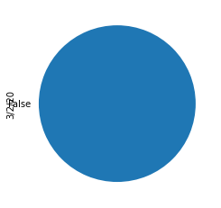
    


```python
confirmed.groupby("is_mainland_china").sum()[last_date].plot(kind='bar')
```


    <matplotlib.axes._subplots.AxesSubplot at 0x7fdaff6bc588>


    
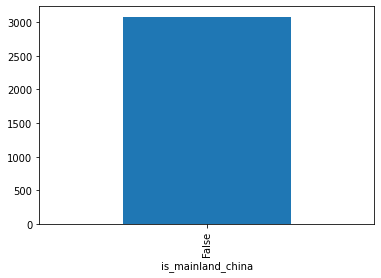
    


## No dia 02/03/2020 mainland china tinha 8 vezes o número de casos que o resto. Mas isso é até injusto pois estamos resumindo as informações e com isso, perdendo elas.

Mas olhar uma fotografia é muito limitado, queremos ver também como anda esse crescimento.


```python
import numpy as np

confirmed['is_mainland_china_label'] = np.where(confirmed["is_mainland_china"], 'Mainland China', 'Others')
display(confirmed.head())
display(confirmed.tail())
```


<div>

<table border="1" class="dataframe">
  <thead>
    <tr style="text-align: right;">
      <th></th>
      <th>Province/State</th>
      <th>Country/Region</th>
      <th>Lat</th>
      <th>Long</th>
      <th>1/22/20</th>
      <th>1/23/20</th>
      <th>1/24/20</th>
      <th>1/25/20</th>
      <th>1/26/20</th>
      <th>1/27/20</th>
      <th>1/28/20</th>
      <th>1/29/20</th>
      <th>1/30/20</th>
      <th>1/31/20</th>
      <th>2/1/20</th>
      <th>2/2/20</th>
      <th>2/3/20</th>
      <th>2/4/20</th>
      <th>2/5/20</th>
      <th>2/6/20</th>
      <th>2/7/20</th>
      <th>2/8/20</th>
      <th>2/9/20</th>
      <th>2/10/20</th>
      <th>2/11/20</th>
      <th>2/12/20</th>
      <th>2/13/20</th>
      <th>2/14/20</th>
      <th>2/15/20</th>
      <th>2/16/20</th>
      <th>2/17/20</th>
      <th>2/18/20</th>
      <th>2/19/20</th>
      <th>2/20/20</th>
      <th>2/21/20</th>
      <th>2/22/20</th>
      <th>2/23/20</th>
      <th>2/24/20</th>
      <th>2/25/20</th>
      <th>2/26/20</th>
      <th>...</th>
      <th>8/27/20</th>
      <th>8/28/20</th>
      <th>8/29/20</th>
      <th>8/30/20</th>
      <th>8/31/20</th>
      <th>9/1/20</th>
      <th>9/2/20</th>
      <th>9/3/20</th>
      <th>9/4/20</th>
      <th>9/5/20</th>
      <th>9/6/20</th>
      <th>9/7/20</th>
      <th>9/8/20</th>
      <th>9/9/20</th>
      <th>9/10/20</th>
      <th>9/11/20</th>
      <th>9/12/20</th>
      <th>9/13/20</th>
      <th>9/14/20</th>
      <th>9/15/20</th>
      <th>9/16/20</th>
      <th>9/17/20</th>
      <th>9/18/20</th>
      <th>9/19/20</th>
      <th>9/20/20</th>
      <th>9/21/20</th>
      <th>9/22/20</th>
      <th>9/23/20</th>
      <th>9/24/20</th>
      <th>9/25/20</th>
      <th>9/26/20</th>
      <th>9/27/20</th>
      <th>9/28/20</th>
      <th>9/29/20</th>
      <th>9/30/20</th>
      <th>10/1/20</th>
      <th>10/2/20</th>
      <th>10/3/20</th>
      <th>is_mainland_china</th>
      <th>is_mainland_china_label</th>
    </tr>
  </thead>
  <tbody>
    <tr>
      <th>0</th>
      <td>NaN</td>
      <td>Afghanistan</td>
      <td>33.93911</td>
      <td>67.709953</td>
      <td>0</td>
      <td>0</td>
      <td>0</td>
      <td>0</td>
      <td>0</td>
      <td>0</td>
      <td>0</td>
      <td>0</td>
      <td>0</td>
      <td>0</td>
      <td>0</td>
      <td>0</td>
      <td>0</td>
      <td>0</td>
      <td>0</td>
      <td>0</td>
      <td>0</td>
      <td>0</td>
      <td>0</td>
      <td>0</td>
      <td>0</td>
      <td>0</td>
      <td>0</td>
      <td>0</td>
      <td>0</td>
      <td>0</td>
      <td>0</td>
      <td>0</td>
      <td>0</td>
      <td>0</td>
      <td>0</td>
      <td>0</td>
      <td>0</td>
      <td>0</td>
      <td>0</td>
      <td>0</td>
      <td>...</td>
      <td>1401</td>
      <td>1402</td>
      <td>1402</td>
      <td>1402</td>
      <td>1402</td>
      <td>1406</td>
      <td>1409</td>
      <td>1409</td>
      <td>1409</td>
      <td>1409</td>
      <td>1412</td>
      <td>1415</td>
      <td>1418</td>
      <td>1420</td>
      <td>1420</td>
      <td>1420</td>
      <td>1420</td>
      <td>1420</td>
      <td>1425</td>
      <td>1426</td>
      <td>1436</td>
      <td>1436</td>
      <td>1437</td>
      <td>1437</td>
      <td>1441</td>
      <td>1444</td>
      <td>1445</td>
      <td>1446</td>
      <td>1451</td>
      <td>1451</td>
      <td>1453</td>
      <td>1453</td>
      <td>1455</td>
      <td>1458</td>
      <td>1458</td>
      <td>1458</td>
      <td>1458</td>
      <td>1462</td>
      <td>False</td>
      <td>Others</td>
    </tr>
    <tr>
      <th>1</th>
      <td>NaN</td>
      <td>Albania</td>
      <td>41.15330</td>
      <td>20.168300</td>
      <td>0</td>
      <td>0</td>
      <td>0</td>
      <td>0</td>
      <td>0</td>
      <td>0</td>
      <td>0</td>
      <td>0</td>
      <td>0</td>
      <td>0</td>
      <td>0</td>
      <td>0</td>
      <td>0</td>
      <td>0</td>
      <td>0</td>
      <td>0</td>
      <td>0</td>
      <td>0</td>
      <td>0</td>
      <td>0</td>
      <td>0</td>
      <td>0</td>
      <td>0</td>
      <td>0</td>
      <td>0</td>
      <td>0</td>
      <td>0</td>
      <td>0</td>
      <td>0</td>
      <td>0</td>
      <td>0</td>
      <td>0</td>
      <td>0</td>
      <td>0</td>
      <td>0</td>
      <td>0</td>
      <td>...</td>
      <td>266</td>
      <td>271</td>
      <td>275</td>
      <td>280</td>
      <td>284</td>
      <td>290</td>
      <td>296</td>
      <td>301</td>
      <td>306</td>
      <td>312</td>
      <td>316</td>
      <td>319</td>
      <td>321</td>
      <td>322</td>
      <td>324</td>
      <td>327</td>
      <td>330</td>
      <td>334</td>
      <td>338</td>
      <td>340</td>
      <td>343</td>
      <td>347</td>
      <td>353</td>
      <td>358</td>
      <td>362</td>
      <td>364</td>
      <td>367</td>
      <td>370</td>
      <td>370</td>
      <td>373</td>
      <td>375</td>
      <td>377</td>
      <td>380</td>
      <td>384</td>
      <td>387</td>
      <td>388</td>
      <td>389</td>
      <td>392</td>
      <td>False</td>
      <td>Others</td>
    </tr>
    <tr>
      <th>2</th>
      <td>NaN</td>
      <td>Algeria</td>
      <td>28.03390</td>
      <td>1.659600</td>
      <td>0</td>
      <td>0</td>
      <td>0</td>
      <td>0</td>
      <td>0</td>
      <td>0</td>
      <td>0</td>
      <td>0</td>
      <td>0</td>
      <td>0</td>
      <td>0</td>
      <td>0</td>
      <td>0</td>
      <td>0</td>
      <td>0</td>
      <td>0</td>
      <td>0</td>
      <td>0</td>
      <td>0</td>
      <td>0</td>
      <td>0</td>
      <td>0</td>
      <td>0</td>
      <td>0</td>
      <td>0</td>
      <td>0</td>
      <td>0</td>
      <td>0</td>
      <td>0</td>
      <td>0</td>
      <td>0</td>
      <td>0</td>
      <td>0</td>
      <td>0</td>
      <td>0</td>
      <td>0</td>
      <td>...</td>
      <td>1475</td>
      <td>1483</td>
      <td>1491</td>
      <td>1501</td>
      <td>1510</td>
      <td>1518</td>
      <td>1523</td>
      <td>1529</td>
      <td>1539</td>
      <td>1549</td>
      <td>1556</td>
      <td>1562</td>
      <td>1571</td>
      <td>1581</td>
      <td>1591</td>
      <td>1599</td>
      <td>1605</td>
      <td>1612</td>
      <td>1620</td>
      <td>1632</td>
      <td>1645</td>
      <td>1654</td>
      <td>1659</td>
      <td>1665</td>
      <td>1672</td>
      <td>1679</td>
      <td>1689</td>
      <td>1698</td>
      <td>1703</td>
      <td>1707</td>
      <td>1711</td>
      <td>1714</td>
      <td>1719</td>
      <td>1726</td>
      <td>1736</td>
      <td>1741</td>
      <td>1749</td>
      <td>1756</td>
      <td>False</td>
      <td>Others</td>
    </tr>
    <tr>
      <th>3</th>
      <td>NaN</td>
      <td>Andorra</td>
      <td>42.50630</td>
      <td>1.521800</td>
      <td>0</td>
      <td>0</td>
      <td>0</td>
      <td>0</td>
      <td>0</td>
      <td>0</td>
      <td>0</td>
      <td>0</td>
      <td>0</td>
      <td>0</td>
      <td>0</td>
      <td>0</td>
      <td>0</td>
      <td>0</td>
      <td>0</td>
      <td>0</td>
      <td>0</td>
      <td>0</td>
      <td>0</td>
      <td>0</td>
      <td>0</td>
      <td>0</td>
      <td>0</td>
      <td>0</td>
      <td>0</td>
      <td>0</td>
      <td>0</td>
      <td>0</td>
      <td>0</td>
      <td>0</td>
      <td>0</td>
      <td>0</td>
      <td>0</td>
      <td>0</td>
      <td>0</td>
      <td>0</td>
      <td>...</td>
      <td>53</td>
      <td>53</td>
      <td>53</td>
      <td>53</td>
      <td>53</td>
      <td>53</td>
      <td>53</td>
      <td>53</td>
      <td>53</td>
      <td>53</td>
      <td>53</td>
      <td>53</td>
      <td>53</td>
      <td>53</td>
      <td>53</td>
      <td>53</td>
      <td>53</td>
      <td>53</td>
      <td>53</td>
      <td>53</td>
      <td>53</td>
      <td>53</td>
      <td>53</td>
      <td>53</td>
      <td>53</td>
      <td>53</td>
      <td>53</td>
      <td>53</td>
      <td>53</td>
      <td>53</td>
      <td>53</td>
      <td>53</td>
      <td>53</td>
      <td>53</td>
      <td>53</td>
      <td>53</td>
      <td>53</td>
      <td>53</td>
      <td>False</td>
      <td>Others</td>
    </tr>
    <tr>
      <th>4</th>
      <td>NaN</td>
      <td>Angola</td>
      <td>-11.20270</td>
      <td>17.873900</td>
      <td>0</td>
      <td>0</td>
      <td>0</td>
      <td>0</td>
      <td>0</td>
      <td>0</td>
      <td>0</td>
      <td>0</td>
      <td>0</td>
      <td>0</td>
      <td>0</td>
      <td>0</td>
      <td>0</td>
      <td>0</td>
      <td>0</td>
      <td>0</td>
      <td>0</td>
      <td>0</td>
      <td>0</td>
      <td>0</td>
      <td>0</td>
      <td>0</td>
      <td>0</td>
      <td>0</td>
      <td>0</td>
      <td>0</td>
      <td>0</td>
      <td>0</td>
      <td>0</td>
      <td>0</td>
      <td>0</td>
      <td>0</td>
      <td>0</td>
      <td>0</td>
      <td>0</td>
      <td>0</td>
      <td>...</td>
      <td>105</td>
      <td>106</td>
      <td>107</td>
      <td>107</td>
      <td>108</td>
      <td>109</td>
      <td>112</td>
      <td>113</td>
      <td>115</td>
      <td>117</td>
      <td>117</td>
      <td>120</td>
      <td>124</td>
      <td>126</td>
      <td>130</td>
      <td>131</td>
      <td>132</td>
      <td>134</td>
      <td>136</td>
      <td>139</td>
      <td>143</td>
      <td>144</td>
      <td>147</td>
      <td>147</td>
      <td>152</td>
      <td>154</td>
      <td>155</td>
      <td>159</td>
      <td>162</td>
      <td>167</td>
      <td>171</td>
      <td>174</td>
      <td>176</td>
      <td>179</td>
      <td>183</td>
      <td>185</td>
      <td>189</td>
      <td>193</td>
      <td>False</td>
      <td>Others</td>
    </tr>
  </tbody>
</table>
<p>5 rows × 262 columns</p>
</div>


<div>

<table border="1" class="dataframe">
  <thead>
    <tr style="text-align: right;">
      <th></th>
      <th>Province/State</th>
      <th>Country/Region</th>
      <th>Lat</th>
      <th>Long</th>
      <th>1/22/20</th>
      <th>1/23/20</th>
      <th>1/24/20</th>
      <th>1/25/20</th>
      <th>1/26/20</th>
      <th>1/27/20</th>
      <th>1/28/20</th>
      <th>1/29/20</th>
      <th>1/30/20</th>
      <th>1/31/20</th>
      <th>2/1/20</th>
      <th>2/2/20</th>
      <th>2/3/20</th>
      <th>2/4/20</th>
      <th>2/5/20</th>
      <th>2/6/20</th>
      <th>2/7/20</th>
      <th>2/8/20</th>
      <th>2/9/20</th>
      <th>2/10/20</th>
      <th>2/11/20</th>
      <th>2/12/20</th>
      <th>2/13/20</th>
      <th>2/14/20</th>
      <th>2/15/20</th>
      <th>2/16/20</th>
      <th>2/17/20</th>
      <th>2/18/20</th>
      <th>2/19/20</th>
      <th>2/20/20</th>
      <th>2/21/20</th>
      <th>2/22/20</th>
      <th>2/23/20</th>
      <th>2/24/20</th>
      <th>2/25/20</th>
      <th>2/26/20</th>
      <th>...</th>
      <th>8/27/20</th>
      <th>8/28/20</th>
      <th>8/29/20</th>
      <th>8/30/20</th>
      <th>8/31/20</th>
      <th>9/1/20</th>
      <th>9/2/20</th>
      <th>9/3/20</th>
      <th>9/4/20</th>
      <th>9/5/20</th>
      <th>9/6/20</th>
      <th>9/7/20</th>
      <th>9/8/20</th>
      <th>9/9/20</th>
      <th>9/10/20</th>
      <th>9/11/20</th>
      <th>9/12/20</th>
      <th>9/13/20</th>
      <th>9/14/20</th>
      <th>9/15/20</th>
      <th>9/16/20</th>
      <th>9/17/20</th>
      <th>9/18/20</th>
      <th>9/19/20</th>
      <th>9/20/20</th>
      <th>9/21/20</th>
      <th>9/22/20</th>
      <th>9/23/20</th>
      <th>9/24/20</th>
      <th>9/25/20</th>
      <th>9/26/20</th>
      <th>9/27/20</th>
      <th>9/28/20</th>
      <th>9/29/20</th>
      <th>9/30/20</th>
      <th>10/1/20</th>
      <th>10/2/20</th>
      <th>10/3/20</th>
      <th>is_mainland_china</th>
      <th>is_mainland_china_label</th>
    </tr>
  </thead>
  <tbody>
    <tr>
      <th>261</th>
      <td>NaN</td>
      <td>West Bank and Gaza</td>
      <td>31.952200</td>
      <td>35.233200</td>
      <td>0</td>
      <td>0</td>
      <td>0</td>
      <td>0</td>
      <td>0</td>
      <td>0</td>
      <td>0</td>
      <td>0</td>
      <td>0</td>
      <td>0</td>
      <td>0</td>
      <td>0</td>
      <td>0</td>
      <td>0</td>
      <td>0</td>
      <td>0</td>
      <td>0</td>
      <td>0</td>
      <td>0</td>
      <td>0</td>
      <td>0</td>
      <td>0</td>
      <td>0</td>
      <td>0</td>
      <td>0</td>
      <td>0</td>
      <td>0</td>
      <td>0</td>
      <td>0</td>
      <td>0</td>
      <td>0</td>
      <td>0</td>
      <td>0</td>
      <td>0</td>
      <td>0</td>
      <td>0</td>
      <td>...</td>
      <td>141</td>
      <td>145</td>
      <td>147</td>
      <td>152</td>
      <td>152</td>
      <td>159</td>
      <td>162</td>
      <td>167</td>
      <td>170</td>
      <td>177</td>
      <td>181</td>
      <td>184</td>
      <td>190</td>
      <td>192</td>
      <td>198</td>
      <td>204</td>
      <td>210</td>
      <td>221</td>
      <td>226</td>
      <td>229</td>
      <td>243</td>
      <td>244</td>
      <td>250</td>
      <td>253</td>
      <td>262</td>
      <td>265</td>
      <td>269</td>
      <td>272</td>
      <td>274</td>
      <td>278</td>
      <td>285</td>
      <td>291</td>
      <td>299</td>
      <td>306</td>
      <td>311</td>
      <td>318</td>
      <td>321</td>
      <td>329</td>
      <td>False</td>
      <td>Others</td>
    </tr>
    <tr>
      <th>262</th>
      <td>NaN</td>
      <td>Western Sahara</td>
      <td>24.215500</td>
      <td>-12.885800</td>
      <td>0</td>
      <td>0</td>
      <td>0</td>
      <td>0</td>
      <td>0</td>
      <td>0</td>
      <td>0</td>
      <td>0</td>
      <td>0</td>
      <td>0</td>
      <td>0</td>
      <td>0</td>
      <td>0</td>
      <td>0</td>
      <td>0</td>
      <td>0</td>
      <td>0</td>
      <td>0</td>
      <td>0</td>
      <td>0</td>
      <td>0</td>
      <td>0</td>
      <td>0</td>
      <td>0</td>
      <td>0</td>
      <td>0</td>
      <td>0</td>
      <td>0</td>
      <td>0</td>
      <td>0</td>
      <td>0</td>
      <td>0</td>
      <td>0</td>
      <td>0</td>
      <td>0</td>
      <td>0</td>
      <td>...</td>
      <td>1</td>
      <td>1</td>
      <td>1</td>
      <td>1</td>
      <td>1</td>
      <td>1</td>
      <td>1</td>
      <td>1</td>
      <td>1</td>
      <td>1</td>
      <td>1</td>
      <td>1</td>
      <td>1</td>
      <td>1</td>
      <td>1</td>
      <td>1</td>
      <td>1</td>
      <td>1</td>
      <td>1</td>
      <td>1</td>
      <td>1</td>
      <td>1</td>
      <td>1</td>
      <td>1</td>
      <td>1</td>
      <td>1</td>
      <td>1</td>
      <td>1</td>
      <td>1</td>
      <td>1</td>
      <td>1</td>
      <td>1</td>
      <td>1</td>
      <td>1</td>
      <td>1</td>
      <td>1</td>
      <td>1</td>
      <td>1</td>
      <td>False</td>
      <td>Others</td>
    </tr>
    <tr>
      <th>263</th>
      <td>NaN</td>
      <td>Yemen</td>
      <td>15.552727</td>
      <td>48.516388</td>
      <td>0</td>
      <td>0</td>
      <td>0</td>
      <td>0</td>
      <td>0</td>
      <td>0</td>
      <td>0</td>
      <td>0</td>
      <td>0</td>
      <td>0</td>
      <td>0</td>
      <td>0</td>
      <td>0</td>
      <td>0</td>
      <td>0</td>
      <td>0</td>
      <td>0</td>
      <td>0</td>
      <td>0</td>
      <td>0</td>
      <td>0</td>
      <td>0</td>
      <td>0</td>
      <td>0</td>
      <td>0</td>
      <td>0</td>
      <td>0</td>
      <td>0</td>
      <td>0</td>
      <td>0</td>
      <td>0</td>
      <td>0</td>
      <td>0</td>
      <td>0</td>
      <td>0</td>
      <td>0</td>
      <td>...</td>
      <td>562</td>
      <td>563</td>
      <td>563</td>
      <td>564</td>
      <td>566</td>
      <td>570</td>
      <td>571</td>
      <td>571</td>
      <td>572</td>
      <td>572</td>
      <td>572</td>
      <td>573</td>
      <td>576</td>
      <td>576</td>
      <td>580</td>
      <td>582</td>
      <td>582</td>
      <td>583</td>
      <td>583</td>
      <td>583</td>
      <td>583</td>
      <td>585</td>
      <td>585</td>
      <td>585</td>
      <td>586</td>
      <td>586</td>
      <td>586</td>
      <td>586</td>
      <td>586</td>
      <td>587</td>
      <td>587</td>
      <td>587</td>
      <td>587</td>
      <td>587</td>
      <td>587</td>
      <td>587</td>
      <td>589</td>
      <td>589</td>
      <td>False</td>
      <td>Others</td>
    </tr>
    <tr>
      <th>264</th>
      <td>NaN</td>
      <td>Zambia</td>
      <td>-13.133897</td>
      <td>27.849332</td>
      <td>0</td>
      <td>0</td>
      <td>0</td>
      <td>0</td>
      <td>0</td>
      <td>0</td>
      <td>0</td>
      <td>0</td>
      <td>0</td>
      <td>0</td>
      <td>0</td>
      <td>0</td>
      <td>0</td>
      <td>0</td>
      <td>0</td>
      <td>0</td>
      <td>0</td>
      <td>0</td>
      <td>0</td>
      <td>0</td>
      <td>0</td>
      <td>0</td>
      <td>0</td>
      <td>0</td>
      <td>0</td>
      <td>0</td>
      <td>0</td>
      <td>0</td>
      <td>0</td>
      <td>0</td>
      <td>0</td>
      <td>0</td>
      <td>0</td>
      <td>0</td>
      <td>0</td>
      <td>0</td>
      <td>...</td>
      <td>282</td>
      <td>283</td>
      <td>284</td>
      <td>287</td>
      <td>288</td>
      <td>290</td>
      <td>292</td>
      <td>292</td>
      <td>292</td>
      <td>292</td>
      <td>295</td>
      <td>295</td>
      <td>297</td>
      <td>300</td>
      <td>300</td>
      <td>306</td>
      <td>312</td>
      <td>312</td>
      <td>320</td>
      <td>324</td>
      <td>326</td>
      <td>326</td>
      <td>329</td>
      <td>330</td>
      <td>330</td>
      <td>331</td>
      <td>331</td>
      <td>332</td>
      <td>332</td>
      <td>332</td>
      <td>332</td>
      <td>332</td>
      <td>332</td>
      <td>332</td>
      <td>332</td>
      <td>333</td>
      <td>333</td>
      <td>333</td>
      <td>False</td>
      <td>Others</td>
    </tr>
    <tr>
      <th>265</th>
      <td>NaN</td>
      <td>Zimbabwe</td>
      <td>-19.015438</td>
      <td>29.154857</td>
      <td>0</td>
      <td>0</td>
      <td>0</td>
      <td>0</td>
      <td>0</td>
      <td>0</td>
      <td>0</td>
      <td>0</td>
      <td>0</td>
      <td>0</td>
      <td>0</td>
      <td>0</td>
      <td>0</td>
      <td>0</td>
      <td>0</td>
      <td>0</td>
      <td>0</td>
      <td>0</td>
      <td>0</td>
      <td>0</td>
      <td>0</td>
      <td>0</td>
      <td>0</td>
      <td>0</td>
      <td>0</td>
      <td>0</td>
      <td>0</td>
      <td>0</td>
      <td>0</td>
      <td>0</td>
      <td>0</td>
      <td>0</td>
      <td>0</td>
      <td>0</td>
      <td>0</td>
      <td>0</td>
      <td>...</td>
      <td>189</td>
      <td>195</td>
      <td>196</td>
      <td>196</td>
      <td>202</td>
      <td>203</td>
      <td>206</td>
      <td>206</td>
      <td>206</td>
      <td>206</td>
      <td>206</td>
      <td>210</td>
      <td>218</td>
      <td>222</td>
      <td>222</td>
      <td>224</td>
      <td>224</td>
      <td>224</td>
      <td>224</td>
      <td>224</td>
      <td>224</td>
      <td>224</td>
      <td>224</td>
      <td>225</td>
      <td>225</td>
      <td>225</td>
      <td>226</td>
      <td>227</td>
      <td>227</td>
      <td>227</td>
      <td>227</td>
      <td>227</td>
      <td>228</td>
      <td>228</td>
      <td>228</td>
      <td>228</td>
      <td>228</td>
      <td>228</td>
      <td>False</td>
      <td>Others</td>
    </tr>
  </tbody>
</table>
<p>5 rows × 262 columns</p>
</div>


```python
confirmed.groupby("is_mainland_china_label").sum()[last_date].plot(kind='bar')
plt.title(f"Casos confirmados acumulados até {last_date}")
plt.show()
```


    
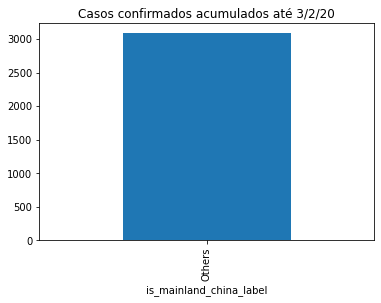
    


```python
summed = confirmed.groupby("is_mainland_china_label").sum()
summed["delta"] = summed["3/2/20"] - summed["3/1/20"]
summed["delta"].plot(kind='bar')
plt.title(f"Novos casos confirmados em {last_date}")
plt.show()
```


    
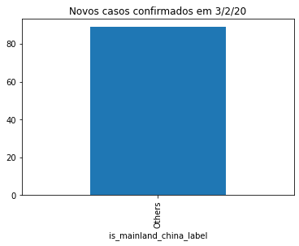
    


```python
summed.T.head()
```


<div>

<table border="1" class="dataframe">
  <thead>
    <tr style="text-align: right;">
      <th>is_mainland_china_label</th>
      <th>Others</th>
    </tr>
  </thead>
  <tbody>
    <tr>
      <th>Lat</th>
      <td>5606.382050</td>
    </tr>
    <tr>
      <th>Long</th>
      <td>6072.631214</td>
    </tr>
    <tr>
      <th>1/22/20</th>
      <td>17.000000</td>
    </tr>
    <tr>
      <th>1/23/20</th>
      <td>18.000000</td>
    </tr>
    <tr>
      <th>1/24/20</th>
      <td>26.000000</td>
    </tr>
  </tbody>
</table>
</div>


```python
summed.T[2:-2].plot()
plt.title("Desenvolvimento de casos confirmados com o passar do tempo")
plt.show()
```


    
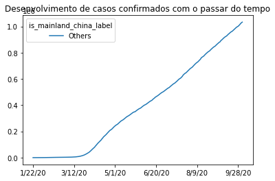
    


```python
import datetime
import matplotlib.dates as mdates

differences = summed.T[2:-2].diff().dropna()
ax = differences.plot(figsize=(10,5),
                      title="Casos novos com o decorrer do tempo",
                      grid=True)
plt.legend(["Mainland China", "Outros"])
ax.set_ylabel("# casos")
ax.set_xlabel("O pico ocorreu devido a mudança de abordagem em Hubei onde, por segurança, passou-se a considerar confirmado mesmos casos sem diagnóstico de laboratório.")
plt.show()
```


    
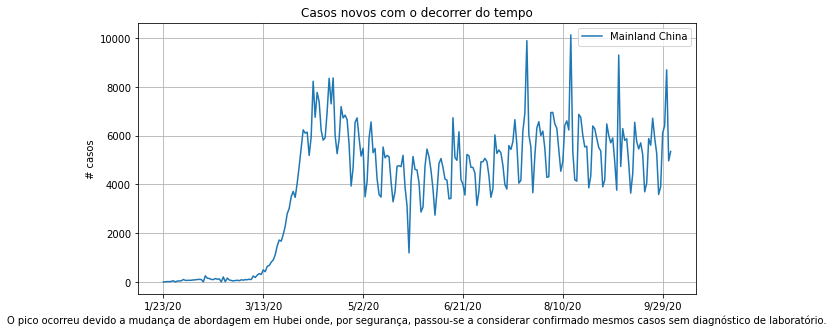
    


```python
differences.head()
```


<div>

<table border="1" class="dataframe">
  <thead>
    <tr style="text-align: right;">
      <th>is_mainland_china_label</th>
      <th>Others</th>
    </tr>
  </thead>
  <tbody>
    <tr>
      <th>1/23/20</th>
      <td>1.0</td>
    </tr>
    <tr>
      <th>1/24/20</th>
      <td>8.0</td>
    </tr>
    <tr>
      <th>1/25/20</th>
      <td>16.0</td>
    </tr>
    <tr>
      <th>1/26/20</th>
      <td>14.0</td>
    </tr>
    <tr>
      <th>1/27/20</th>
      <td>26.0</td>
    </tr>
  </tbody>
</table>
</div>


```python
cases = confirmed.groupby("is_mainland_china_label").sum()[last_date].loc["China"]
estimated_population =  1437525528
incidence_ratio = cases / estimated_population * 100000
incidence_ratio

# conta péssima, e ruim. e errada. pois estou usando uma populacao MUITO maior do que
# deveria estar usando
```


    ---------------------------------------------------------------------------

    KeyError                                  Traceback (most recent call last)

    /usr/local/lib/python3.6/dist-packages/pandas/core/indexes/base.py in get_loc(self, key, method, tolerance)
       2890             try:
    -> 2891                 return self._engine.get_loc(casted_key)
       2892             except KeyError as err:
    

    pandas/_libs/index.pyx in pandas._libs.index.IndexEngine.get_loc()
    

    pandas/_libs/index.pyx in pandas._libs.index.IndexEngine.get_loc()
    

    pandas/_libs/hashtable_class_helper.pxi in pandas._libs.hashtable.PyObjectHashTable.get_item()
    

    pandas/_libs/hashtable_class_helper.pxi in pandas._libs.hashtable.PyObjectHashTable.get_item()
    

    KeyError: 'China'

    
    The above exception was the direct cause of the following exception:
    

    KeyError                                  Traceback (most recent call last)

    <ipython-input-131-8facf26880c7> in <module>()
    ----> 1 cases = confirmed.groupby("is_mainland_china_label").sum()[last_date].loc["China"]
          2 estimated_population =  1437525528
          3 incidence_ratio = cases / estimated_population * 100000
          4 incidence_ratio
          5 
    

    /usr/local/lib/python3.6/dist-packages/pandas/core/indexing.py in __getitem__(self, key)
        877 
        878             maybe_callable = com.apply_if_callable(key, self.obj)
    --> 879             return self._getitem_axis(maybe_callable, axis=axis)
        880 
        881     def _is_scalar_access(self, key: Tuple):
    

    /usr/local/lib/python3.6/dist-packages/pandas/core/indexing.py in _getitem_axis(self, key, axis)
       1108         # fall thru to straight lookup
       1109         self._validate_key(key, axis)
    -> 1110         return self._get_label(key, axis=axis)
       1111 
       1112     def _get_slice_axis(self, slice_obj: slice, axis: int):
    

    /usr/local/lib/python3.6/dist-packages/pandas/core/indexing.py in _get_label(self, label, axis)
       1057     def _get_label(self, label, axis: int):
       1058         # GH#5667 this will fail if the label is not present in the axis.
    -> 1059         return self.obj.xs(label, axis=axis)
       1060 
       1061     def _handle_lowerdim_multi_index_axis0(self, tup: Tuple):
    

    /usr/local/lib/python3.6/dist-packages/pandas/core/generic.py in xs(self, key, axis, level, drop_level)
       3486             loc, new_index = self.index.get_loc_level(key, drop_level=drop_level)
       3487         else:
    -> 3488             loc = self.index.get_loc(key)
       3489 
       3490             if isinstance(loc, np.ndarray):
    

    /usr/local/lib/python3.6/dist-packages/pandas/core/indexes/base.py in get_loc(self, key, method, tolerance)
       2891                 return self._engine.get_loc(casted_key)
       2892             except KeyError as err:
    -> 2893                 raise KeyError(key) from err
       2894 
       2895         if tolerance is not None:
    

    KeyError: 'China'


```python
un_population = pd.read_csv("https://population.un.org/wpp/Download/Files/1_Indicators%20(Standard)/CSV_FILES/WPP2019_TotalPopulationBySex.csv")
un_population["PopTotal"] = un_population["PopTotal"] * 1000
un_population.head()
```


```python
un_population.describe()
```


<div>

<table border="1" class="dataframe">
  <thead>
    <tr style="text-align: right;">
      <th></th>
      <th>LocID</th>
      <th>VarID</th>
      <th>Time</th>
      <th>MidPeriod</th>
      <th>PopMale</th>
      <th>PopFemale</th>
      <th>PopTotal</th>
      <th>PopDensity</th>
    </tr>
  </thead>
  <tbody>
    <tr>
      <th>count</th>
      <td>280932.000000</td>
      <td>280932.000000</td>
      <td>280932.000000</td>
      <td>280932.000000</td>
      <td>2.508760e+05</td>
      <td>2.508760e+05</td>
      <td>2.809320e+05</td>
      <td>280932.000000</td>
    </tr>
    <tr>
      <th>mean</th>
      <td>703.125062</td>
      <td>22.411345</td>
      <td>2051.026494</td>
      <td>2051.526494</td>
      <td>2.324362e+05</td>
      <td>2.298754e+05</td>
      <td>4.128536e+08</td>
      <td>426.659040</td>
    </tr>
    <tr>
      <th>std</th>
      <td>631.959759</td>
      <td>55.972847</td>
      <td>33.642148</td>
      <td>33.642148</td>
      <td>6.938837e+05</td>
      <td>6.829825e+05</td>
      <td>1.308911e+09</td>
      <td>2418.990784</td>
    </tr>
    <tr>
      <th>min</th>
      <td>4.000000</td>
      <td>2.000000</td>
      <td>1950.000000</td>
      <td>1950.500000</td>
      <td>6.812000e+00</td>
      <td>6.889000e+00</td>
      <td>1.510000e+02</td>
      <td>0.052000</td>
    </tr>
    <tr>
      <th>25%</th>
      <td>300.000000</td>
      <td>2.000000</td>
      <td>2031.000000</td>
      <td>2031.500000</td>
      <td>1.847834e+03</td>
      <td>1.860604e+03</td>
      <td>1.240100e+06</td>
      <td>34.205250</td>
    </tr>
    <tr>
      <th>50%</th>
      <td>586.000000</td>
      <td>5.000000</td>
      <td>2055.000000</td>
      <td>2055.500000</td>
      <td>1.136849e+04</td>
      <td>1.164585e+04</td>
      <td>1.420555e+07</td>
      <td>91.590000</td>
    </tr>
    <tr>
      <th>75%</th>
      <td>903.000000</td>
      <td>9.000000</td>
      <td>2078.000000</td>
      <td>2078.500000</td>
      <td>8.526402e+04</td>
      <td>8.648854e+04</td>
      <td>1.171661e+08</td>
      <td>216.985750</td>
    </tr>
    <tr>
      <th>max</th>
      <td>5501.000000</td>
      <td>207.000000</td>
      <td>2100.000000</td>
      <td>2100.500000</td>
      <td>1.092000e+07</td>
      <td>1.071273e+07</td>
      <td>2.163274e+10</td>
      <td>56025.839000</td>
    </tr>
  </tbody>
</table>
</div>


```python
un_population_total = un_population.query("Time==2019")[["Location","PopTotal"]].set_index("Location")
un_population_total.head()
```


<div>

<table border="1" class="dataframe">
  <thead>
    <tr style="text-align: right;">
      <th></th>
      <th>PopTotal</th>
    </tr>
    <tr>
      <th>Location</th>
      <th></th>
    </tr>
  </thead>
  <tbody>
    <tr>
      <th>Afghanistan</th>
      <td>3.804176e+07</td>
    </tr>
    <tr>
      <th>Africa</th>
      <td>1.308064e+09</td>
    </tr>
    <tr>
      <th>African Group</th>
      <td>1.306321e+09</td>
    </tr>
    <tr>
      <th>African Union</th>
      <td>1.306903e+09</td>
    </tr>
    <tr>
      <th>African Union: Central Africa</th>
      <td>1.540137e+08</td>
    </tr>
  </tbody>
</table>
</div>


```python
combined.join(un_population_total)
```


<div>

<table border="1" class="dataframe">
  <thead>
    <tr style="text-align: right;">
      <th></th>
      <th>confirmed</th>
      <th>deaths</th>
      <th>recovered</th>
      <th>letality_rate_1</th>
      <th>letality_rate_2</th>
      <th>PopTotal</th>
    </tr>
  </thead>
  <tbody>
    <tr>
      <th>Afghanistan</th>
      <td>1462</td>
      <td>1462</td>
      <td>32842</td>
      <td>100.0</td>
      <td>4.261894</td>
      <td>38041757.0</td>
    </tr>
    <tr>
      <th>Albania</th>
      <td>392</td>
      <td>392</td>
      <td>8536</td>
      <td>100.0</td>
      <td>4.390681</td>
      <td>2880913.0</td>
    </tr>
    <tr>
      <th>Algeria</th>
      <td>1756</td>
      <td>1756</td>
      <td>36482</td>
      <td>100.0</td>
      <td>4.592290</td>
      <td>43053054.0</td>
    </tr>
    <tr>
      <th>Andorra</th>
      <td>53</td>
      <td>53</td>
      <td>1540</td>
      <td>100.0</td>
      <td>3.327056</td>
      <td>77146.0</td>
    </tr>
    <tr>
      <th>Angola</th>
      <td>193</td>
      <td>193</td>
      <td>2436</td>
      <td>100.0</td>
      <td>7.341194</td>
      <td>31825299.0</td>
    </tr>
    <tr>
      <th>...</th>
      <td>...</td>
      <td>...</td>
      <td>...</td>
      <td>...</td>
      <td>...</td>
      <td>...</td>
    </tr>
    <tr>
      <th>West Bank and Gaza</th>
      <td>329</td>
      <td>329</td>
      <td>33442</td>
      <td>100.0</td>
      <td>0.974209</td>
      <td>NaN</td>
    </tr>
    <tr>
      <th>Western Sahara</th>
      <td>1</td>
      <td>1</td>
      <td>8</td>
      <td>100.0</td>
      <td>11.111111</td>
      <td>582458.0</td>
    </tr>
    <tr>
      <th>Yemen</th>
      <td>589</td>
      <td>589</td>
      <td>1320</td>
      <td>100.0</td>
      <td>30.853850</td>
      <td>29161922.0</td>
    </tr>
    <tr>
      <th>Zambia</th>
      <td>333</td>
      <td>333</td>
      <td>14094</td>
      <td>100.0</td>
      <td>2.308172</td>
      <td>17861034.0</td>
    </tr>
    <tr>
      <th>Zimbabwe</th>
      <td>228</td>
      <td>228</td>
      <td>6327</td>
      <td>100.0</td>
      <td>3.478261</td>
      <td>14645473.0</td>
    </tr>
  </tbody>
</table>
<p>188 rows × 6 columns</p>
</div>


```python
combined.join(un_population_total).sort_values("confirmed", ascending=False).head(20)
```


<div>

<table border="1" class="dataframe">
  <thead>
    <tr style="text-align: right;">
      <th></th>
      <th>confirmed</th>
      <th>deaths</th>
      <th>recovered</th>
      <th>letality_rate_1</th>
      <th>letality_rate_2</th>
      <th>PopTotal</th>
    </tr>
  </thead>
  <tbody>
    <tr>
      <th>US</th>
      <td>209384</td>
      <td>209384</td>
      <td>2897322</td>
      <td>100.0</td>
      <td>6.739743</td>
      <td>NaN</td>
    </tr>
    <tr>
      <th>Brazil</th>
      <td>145987</td>
      <td>145987</td>
      <td>4361108</td>
      <td>100.0</td>
      <td>3.239049</td>
      <td>2.110495e+08</td>
    </tr>
    <tr>
      <th>India</th>
      <td>101782</td>
      <td>101782</td>
      <td>5509966</td>
      <td>100.0</td>
      <td>1.813731</td>
      <td>1.366418e+09</td>
    </tr>
    <tr>
      <th>Mexico</th>
      <td>78880</td>
      <td>78880</td>
      <td>637993</td>
      <td>100.0</td>
      <td>11.003344</td>
      <td>1.275755e+08</td>
    </tr>
    <tr>
      <th>United Kingdom</th>
      <td>42407</td>
      <td>42407</td>
      <td>2396</td>
      <td>100.0</td>
      <td>94.652144</td>
      <td>6.753016e+07</td>
    </tr>
    <tr>
      <th>Italy</th>
      <td>35968</td>
      <td>35968</td>
      <td>231217</td>
      <td>100.0</td>
      <td>13.461834</td>
      <td>6.055009e+07</td>
    </tr>
    <tr>
      <th>Peru</th>
      <td>32609</td>
      <td>32609</td>
      <td>695645</td>
      <td>100.0</td>
      <td>4.477696</td>
      <td>3.251046e+07</td>
    </tr>
    <tr>
      <th>France</th>
      <td>32171</td>
      <td>32171</td>
      <td>100281</td>
      <td>100.0</td>
      <td>24.288799</td>
      <td>6.512973e+07</td>
    </tr>
    <tr>
      <th>Spain</th>
      <td>32086</td>
      <td>32086</td>
      <td>150376</td>
      <td>100.0</td>
      <td>17.585031</td>
      <td>4.673678e+07</td>
    </tr>
    <tr>
      <th>Iran</th>
      <td>26746</td>
      <td>26746</td>
      <td>387675</td>
      <td>100.0</td>
      <td>6.453824</td>
      <td>NaN</td>
    </tr>
    <tr>
      <th>Colombia</th>
      <td>26556</td>
      <td>26556</td>
      <td>757801</td>
      <td>100.0</td>
      <td>3.385703</td>
      <td>5.033944e+07</td>
    </tr>
    <tr>
      <th>Russia</th>
      <td>21153</td>
      <td>21153</td>
      <td>972249</td>
      <td>100.0</td>
      <td>2.129349</td>
      <td>NaN</td>
    </tr>
    <tr>
      <th>Argentina</th>
      <td>20795</td>
      <td>20795</td>
      <td>626114</td>
      <td>100.0</td>
      <td>3.214517</td>
      <td>4.478068e+07</td>
    </tr>
    <tr>
      <th>South Africa</th>
      <td>16938</td>
      <td>16938</td>
      <td>612763</td>
      <td>100.0</td>
      <td>2.689848</td>
      <td>5.855827e+07</td>
    </tr>
    <tr>
      <th>Chile</th>
      <td>12919</td>
      <td>12919</td>
      <td>440881</td>
      <td>100.0</td>
      <td>2.846849</td>
      <td>1.895204e+07</td>
    </tr>
    <tr>
      <th>Ecuador</th>
      <td>11597</td>
      <td>11597</td>
      <td>112296</td>
      <td>100.0</td>
      <td>9.360497</td>
      <td>1.737366e+07</td>
    </tr>
    <tr>
      <th>Indonesia</th>
      <td>11055</td>
      <td>11055</td>
      <td>225052</td>
      <td>100.0</td>
      <td>4.682199</td>
      <td>2.706256e+08</td>
    </tr>
    <tr>
      <th>Belgium</th>
      <td>10044</td>
      <td>10044</td>
      <td>19645</td>
      <td>100.0</td>
      <td>33.830712</td>
      <td>1.153933e+07</td>
    </tr>
    <tr>
      <th>Germany</th>
      <td>9531</td>
      <td>9531</td>
      <td>260916</td>
      <td>100.0</td>
      <td>3.524166</td>
      <td>8.351705e+07</td>
    </tr>
    <tr>
      <th>Canada</th>
      <td>9488</td>
      <td>9488</td>
      <td>140711</td>
      <td>100.0</td>
      <td>6.316953</td>
      <td>3.741104e+07</td>
    </tr>
  </tbody>
</table>
</div>


```python
un_population_total.index[:5]
```


    Index(['Afghanistan', 'Africa', 'African Group', 'African Union',
           'African Union: Central Africa'],
          dtype='object', name='Location')


```python
def locate(population, country):
  return population.query(f"Location.str.contains('{country}') and Time==2019", engine='python')

locate(un_population, 'Hong K')

```


<div>

<table border="1" class="dataframe">
  <thead>
    <tr style="text-align: right;">
      <th></th>
      <th>LocID</th>
      <th>Location</th>
      <th>VarID</th>
      <th>Variant</th>
      <th>Time</th>
      <th>MidPeriod</th>
      <th>PopMale</th>
      <th>PopFemale</th>
      <th>PopTotal</th>
      <th>PopDensity</th>
    </tr>
  </thead>
  <tbody>
    <tr>
      <th>48928</th>
      <td>344</td>
      <td>China, Hong Kong SAR</td>
      <td>2</td>
      <td>Medium</td>
      <td>2019</td>
      <td>2019.5</td>
      <td>3418.487</td>
      <td>4017.67</td>
      <td>7436157.0</td>
      <td>7082.054</td>
    </tr>
  </tbody>
</table>
</div>


```python
# vou assumir algumas premissas
# estou assumindo que na UN China = John Hokpins Mainland China

def rename_location(location):
  if location=='China':
    return 'Mainland China'
  if location=='Republic of Korea':
    return 'South Korea'
  if location=='Iran (Islamic Republic of)':
    return 'Iran'
  if location=='China, Hong Kong SAR':
    return 'Hong Kong'
  if location=='United States of America':
    return 'US'
  return location

un_population_total['location_for_who'] = un_population_total.index.map(rename_location)
un_population_total.query("location_for_who=='South Korea'").head()
```


<div>

<table border="1" class="dataframe">
  <thead>
    <tr style="text-align: right;">
      <th></th>
      <th>PopTotal</th>
      <th>location_for_who</th>
    </tr>
    <tr>
      <th>location_for_who</th>
      <th></th>
      <th></th>
    </tr>
  </thead>
  <tbody>
    <tr>
      <th>South Korea</th>
      <td>51225321.0</td>
      <td>South Korea</td>
    </tr>
  </tbody>
</table>
</div>


```python
un_population_total = un_population_total.set_index("location_for_who")
un_population_total.head()
```


<div>

<table border="1" class="dataframe">
  <thead>
    <tr style="text-align: right;">
      <th></th>
      <th>PopTotal</th>
    </tr>
    <tr>
      <th>location_for_who</th>
      <th></th>
    </tr>
  </thead>
  <tbody>
    <tr>
      <th>Afghanistan</th>
      <td>3.804176e+07</td>
    </tr>
    <tr>
      <th>Africa</th>
      <td>1.308064e+09</td>
    </tr>
    <tr>
      <th>African Group</th>
      <td>1.306321e+09</td>
    </tr>
    <tr>
      <th>African Union</th>
      <td>1.306903e+09</td>
    </tr>
    <tr>
      <th>African Union: Central Africa</th>
      <td>1.540137e+08</td>
    </tr>
  </tbody>
</table>
</div>


```python
combined_expanded = combined.join(un_population_total).sort_values("confirmed", ascending=False).dropna()
combined_expanded.head(10)
```


<div>

<table border="1" class="dataframe">
  <thead>
    <tr style="text-align: right;">
      <th></th>
      <th>confirmed</th>
      <th>deaths</th>
      <th>recovered</th>
      <th>letality_rate_1</th>
      <th>letality_rate_2</th>
      <th>PopTotal</th>
    </tr>
  </thead>
  <tbody>
    <tr>
      <th>US</th>
      <td>209384</td>
      <td>209384</td>
      <td>2897322</td>
      <td>100.0</td>
      <td>6.739743</td>
      <td>3.290649e+08</td>
    </tr>
    <tr>
      <th>Brazil</th>
      <td>145987</td>
      <td>145987</td>
      <td>4361108</td>
      <td>100.0</td>
      <td>3.239049</td>
      <td>2.110495e+08</td>
    </tr>
    <tr>
      <th>India</th>
      <td>101782</td>
      <td>101782</td>
      <td>5509966</td>
      <td>100.0</td>
      <td>1.813731</td>
      <td>1.366418e+09</td>
    </tr>
    <tr>
      <th>Mexico</th>
      <td>78880</td>
      <td>78880</td>
      <td>637993</td>
      <td>100.0</td>
      <td>11.003344</td>
      <td>1.275755e+08</td>
    </tr>
    <tr>
      <th>United Kingdom</th>
      <td>42407</td>
      <td>42407</td>
      <td>2396</td>
      <td>100.0</td>
      <td>94.652144</td>
      <td>6.753016e+07</td>
    </tr>
    <tr>
      <th>Italy</th>
      <td>35968</td>
      <td>35968</td>
      <td>231217</td>
      <td>100.0</td>
      <td>13.461834</td>
      <td>6.055009e+07</td>
    </tr>
    <tr>
      <th>Peru</th>
      <td>32609</td>
      <td>32609</td>
      <td>695645</td>
      <td>100.0</td>
      <td>4.477696</td>
      <td>3.251046e+07</td>
    </tr>
    <tr>
      <th>France</th>
      <td>32171</td>
      <td>32171</td>
      <td>100281</td>
      <td>100.0</td>
      <td>24.288799</td>
      <td>6.512973e+07</td>
    </tr>
    <tr>
      <th>Spain</th>
      <td>32086</td>
      <td>32086</td>
      <td>150376</td>
      <td>100.0</td>
      <td>17.585031</td>
      <td>4.673678e+07</td>
    </tr>
    <tr>
      <th>Iran</th>
      <td>26746</td>
      <td>26746</td>
      <td>387675</td>
      <td>100.0</td>
      <td>6.453824</td>
      <td>8.291389e+07</td>
    </tr>
  </tbody>
</table>
</div>


```python
# O cálculo de incidencia aqui está errado, pois assumi que a população em risco de Mainland China é todo mundo
# mas até agora 83% dos casos estão em Hubei
# Durante esse momento da epidemia é injusto com a localização (Mainland China) considerar essa incidência.

combined_expanded['incidence_ratio'] = combined_expanded['confirmed'] / combined_expanded['PopTotal'] * 100000
combined_expanded['mortality_rate'] = combined_expanded['deaths'] / combined_expanded['PopTotal'] * 100000
combined_expanded.head(10)
```


<div>

<table border="1" class="dataframe">
  <thead>
    <tr style="text-align: right;">
      <th></th>
      <th>confirmed</th>
      <th>deaths</th>
      <th>recovered</th>
      <th>letality_rate_1</th>
      <th>letality_rate_2</th>
      <th>PopTotal</th>
      <th>incidence_ratio</th>
      <th>mortality_rate</th>
    </tr>
  </thead>
  <tbody>
    <tr>
      <th>US</th>
      <td>209384</td>
      <td>209384</td>
      <td>2897322</td>
      <td>100.0</td>
      <td>6.739743</td>
      <td>3.290649e+08</td>
      <td>63.629998</td>
      <td>63.629998</td>
    </tr>
    <tr>
      <th>Brazil</th>
      <td>145987</td>
      <td>145987</td>
      <td>4361108</td>
      <td>100.0</td>
      <td>3.239049</td>
      <td>2.110495e+08</td>
      <td>69.171918</td>
      <td>69.171918</td>
    </tr>
    <tr>
      <th>India</th>
      <td>101782</td>
      <td>101782</td>
      <td>5509966</td>
      <td>100.0</td>
      <td>1.813731</td>
      <td>1.366418e+09</td>
      <td>7.448820</td>
      <td>7.448820</td>
    </tr>
    <tr>
      <th>Mexico</th>
      <td>78880</td>
      <td>78880</td>
      <td>637993</td>
      <td>100.0</td>
      <td>11.003344</td>
      <td>1.275755e+08</td>
      <td>61.830040</td>
      <td>61.830040</td>
    </tr>
    <tr>
      <th>United Kingdom</th>
      <td>42407</td>
      <td>42407</td>
      <td>2396</td>
      <td>100.0</td>
      <td>94.652144</td>
      <td>6.753016e+07</td>
      <td>62.797126</td>
      <td>62.797126</td>
    </tr>
    <tr>
      <th>Italy</th>
      <td>35968</td>
      <td>35968</td>
      <td>231217</td>
      <td>100.0</td>
      <td>13.461834</td>
      <td>6.055009e+07</td>
      <td>59.402057</td>
      <td>59.402057</td>
    </tr>
    <tr>
      <th>Peru</th>
      <td>32609</td>
      <td>32609</td>
      <td>695645</td>
      <td>100.0</td>
      <td>4.477696</td>
      <td>3.251046e+07</td>
      <td>100.303096</td>
      <td>100.303096</td>
    </tr>
    <tr>
      <th>France</th>
      <td>32171</td>
      <td>32171</td>
      <td>100281</td>
      <td>100.0</td>
      <td>24.288799</td>
      <td>6.512973e+07</td>
      <td>49.395260</td>
      <td>49.395260</td>
    </tr>
    <tr>
      <th>Spain</th>
      <td>32086</td>
      <td>32086</td>
      <td>150376</td>
      <td>100.0</td>
      <td>17.585031</td>
      <td>4.673678e+07</td>
      <td>68.652566</td>
      <td>68.652566</td>
    </tr>
    <tr>
      <th>Iran</th>
      <td>26746</td>
      <td>26746</td>
      <td>387675</td>
      <td>100.0</td>
      <td>6.453824</td>
      <td>8.291389e+07</td>
      <td>32.257561</td>
      <td>32.257561</td>
    </tr>
  </tbody>
</table>
</div>


Penso em comparar com outro virus, como Influenza, em outro pais, como Brasil, em outro estado,
como Rio Grande do Sul, em outro período de 2019, em outro tamanho de período de 1 ano inteiro versus 2 meses.

Totalmente diferente, qual a chance da comparação ser justa e honesta?

Fonte: https://www.cevs.rs.gov.br/informativos-epidemiologicos-2019


> O coeficiente de incidência entre os SRAG, está em 3,88/100.000 habitantes, o coeficiente de mortalidade (CM) está em 0,61/100.000 habitantes, enquanto que o CM nacional, na SE 46 foi de 0,50/100.000 habitantes. A letalidade no Estado está em 15,8%.

Parece que, dado o coeficiente de incidencia nos paises afetados pelo coronavirus até então, e somente o tempo de 2 meses, além da curva de crescimento de casos novos na China e fora da China, parece que existe ainda um triste potencial alto de um coeficiente de incidência mais alto que Influenza no relatório analisado.

Mesmo que comparemos com o CDB Burden Influenza, ou outros relatorios é muito dificil pois estamos no começo da epidemia. Além disso, são muitas variáveis e métricas distintas.


```python
confirmed.sort_values(last_date, ascending=False).head()
```


<div>

<table border="1" class="dataframe">
  <thead>
    <tr style="text-align: right;">
      <th></th>
      <th>Province/State</th>
      <th>Country/Region</th>
      <th>Lat</th>
      <th>Long</th>
      <th>1/22/20</th>
      <th>1/23/20</th>
      <th>1/24/20</th>
      <th>1/25/20</th>
      <th>1/26/20</th>
      <th>1/27/20</th>
      <th>1/28/20</th>
      <th>1/29/20</th>
      <th>1/30/20</th>
      <th>1/31/20</th>
      <th>2/1/20</th>
      <th>2/2/20</th>
      <th>2/3/20</th>
      <th>2/4/20</th>
      <th>2/5/20</th>
      <th>2/6/20</th>
      <th>2/7/20</th>
      <th>2/8/20</th>
      <th>2/9/20</th>
      <th>2/10/20</th>
      <th>2/11/20</th>
      <th>2/12/20</th>
      <th>2/13/20</th>
      <th>2/14/20</th>
      <th>2/15/20</th>
      <th>2/16/20</th>
      <th>2/17/20</th>
      <th>2/18/20</th>
      <th>2/19/20</th>
      <th>2/20/20</th>
      <th>2/21/20</th>
      <th>2/22/20</th>
      <th>2/23/20</th>
      <th>2/24/20</th>
      <th>2/25/20</th>
      <th>2/26/20</th>
      <th>...</th>
      <th>8/27/20</th>
      <th>8/28/20</th>
      <th>8/29/20</th>
      <th>8/30/20</th>
      <th>8/31/20</th>
      <th>9/1/20</th>
      <th>9/2/20</th>
      <th>9/3/20</th>
      <th>9/4/20</th>
      <th>9/5/20</th>
      <th>9/6/20</th>
      <th>9/7/20</th>
      <th>9/8/20</th>
      <th>9/9/20</th>
      <th>9/10/20</th>
      <th>9/11/20</th>
      <th>9/12/20</th>
      <th>9/13/20</th>
      <th>9/14/20</th>
      <th>9/15/20</th>
      <th>9/16/20</th>
      <th>9/17/20</th>
      <th>9/18/20</th>
      <th>9/19/20</th>
      <th>9/20/20</th>
      <th>9/21/20</th>
      <th>9/22/20</th>
      <th>9/23/20</th>
      <th>9/24/20</th>
      <th>9/25/20</th>
      <th>9/26/20</th>
      <th>9/27/20</th>
      <th>9/28/20</th>
      <th>9/29/20</th>
      <th>9/30/20</th>
      <th>10/1/20</th>
      <th>10/2/20</th>
      <th>10/3/20</th>
      <th>is_mainland_china</th>
      <th>is_mainland_china_label</th>
    </tr>
  </thead>
  <tbody>
    <tr>
      <th>69</th>
      <td>Hubei</td>
      <td>China</td>
      <td>30.975600</td>
      <td>112.270700</td>
      <td>17</td>
      <td>17</td>
      <td>24</td>
      <td>40</td>
      <td>52</td>
      <td>76</td>
      <td>125</td>
      <td>125</td>
      <td>162</td>
      <td>204</td>
      <td>249</td>
      <td>350</td>
      <td>414</td>
      <td>479</td>
      <td>549</td>
      <td>618</td>
      <td>699</td>
      <td>780</td>
      <td>871</td>
      <td>974</td>
      <td>1068</td>
      <td>1068</td>
      <td>1310</td>
      <td>1457</td>
      <td>1596</td>
      <td>1696</td>
      <td>1789</td>
      <td>1921</td>
      <td>2029</td>
      <td>2144</td>
      <td>2144</td>
      <td>2346</td>
      <td>2346</td>
      <td>2495</td>
      <td>2563</td>
      <td>2615</td>
      <td>...</td>
      <td>4512</td>
      <td>4512</td>
      <td>4512</td>
      <td>4512</td>
      <td>4512</td>
      <td>4512</td>
      <td>4512</td>
      <td>4512</td>
      <td>4512</td>
      <td>4512</td>
      <td>4512</td>
      <td>4512</td>
      <td>4512</td>
      <td>4512</td>
      <td>4512</td>
      <td>4512</td>
      <td>4512</td>
      <td>4512</td>
      <td>4512</td>
      <td>4512</td>
      <td>4512</td>
      <td>4512</td>
      <td>4512</td>
      <td>4512</td>
      <td>4512</td>
      <td>4512</td>
      <td>4512</td>
      <td>4512</td>
      <td>4512</td>
      <td>4512</td>
      <td>4512</td>
      <td>4512</td>
      <td>4512</td>
      <td>4512</td>
      <td>4512</td>
      <td>4512</td>
      <td>4512</td>
      <td>4512</td>
      <td>False</td>
      <td>Others</td>
    </tr>
    <tr>
      <th>145</th>
      <td>NaN</td>
      <td>Iran</td>
      <td>32.427908</td>
      <td>53.688046</td>
      <td>0</td>
      <td>0</td>
      <td>0</td>
      <td>0</td>
      <td>0</td>
      <td>0</td>
      <td>0</td>
      <td>0</td>
      <td>0</td>
      <td>0</td>
      <td>0</td>
      <td>0</td>
      <td>0</td>
      <td>0</td>
      <td>0</td>
      <td>0</td>
      <td>0</td>
      <td>0</td>
      <td>0</td>
      <td>0</td>
      <td>0</td>
      <td>0</td>
      <td>0</td>
      <td>0</td>
      <td>0</td>
      <td>0</td>
      <td>0</td>
      <td>0</td>
      <td>2</td>
      <td>2</td>
      <td>4</td>
      <td>5</td>
      <td>8</td>
      <td>12</td>
      <td>16</td>
      <td>19</td>
      <td>...</td>
      <td>21137</td>
      <td>21249</td>
      <td>21359</td>
      <td>21462</td>
      <td>21571</td>
      <td>21672</td>
      <td>21797</td>
      <td>21926</td>
      <td>22044</td>
      <td>22154</td>
      <td>22293</td>
      <td>22410</td>
      <td>22542</td>
      <td>22669</td>
      <td>22798</td>
      <td>22913</td>
      <td>23029</td>
      <td>23157</td>
      <td>23313</td>
      <td>23453</td>
      <td>23632</td>
      <td>23808</td>
      <td>23952</td>
      <td>24118</td>
      <td>24301</td>
      <td>24478</td>
      <td>24656</td>
      <td>24840</td>
      <td>25015</td>
      <td>25222</td>
      <td>25394</td>
      <td>25589</td>
      <td>25779</td>
      <td>25986</td>
      <td>26169</td>
      <td>26380</td>
      <td>26567</td>
      <td>26746</td>
      <td>False</td>
      <td>Others</td>
    </tr>
    <tr>
      <th>149</th>
      <td>NaN</td>
      <td>Italy</td>
      <td>41.871940</td>
      <td>12.567380</td>
      <td>0</td>
      <td>0</td>
      <td>0</td>
      <td>0</td>
      <td>0</td>
      <td>0</td>
      <td>0</td>
      <td>0</td>
      <td>0</td>
      <td>0</td>
      <td>0</td>
      <td>0</td>
      <td>0</td>
      <td>0</td>
      <td>0</td>
      <td>0</td>
      <td>0</td>
      <td>0</td>
      <td>0</td>
      <td>0</td>
      <td>0</td>
      <td>0</td>
      <td>0</td>
      <td>0</td>
      <td>0</td>
      <td>0</td>
      <td>0</td>
      <td>0</td>
      <td>0</td>
      <td>0</td>
      <td>1</td>
      <td>2</td>
      <td>3</td>
      <td>7</td>
      <td>10</td>
      <td>12</td>
      <td>...</td>
      <td>35463</td>
      <td>35472</td>
      <td>35473</td>
      <td>35477</td>
      <td>35483</td>
      <td>35491</td>
      <td>35497</td>
      <td>35507</td>
      <td>35518</td>
      <td>35534</td>
      <td>35541</td>
      <td>35553</td>
      <td>35563</td>
      <td>35577</td>
      <td>35587</td>
      <td>35597</td>
      <td>35603</td>
      <td>35610</td>
      <td>35624</td>
      <td>35633</td>
      <td>35645</td>
      <td>35658</td>
      <td>35668</td>
      <td>35692</td>
      <td>35707</td>
      <td>35724</td>
      <td>35738</td>
      <td>35758</td>
      <td>35781</td>
      <td>35801</td>
      <td>35818</td>
      <td>35835</td>
      <td>35851</td>
      <td>35875</td>
      <td>35894</td>
      <td>35918</td>
      <td>35941</td>
      <td>35968</td>
      <td>False</td>
      <td>Others</td>
    </tr>
    <tr>
      <th>155</th>
      <td>NaN</td>
      <td>Korea, South</td>
      <td>35.907757</td>
      <td>127.766922</td>
      <td>0</td>
      <td>0</td>
      <td>0</td>
      <td>0</td>
      <td>0</td>
      <td>0</td>
      <td>0</td>
      <td>0</td>
      <td>0</td>
      <td>0</td>
      <td>0</td>
      <td>0</td>
      <td>0</td>
      <td>0</td>
      <td>0</td>
      <td>0</td>
      <td>0</td>
      <td>0</td>
      <td>0</td>
      <td>0</td>
      <td>0</td>
      <td>0</td>
      <td>0</td>
      <td>0</td>
      <td>0</td>
      <td>0</td>
      <td>0</td>
      <td>0</td>
      <td>0</td>
      <td>1</td>
      <td>2</td>
      <td>2</td>
      <td>6</td>
      <td>8</td>
      <td>10</td>
      <td>12</td>
      <td>...</td>
      <td>316</td>
      <td>321</td>
      <td>323</td>
      <td>324</td>
      <td>324</td>
      <td>326</td>
      <td>329</td>
      <td>331</td>
      <td>333</td>
      <td>334</td>
      <td>336</td>
      <td>341</td>
      <td>344</td>
      <td>346</td>
      <td>350</td>
      <td>355</td>
      <td>358</td>
      <td>363</td>
      <td>367</td>
      <td>367</td>
      <td>372</td>
      <td>377</td>
      <td>378</td>
      <td>383</td>
      <td>385</td>
      <td>388</td>
      <td>388</td>
      <td>393</td>
      <td>395</td>
      <td>399</td>
      <td>401</td>
      <td>406</td>
      <td>407</td>
      <td>413</td>
      <td>415</td>
      <td>416</td>
      <td>420</td>
      <td>421</td>
      <td>False</td>
      <td>Others</td>
    </tr>
    <tr>
      <th>67</th>
      <td>Henan</td>
      <td>China</td>
      <td>37.895700</td>
      <td>114.904200</td>
      <td>0</td>
      <td>0</td>
      <td>0</td>
      <td>0</td>
      <td>1</td>
      <td>1</td>
      <td>1</td>
      <td>2</td>
      <td>2</td>
      <td>2</td>
      <td>2</td>
      <td>2</td>
      <td>2</td>
      <td>2</td>
      <td>2</td>
      <td>2</td>
      <td>3</td>
      <td>4</td>
      <td>6</td>
      <td>6</td>
      <td>7</td>
      <td>8</td>
      <td>10</td>
      <td>11</td>
      <td>13</td>
      <td>13</td>
      <td>16</td>
      <td>19</td>
      <td>19</td>
      <td>19</td>
      <td>19</td>
      <td>19</td>
      <td>19</td>
      <td>19</td>
      <td>19</td>
      <td>19</td>
      <td>...</td>
      <td>22</td>
      <td>22</td>
      <td>22</td>
      <td>22</td>
      <td>22</td>
      <td>22</td>
      <td>22</td>
      <td>22</td>
      <td>22</td>
      <td>22</td>
      <td>22</td>
      <td>22</td>
      <td>22</td>
      <td>22</td>
      <td>22</td>
      <td>22</td>
      <td>22</td>
      <td>22</td>
      <td>22</td>
      <td>22</td>
      <td>22</td>
      <td>22</td>
      <td>22</td>
      <td>22</td>
      <td>22</td>
      <td>22</td>
      <td>22</td>
      <td>22</td>
      <td>22</td>
      <td>22</td>
      <td>22</td>
      <td>22</td>
      <td>22</td>
      <td>22</td>
      <td>22</td>
      <td>22</td>
      <td>22</td>
      <td>22</td>
      <td>False</td>
      <td>Others</td>
    </tr>
  </tbody>
</table>
<p>5 rows × 262 columns</p>
</div>


```python
# https://en.wikipedia.org/wiki/Hubei
# hubei population

hubei_population = 59020000
confirmed_cases = confirmed.set_index("Province/State").loc["Hubei"][last_date]
death_cases = deaths.set_index("Province/State").loc["Hubei"][last_date]
recovered_cases = recovered.set_index("Province/State").loc["Hubei"][last_date]

letality_rate_1 = death_cases / confirmed_cases * 100
letality_rate_2 = death_cases / (death_cases + recovered_cases) * 100
print(f"Letality rate 1: {letality_rate_1}%")
print(f"Letality rate 2: {letality_rate_2}%")
```

    Letality rate 1: 100.0%
    Letality rate 2: 7.629909900100716%
    


```python
# nos estados unidos de acordo com burden report de influenza 2018-2019 estimativa não final
letality_rate_hospitalization = 34157 / 490561 * 100

print(f"Letality rate hospitalização EUA influenza 2018-2019: {letality_rate_hospitalization}%")
```

    Letality rate hospitalização EUA influenza 2018-2019: 6.962844579980879%
    


```python
# nos estados unidos de acordo com burden report de influenza 2018-2019 estimativa não final
letality_rate_medical_visit = 34157 / 16520350 * 100

print(f"Letality rate visita médica EUA influenza 2018-2019: {letality_rate_medical_visit}%")
```

    Letality rate visita médica EUA influenza 2018-2019: 0.20675712076317995%
    


```python
# nos estados unidos de acordo com burden report de influenza 2018-2019 estimativa não final
letality_rate_symptomatic = 34157 / 35520883 * 100

print(f"Letality rate sintomáticos EUA influenza 2018-2019: {letality_rate_symptomatic}%")
```

    Letality rate sintomáticos EUA influenza 2018-2019: 0.09616033475293956%
    


```python
incidence_ratio = confirmed_cases / hubei_population * 100000
mortality_rate = death_cases / hubei_population * 100000

print(f"Coeficiente de incidencia em Hubei {incidence_ratio}")
print(f"Coeficiente de mortalidade em Hubei {mortality_rate}")
```

    Coeficiente de incidencia em Hubei 4.749237546594375
    Coeficiente de mortalidade em Hubei 4.749237546594375
    


```python
# estados unidos, mesmo relatorio de burden, coeficiente de incidencia

incidence_ratio = 35520883 / 329450000 * 100000
mortality_rate = 34157 / 329450000 * 100000

print(f"Coeficiente de incidencia de influenza 2018-2019 em EUA  {incidence_ratio}")
print(f"Coeficiente de mortalidade de influenza 2018-2019 em EUA {mortality_rate}")
```

    Coeficiente de incidencia de influenza 2018-2019 em EUA  10781.873728942177
    Coeficiente de mortalidade de influenza 2018-2019 em EUA 10.367885870390044
    

É muito ruim e muito difícil fazer comparação com períodos de tempo diferentes (2 meses / 12 meses). Você quer extrapolar simplesmente e multiplicar por 6? 24 a mortalidade. Mas extrapolar com esse tipo de crescimento pode ser muito irreal. Então infelizmente tem que ir por estimativas.... estatística.


```python
grouped_per_day = pd.DataFrame([confirmed.sum()[2:-1],recovered.sum()[2:], deaths.sum()[2:]],
            index=["confirmed", "recovered", "deaths"]).T
grouped_per_day.head()
```


<div>

<table border="1" class="dataframe">
  <thead>
    <tr style="text-align: right;">
      <th></th>
      <th>confirmed</th>
      <th>recovered</th>
      <th>deaths</th>
    </tr>
  </thead>
  <tbody>
    <tr>
      <th>Long</th>
      <td>6072.631214</td>
      <td>7083.258098</td>
      <td>6072.631214</td>
    </tr>
    <tr>
      <th>1/22/20</th>
      <td>17.000000</td>
      <td>28.000000</td>
      <td>17.000000</td>
    </tr>
    <tr>
      <th>1/23/20</th>
      <td>18.000000</td>
      <td>30.000000</td>
      <td>18.000000</td>
    </tr>
    <tr>
      <th>1/24/20</th>
      <td>26.000000</td>
      <td>36.000000</td>
      <td>26.000000</td>
    </tr>
    <tr>
      <th>1/25/20</th>
      <td>42.000000</td>
      <td>39.000000</td>
      <td>42.000000</td>
    </tr>
  </tbody>
</table>
</div>


```python
grouped_per_day["letality_rate_1"] = grouped_per_day["deaths"]/ grouped_per_day["confirmed"] * 100
grouped_per_day["letality_rate_2"] = grouped_per_day["deaths"] / (grouped_per_day["deaths"] + grouped_per_day["recovered"]) * 100
grouped_per_day.head()
```


<div>

<table border="1" class="dataframe">
  <thead>
    <tr style="text-align: right;">
      <th></th>
      <th>confirmed</th>
      <th>recovered</th>
      <th>deaths</th>
      <th>letality_rate_1</th>
      <th>letality_rate_2</th>
    </tr>
  </thead>
  <tbody>
    <tr>
      <th>Long</th>
      <td>6072.631214</td>
      <td>7083.258098</td>
      <td>6072.631214</td>
      <td>100.0</td>
      <td>46.159032</td>
    </tr>
    <tr>
      <th>1/22/20</th>
      <td>17.000000</td>
      <td>28.000000</td>
      <td>17.000000</td>
      <td>100.0</td>
      <td>37.777778</td>
    </tr>
    <tr>
      <th>1/23/20</th>
      <td>18.000000</td>
      <td>30.000000</td>
      <td>18.000000</td>
      <td>100.0</td>
      <td>37.500000</td>
    </tr>
    <tr>
      <th>1/24/20</th>
      <td>26.000000</td>
      <td>36.000000</td>
      <td>26.000000</td>
      <td>100.0</td>
      <td>41.935484</td>
    </tr>
    <tr>
      <th>1/25/20</th>
      <td>42.000000</td>
      <td>39.000000</td>
      <td>42.000000</td>
      <td>100.0</td>
      <td>51.851852</td>
    </tr>
  </tbody>
</table>
</div>


```python
fig = plt.figure(figsize=(10,5))
grouped_per_day["letality_rate_1"].plot()
ax = grouped_per_day["letality_rate_2"].plot()
plt.legend(['Mortes por casos confirmados ("otimista")', 'Mortes por casos recuperados ou óbitos ("pessimista")'])
plt.title("Taxa de letalidade do COVID-19 (evolução acumulada)", pad=10)
plt.grid(linestyle='-')
ax.set_ylabel("letalidade %")
ax.set_xlabel("Fonte Johns Hopkins CSSE / Gráfico e Collab www.alura.com.br", labelpad=10)
plt.show()
```


    
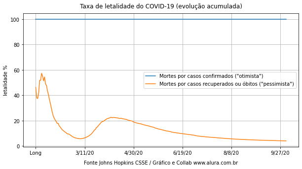
    


```python
grouped_per_day["letality_rate_2"].plot()
plt.title("Mortes por casos recuperados ou mortos no mundo todo")
plt.show()
```


    
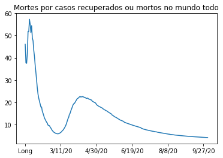
    


```python
grouped_per_day["letality_rate_1"].plot()
plt.title("Mortes por casos confirmados no mundo todo")
plt.show()
```


    
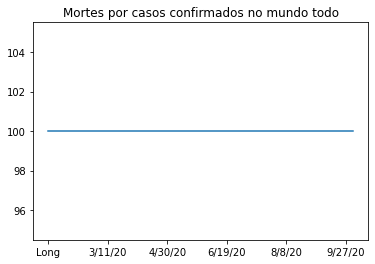
    


```python

```
